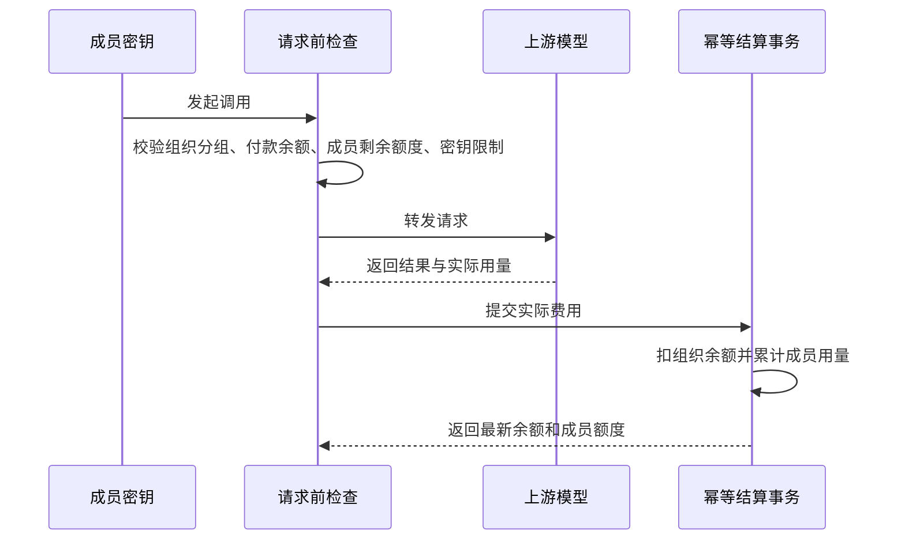

# Sub2API Enterprise 技术设计

版本：0.2.0

更新日期：2026-09-10

阶段：M1 技术设计确认稿，功能尚未实现

关联需求：[需求设计](./需求设计.md)

设计基线：`48d382b`（`docs: define M1 enterprise requirements`）

## 1. 设计目标

在现有 Sub2API 单体应用中增加组织、成员、组织邀请码、成员消费配额、组织分组权限和组织用量能力。继续复用现有注册、用户、密钥、分组、计费和使用记录链路，不新增独立服务、数据库或消息队列。

本设计只覆盖 M1。M2 视觉改造、M3 ACF、M4 ManyRouter 留到对应阶段单独设计。

## 2. 现有基础

本次只核对了与 M1 直接相关的代码。

| 领域 | 当前实现 | M1 复用方式 |
|---|---|---|
| 后端 | Go、Gin、Ent、PostgreSQL、Redis、Wire | 沿用 handler → service → repository 分层与依赖注入 |
| 前端 | Vue 3、TypeScript、Pinia、Vue Router、Tailwind CSS | 沿用现有布局、路由、接口封装和基础组件；TypeScript 已开启 `strict` |
| 注册 | [`AuthService.RegisterWithVerification`](../backend/internal/service/auth_service.go) 统一处理开放注册、邮箱验证和平台邀请码，用户创建与邀请码占用已有事务保护 | 增加注册意图解析，把个人注册、创建组织、加入组织统一纳入原事务 |
| 邀请码 | `redeem_codes` 已支持一次性邀请码、过期时间和并发占用 | 增加组织归属；空组织归属代表平台邀请码 |
| 分组 | 用户已有公开分组限制和专属分组授权；密钥创建与请求入口都会校验 | 组织用户改为读取组织授权范围，个人用户保持现有规则 |
| API 密钥 | 密钥属于用户，带分组、额度、有效期和限流；认证快照存入 Redis | 保留密钥归属，在认证快照中增加组织结算上下文 |
| 余额与计费 | [`BillingCacheService`](../backend/internal/service/billing_cache_service.go) 做请求前检查；[`usageBillingRepository.Apply`](../backend/internal/repository/usage_billing_repo.go) 幂等、原子地扣余额并累计密钥额度 | 将付款账号和成员账号分开，原子累计成员消费配额 |
| 使用记录 | `usage_logs` 按用户、密钥、分组和时间查询，用户页与管理页已有筛选和统计 | 增加组织和付款账号快照，组织查询由服务端强制限定范围 |
| 前端页面 | 已有注册、用户管理、密钥、用量、分组和侧边栏 | 复用交互模式，组织代码放到独立功能目录，避免继续扩大现有大页面 |

## 3. 技术选择

1. 保持现有单体部署。组织能力与 Sub2API 一起发布、迁移和回滚。
2. PostgreSQL 继续作为业务事实来源，Redis只承担读缓存和快速额度预检。
3. 平台身份仍使用 `admin`、`user` 两种值。组织管理员由“当前用户是否为组织创建者”判断，禁止把组织管理员映射为平台管理员。
4. 组织授权分组单独保存。不会批量复制到每个成员的个人分组表，避免成员加入和授权调整时产生多份状态。
5. 金额沿用数据库 `numeric(20,8)`。服务层的均分和入库前量化使用现有 `shopspring/decimal`，统一保留 8 位小数。
6. Ent schema 和手写 SQL 迁移同时维护。Ent 生成文件通过 `make -C backend generate` 生成，禁止手工修改。

## 4. 数据设计

### 4.1 组织

新增 `organizations`：

| 字段 | 说明 |
|---|---|
| `id` | 组织标识 |
| `name` | 组织名称，去除首尾空白，1 至 100 个字符；M1 允许重名 |
| `owner_user_id` | 唯一组织管理员及付款账号，用户只能创建一个组织 |
| `created_at`、`updated_at` | 创建和更新时间 |

M1 没有删除组织、转让管理员和增加第二位管理员的入口。

### 4.2 组织成员

新增 `organization_members`，组织创建者也保存一条成员关系：

| 字段 | 说明 |
|---|---|
| `id` | 成员关系标识 |
| `organization_id` | 所属组织 |
| `user_id` | 所属用户，全表唯一以保证一个账号最多属于一个组织 |
| `quota_limit` | 成员累计消费上限，默认 0 |
| `quota_used` | 成员已经发生的累计消费，默认 0 |
| `quota_reserved` | 异步批量任务已经冻结、尚未结算的额度，默认 0 |
| `created_at`、`updated_at` | 加入和更新时间 |

三个额度字段都使用 `numeric(20,8)` 并限制为非负数。组织创建者的调用跳过成员额度限制，仍保留成员关系用于组织用量统计。

调整额度只修改 `quota_limit`。允许把上限调到已用额度以下，剩余额度按 `max(上限 - 已用 - 冻结, 0)` 展示，后续请求立即停止。

### 4.3 组织分组

新增 `organization_allowed_groups`：

- `organization_id` 与 `group_id` 组成唯一关系。
- 只允许关联未删除的有效分组。
- M1 管理界面只提供余额计费分组。订阅分组仍依赖个人订阅，与组织统一扣款规则冲突，暂不进入组织授权范围。

组织用户的分组规则以组织授权为准。个人用户继续使用现有公开分组和专属分组规则。组织用户创建密钥时必须选择分组，防止空分组密钥绕过组织授权。

### 4.4 邀请码

在 `redeem_codes` 增加可空的 `organization_id`：

- 为空：现有平台邀请码。
- 有值：对应组织的一次性邀请码。
- 组织邀请码继续沿用现有随机码、未使用状态、过期时间和原子占用逻辑。
- 组织管理员只能创建自己组织的邀请码，不能指定邀请码价值、分组或其他组织。

### 4.5 使用记录

在 `usage_logs` 增加两个可空字段：

| 字段 | 说明 |
|---|---|
| `organization_id` | 调用发生时的组织归属快照；个人调用为空 |
| `billing_user_id` | 实际承担费用的用户；个人和组织创建者调用时等于密钥所属用户 |

新记录始终写入付款账号。历史记录保持为空，读取时按原有个人记录处理，不做全表回填。新增 `(organization_id, created_at)` 和 `(organization_id, user_id, created_at)` 索引，支持组织时间范围查询和成员筛选。

使用记录仍按密钥所属用户统计。组织创建者把自己的密钥交给他人使用时，用量继续归组织创建者。

## 5. 后端职责划分

### 5.1 新增代码

```text
backend/
├─ ent/schema/
│  ├─ organization.go
│  ├─ organization_member.go
│  └─ organization_allowed_group.go
├─ internal/service/
│  ├─ organization.go                 # 业务对象、输入输出、错误定义
│  ├─ organization_service.go         # 组织、成员、分组、邀请码操作
│  ├─ organization_registration.go    # 注册意图与注册事务编排
│  └─ organization_billing.go         # 付款账号和成员额度解析
├─ internal/repository/
│  ├─ organization_repo.go
│  └─ organization_billing_repo.go
├─ internal/handler/
│  ├─ organization_handler.go         # 组织管理员接口
│  └─ admin/organization_handler.go    # 平台管理员接口
└─ internal/server/routes/
   └─ organization.go
```

组织代码保持独立，注册、密钥、计费和用量模块只增加必要接入点。数据库查询集中在 repository，权限和业务规则集中在 service，handler 只负责参数校验和响应转换。

### 5.2 当前用户组织上下文

用户的持久化平台身份不变。服务层用户对象增加只在运行时使用的组织上下文，包含：

- 组织、成员关系和组织创建者标识。
- 组织授权分组。
- 成员额度上限、已用额度和冻结额度。
- 付款账号标识；组织创建者和个人用户指向自己。

API 密钥认证查询一次性加载这些字段，并写入现有认证缓存快照。缓存结构版本同步升级，旧版本缓存直接失效。

### 5.3 权限边界

- 平台管理员接口继续使用现有管理员鉴权。
- 组织管理员接口从登录用户推导组织，客户端不传可替换的组织标识。
- 组织管理员操作成员时，repository 查询必须同时带当前组织条件。
- 组织创建者不能停用自己。
- 普通组织成员不能读取成员列表、创建组织邀请码、调整额度或查看全组织用量。
- 平台管理员仍可通过现有用户管理能力处理任意用户。

成员启用和停用复用现有用户状态逻辑，并同步清除登录和密钥认证缓存。停用不修改组织关系、额度、密钥和历史记录。

## 6. 注册设计

### 6.1 注册意图

注册服务将请求解析为三种意图：

| 请求内容 | 注册结果 |
|---|---|
| 无组织名称，邀请码为空或为平台邀请码 | 创建个人用户 |
| 有组织名称，邀请码为空或为平台邀请码 | 创建组织和唯一组织管理员 |
| 邀请码属于某个组织 | 创建普通组织成员；请求中的组织名称必须为空 |

开放注册关闭时，三种意图全部拒绝。邀请码注册开启时，个人注册和创建组织必须提供平台邀请码；加入组织使用组织邀请码。邀请码注册关闭时，个人注册和创建组织可以不填码，加入组织仍必须提供组织邀请码来确定归属。

### 6.2 原子事务

现有“创建用户 + 占用邀请码”事务扩展为统一注册事务：


任一步失败都会回滚用户、组织、成员关系和邀请码状态。邮箱注册及现有 OAuth 完成注册入口都调用同一套意图解析和事务编排，防止不同入口出现规则差异。OAuth 待完成会话保存组织名称或组织邀请码，回调阶段不能由客户端替换已经验证的第三方身份。

组织普通成员仍完成现有账号初始化。其 API 调用始终使用组织付款账号，个人余额和个人订阅不参与组织调用。

### 6.3 邀请码预校验

现有邀请码预校验接口改为先识别码，再结合开关返回结果。邀请码开关关闭时，组织邀请码仍可验证。响应增加 `platform` 或 `organization` 类型，前端据此自动进入个人注册或加入组织流程；响应不公开组织成员和付款信息。

注册页的邀请码输入框始终保留。邀请码注册开启时按规则必填，关闭时作为可选的组织邀请码入口。现有邀请返利码继续使用独立的 `aff_code` 字段和链接参数，不再占用平台或组织邀请码输入框。

## 7. 分组与密钥设计

密钥创建、密钥修改、可选分组列表和每次 API 请求都调用同一个分组判断方法：

1. 个人用户执行现有公开分组、专属分组和订阅判断。
2. 组织用户要求目标分组存在于组织授权范围，并且分组处于可用状态。
3. 请求阶段始终重新执行缓存快照中的授权判断，确保已有密钥也受到最新组织授权限制。

平台修改组织授权后，服务列出该组织成员并调用现有“按用户清除认证缓存”能力。M1 面向个人和小型企业，这个线性失效过程足够简单可靠；大组织的分片失效可以后续增加。

## 8. 结算与成员额度

### 8.1 请求前检查

现有计费资格检查增加组织分支：

- 个人用户：检查本人余额，行为保持现状。
- 组织创建者：检查本人余额，不检查成员额度。
- 普通组织成员：检查组织创建者余额，同时检查成员剩余额度。
- 密钥额度、有效期、金额限流、并发和每分钟请求限制继续按密钥所属用户执行。

API 密钥中间件里的首轮余额检查和各网关共用的计费资格检查都读取同一个付款账号，避免普通成员因个人余额为 0 被提前拦截。组织信息放入现有密钥认证快照后，网关 handler 继续调用统一计费资格检查，不在每个协议入口重复增加组织判断。

成员额度使用 Redis 读缓存，缓存缺失时回源 PostgreSQL。额度调整后删除对应缓存；成功结算后用数据库返回的新额度状态更新缓存，缓存更新失败时直接删除，下一次请求回源。

### 8.2 原子结算

现有幂等计费命令增加组织、付款账号和成员关系信息。一次数据库事务依次完成：

1. 使用请求标识和密钥标识占用幂等记录。
2. 扣付款账号余额。
3. 普通成员调用时累计成员已用额度。
4. 累计密钥额度和金额限流。
5. 累计上游账号额度。

任一写入失败时整笔回滚。同一请求重试只结算一次。计费指纹加入组织、付款账号和成员关系，防止相同请求标识携带不同结算归属。

组织余额不足通知读取组织创建者的通知设置并发送给创建者。成员仍是请求归属人，其个人余额通知不会因组织消费触发。现有直接扣减使用记录余额的兼容路径必须转入统一结算逻辑，确保任何协议入口都不能绕过组织付款和成员额度累计。



模型请求的最终费用只能在响应后确定。M1 沿用现有余额与密钥额度行为：请求开始时剩余额度大于 0 即可进入，已经在途的请求允许完成；结算后额度可以超过上限，后续请求会被拒绝。数据库累加保持原子，并发请求不会丢失用量。

### 8.3 异步批量任务

批量图片等已有冻结余额流程需要同时处理组织成员额度：

- 创建任务时冻结组织创建者余额，并增加成员冻结额度。
- 成功结算时按实际金额从冻结额度转为已用额度。
- 失败或取消时同时释放余额和成员冻结额度。
- 三步继续使用现有幂等请求标识，组织余额和成员额度处于同一个事务。

## 9. 使用记录与统计

组织用量服务复用现有筛选和聚合 repository，并增加由服务端写入的组织条件：

- 组织管理员查询时固定 `organization_id`，可再选择本组织成员。
- 普通成员沿用固定 `user_id` 的个人查询。
- 成员分布按 `user_id` 聚合实际费用、请求数和令牌数，时间范围沿用现有统计口径。
- 详情查询同时校验组织归属，防止通过记录标识读取其他组织数据。
- 历史组织归属读取 `usage_logs.organization_id`，不依赖用户当前状态。

显示用量以 `usage_logs` 为准，余额、成员累计额度和计费幂等记录是结算事实。沿用当前使用记录尽力写入和告警机制，M1 不新增财务总账或历史日志补写系统。

## 10. HTTP 接口

### 10.1 注册接口调整

| 方法与路径 | 调整 |
|---|---|
| `POST /api/v1/auth/register` | 增加可选组织名称；邀请码字段继续复用 |
| `POST /api/v1/auth/validate-invitation-code` | 返回邀请码类型；邀请码开关关闭时仍允许验证组织邀请码 |
| 各 OAuth 完成注册接口 | 增加同样的组织注册意图，统一进入注册事务 |
| `GET /api/v1/auth/me` | 返回当前组织摘要及是否为组织创建者 |

### 10.2 组织管理员接口

| 方法与路径 | 用途 |
|---|---|
| `GET /api/v1/organization` | 查看当前组织摘要 |
| `GET /api/v1/organization/members` | 分页查询本组织成员、额度和用量 |
| `PUT /api/v1/organization/members/:user_id/status` | 启用或停用普通成员 |
| `PUT /api/v1/organization/members/:user_id/quota` | 设置单个成员消费上限 |
| `POST /api/v1/organization/members/quota/equal-split` | 给选中成员均分指定总额 |
| `GET /api/v1/organization/invitations` | 查看本组织邀请码 |
| `POST /api/v1/organization/invitations` | 创建本组织一次性邀请码 |
| `GET /api/v1/organization/usage` | 查询组织使用记录，支持成员筛选 |
| `GET /api/v1/organization/usage/stats` | 查询组织汇总和成员分布 |

均分时服务按成员标识升序分配 8 位小数。无法整除的最小余数从前往后各补 `0.00000001`，保证各成员新上限之和等于输入总额。选中列表去重，并在事务中锁定成员行。

### 10.3 平台管理员接口

| 方法与路径 | 用途 |
|---|---|
| `GET /api/v1/admin/organizations` | 查询全平台组织列表 |
| `GET /api/v1/admin/organizations/:id` | 查看组织、创建者和成员详情 |
| `PUT /api/v1/admin/organizations/:id/groups` | 整体替换组织授权分组 |

整体替换分组在事务中校验全部分组后提交，空数组代表收回全部授权。提交成功后再清理组织成员的密钥认证缓存。

## 11. 前端设计

```text
frontend/src/features/organization/
├─ api.ts
├─ types.ts
├─ composables/
│  ├─ useOrganization.ts
│  └─ useOrganizationUsage.ts
├─ components/
│  ├─ MemberTable.vue
│  ├─ MemberQuotaDialog.vue
│  ├─ EqualSplitQuotaDialog.vue
│  └─ InvitationList.vue
└─ views/
   ├─ OrganizationMembersView.vue
   ├─ OrganizationUsageView.vue
   └─ AdminOrganizationsView.vue
```

- 注册页始终保留单个平台或组织邀请码输入框，在下方增加“创建组织”文字入口；进入后只补充组织名称。
- 组织邀请码识别成功后直接显示加入组织状态，关闭创建组织输入。
- 邀请返利继续走已有链接参数和独立接口字段，界面需要展示时使用明确的返利码名称。
- 组织管理员侧边栏增加“成员管理”，组织用量使用现有用量页面的筛选和图表组件。
- 平台管理员侧边栏增加“组织管理”。
- 普通组织成员隐藏充值、兑换和购买入口；服务端也拒绝相应资金操作，组织充值由组织创建者完成。
- 密钥页继续使用现有交互，只把可选分组换成组织授权结果。
- 新增页面必须包含加载、空数据、接口错误、长组织名称和窄屏状态。M1 继续使用现有主题 Token 和基础组件。
- 中文和英文文案同时增加，并通过现有多语言键完整性检查。

## 12. 缓存与一致性

| 变化 | 处理 |
|---|---|
| 组织分组调整 | 清除组织所有成员的密钥认证缓存 |
| 成员额度调整或均分 | 清除成员额度缓存 |
| 成员消费结算 | 用事务返回值同步更新成员额度缓存；失败则删除缓存 |
| 付款账号余额变化 | 复用现有余额缓存更新和失效机制，目标改为组织创建者 |
| 成员启用或停用 | 清除成员登录相关状态和全部密钥认证缓存 |
| 认证缓存结构变化 | 提升快照版本，旧条目不再使用 |

权限和计费写入先提交 PostgreSQL，再更新或失效 Redis。缓存失效失败会记录告警；缓存条目带有效期，后续请求最终回到数据库状态。

## 13. 数据迁移与兼容

1. 新增组织相关表和外键，不改现有用户记录。
2. `redeem_codes.organization_id`、`usage_logs.organization_id`、`usage_logs.billing_user_id` 都先以可空字段发布。
3. 大表索引使用仓库现有非事务迁移机制创建，避免长时间阻塞使用记录写入。
4. 现有用户因没有成员关系，全部继续走个人业务。
5. 现有邀请码因组织归属为空，继续作为平台邀请码。
6. 现有使用记录继续按个人记录读取。
7. 发布前验证迁移重复执行、并发实例迁移锁和 Ent schema 一致性。

## 14. 错误处理与安全

- 组织权限不足统一返回 403，目标成员或组织不存在返回 404，重复加入或并发占用邀请码返回 409 或现有邀请码失效错误。
- 成员额度耗尽返回独立业务码，便于调用方与余额不足、密钥额度不足区分。
- 所有金额拒绝负数、非有限数和超过数据库范围的输入。
- 组织名称和查询关键字做长度限制；列表接口保留分页上限。
- 组织邀请码沿用现有高熵随机生成和公开预校验限流。
- 日志只记录组织、成员和请求标识，不记录邀请码明文、API 密钥或付款凭据。
- 组织管理员接口不接受客户端指定的组织范围，防止横向访问。

## 15. 测试与工程门禁

### 15.1 后端核心测试

- 注册开关与三种注册意图的完整组合。
- 平台邀请码和组织邀请码并发占用，验证只产生一个账号和一条成员关系。
- 创建组织、加入组织、单组织唯一性和唯一创建者。
- 组织管理员只能读取和操作本组织普通成员。
- 分组授权新增、收回、已有密钥请求拦截和认证缓存失效。
- 单人额度调整、均分舍入、额度低于已用值和并发调整。
- 个人、组织创建者、普通成员三种结算路径。
- 同一请求重试只扣一次组织余额、只累计一次成员额度。
- 并发结算不丢失成员用量，余额或额度耗尽后阻止后续请求。
- 批量任务冻结、结算和释放同时更新组织余额与成员额度。
- 组织记录列表、详情、统计和成员分布的范围隔离。
- PostgreSQL 迁移幂等性、约束和索引验证。

### 15.2 前端验证

- 注册意图和邀请码类型的状态逻辑写单测。
- 组织权限相关路由与接口状态写单测。
- 纯布局、配色和组件外观通过浏览器人工验收，不增加展示层单测。
- 检查长文本、加载、空状态、错误状态、桌面和移动尺寸。

### 15.3 提交前门禁

```text
make -C backend generate
make test
make build
```

实现期间先运行受影响包的测试，提交前运行仓库完整门禁。不得自行启动开发服务器；需要浏览器验收时由用户明确安排。

## 16. M1 已确认边界

以下选择已经确认，作为后续架构设计和实现依据：

1. 组织授权只覆盖余额计费分组，订阅分组暂不支持。
2. 成员个人充值、兑换和购买入口在加入组织后关闭，所有组织调用由创建者付款。
3. 最终费用在响应后结算，允许已经在途的并发请求造成成员额度小幅超出；后续请求立即停止。
4. M1 不提供成员移除、现有个人账号加入组织、组织解散和管理员转让。
5. 使用记录沿用现有尽力写入机制，M1 不增加独立财务总账和历史补写任务。
6. 对外运营使用仓库默认的 `RUN_MODE=standard`，组织注册、管理、计费和成员额度在该模式完整开放。`RUN_MODE=simple` 面向个人或内部团队，会跳过计费，因此不展示组织注册和组织管理入口。

## 17. 确认记录

| 日期 | 版本 | 确认内容 |
|---|---|---|
| 2026-09-10 | 0.2.0 | 确认组织只使用余额计费分组；普通成员关闭个人资金入口；沿用现有在途请求可能超额的结算行为；M1 不增加成员移除等扩展能力；在现有使用记录界面和实现上扩展；对外运营的标准模式完整支持组织能力 |

## 18. 变更记录

| 日期 | 版本 | 内容 |
|---|---|---|
| 2026-09-10 | 0.1.0 | 基于现有注册、密钥、分组、计费、缓存和使用记录链路形成 M1 技术设计草案 |
| 2026-09-10 | 0.2.0 | 根据确认结果固定 M1 边界，明确标准模式是对外运营的完整 SaaS 模式，并将文档更新为确认稿 |
