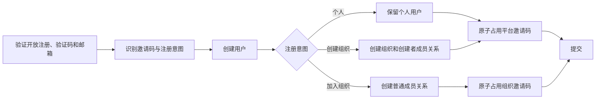
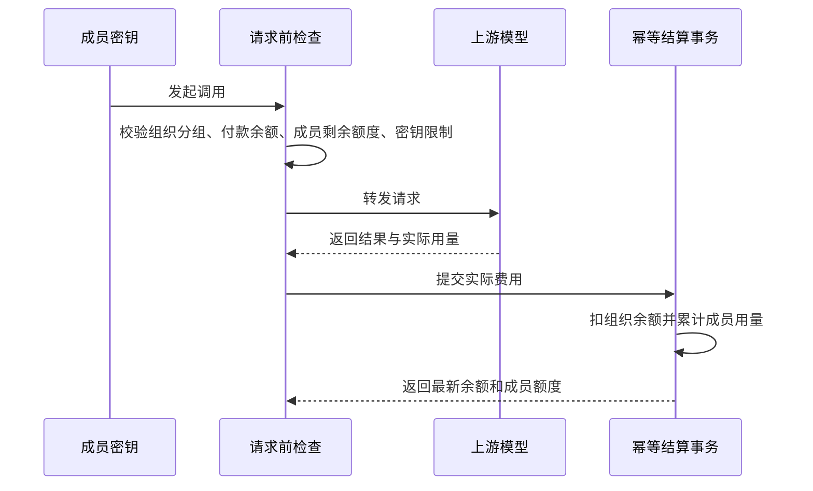

# Sub2API Enterprise 技术设计

版本：0.3.0

更新日期：2026-10-03

阶段：M1 技术设计确认稿，功能尚未实现

关联需求：[需求设计](./需求设计.md)

设计基线：`48d382b`（`docs: define M1 enterprise requirements`）

## 1. 设计目标

在现有 Sub2API 单体应用中增加组织、成员、组织邀请码、成员消费配额、组织分组权限和组织用量能力。继续复用现有注册、用户、密钥、分组、计费和使用记录链路，不新增独立服务、数据库或消息队列。

本设计只覆盖 M1。M2 视觉改造、M3 ACF、M4 ManyRouter 留到对应阶段单独设计。

## 2. 现有基础

本次只核对了与 M1 直接相关的代码。

| 领域 | 当前实现 | M1 复用方式 |
|---|---|---|
| 后端 | Go、Gin、Ent、PostgreSQL、Redis、Wire | 沿用 handler → service → repository 分层与依赖注入 |
| 前端 | Vue 3、TypeScript、Pinia、Vue Router、Tailwind CSS | 沿用现有布局、路由、接口封装和基础组件；TypeScript 已开启 `strict` |
| 注册 | [`AuthService.RegisterWithVerification`](../backend/internal/service/auth_service.go) 统一处理开放注册、邮箱验证和平台邀请码，用户创建与邀请码占用已有事务保护 | 增加注册意图解析，把个人注册、创建组织、加入组织统一纳入原事务 |
| 邀请码 | `redeem_codes` 已支持一次性邀请码、过期时间和并发占用 | 增加组织归属；空组织归属代表平台邀请码 |
| 分组 | 用户已有公开分组限制和专属分组授权；密钥创建与请求入口都会校验 | 组织用户改为读取组织授权范围，个人用户保持现有规则 |
| API 密钥 | 密钥属于用户，带分组、额度、有效期和限流；认证快照存入 Redis | 保留密钥归属，在认证快照中增加组织结算上下文 |
| 余额与计费 | [`BillingCacheService`](../backend/internal/service/billing_cache_service.go) 做请求前检查；[`usageBillingRepository.Apply`](../backend/internal/repository/usage_billing_repo.go) 幂等、原子地扣余额并累计密钥额度 | 将付款账号和成员账号分开，原子累计成员消费配额 |
| 使用记录 | `usage_logs` 按用户、密钥、分组和时间查询，用户页与管理页已有筛选和统计 | 增加组织和付款账号快照，组织查询由服务端强制限定范围 |
| 前端页面 | 已有注册、用户管理、密钥、用量、分组和侧边栏 | 复用交互模式，组织代码放到独立功能目录，避免继续扩大现有大页面 |

## 3. 技术选择

1. 保持现有单体部署。组织能力与 Sub2API 一起发布、迁移和回滚。
2. PostgreSQL 继续作为业务事实来源，Redis只承担读缓存和快速额度预检。
3. 平台身份仍使用 `admin`、`user` 两种值。组织管理员由“当前用户是否为组织创建者”判断，禁止把组织管理员映射为平台管理员。
4. 组织授权分组单独保存。不会批量复制到每个成员的个人分组表，避免成员加入和授权调整时产生多份状态。
5. 金额沿用数据库 `numeric(20,8)`。服务层的均分和入库前量化使用现有 `shopspring/decimal`，统一保留 8 位小数。
6. Ent schema 和手写 SQL 迁移同时维护。Ent 生成文件通过 `make -C backend generate` 生成，禁止手工修改。

## 4. 数据设计

### 4.1 组织

新增 `organizations`：

| 字段 | 说明 |
|---|---|
| `id` | 组织标识 |
| `name` | 组织名称，去除首尾空白，1 至 100 个字符；M1 允许重名 |
| `owner_user_id` | 唯一组织管理员及付款账号，用户只能创建一个组织 |
| `created_at`、`updated_at` | 创建和更新时间 |

M1 没有删除组织、转让管理员和增加第二位管理员的入口。

### 4.2 组织成员

新增 `organization_members`，组织创建者也保存一条成员关系：

| 字段 | 说明 |
|---|---|
| `id` | 成员关系标识 |
| `organization_id` | 所属组织 |
| `user_id` | 所属用户，全表唯一以保证一个账号最多属于一个组织 |
| `quota_limit` | 成员累计消费上限，默认 0 |
| `quota_used` | 成员已经发生的累计消费，默认 0 |
| `quota_reserved` | 异步批量任务已经冻结、尚未结算的额度，默认 0 |
| `created_at`、`updated_at` | 加入和更新时间 |

三个额度字段都使用 `numeric(20,8)` 并限制为非负数。组织创建者的调用跳过成员额度限制，仍保留成员关系用于组织用量统计。

调整额度只修改 `quota_limit`。允许把上限调到已用额度以下，剩余额度按 `max(上限 - 已用 - 冻结, 0)` 展示，后续请求立即停止。

### 4.3 组织分组

新增 `organization_allowed_groups`：

- `organization_id` 与 `group_id` 组成唯一关系。
- 只允许关联未删除的有效分组。
- M1 管理界面只提供余额计费分组。订阅分组仍依赖个人订阅，与组织统一扣款规则冲突，暂不进入组织授权范围。

组织用户的分组规则以组织授权为准。个人用户继续使用现有公开分组和专属分组规则。组织用户创建密钥时必须选择分组，防止空分组密钥绕过组织授权。

### 4.4 邀请码

在 `redeem_codes` 增加可空的 `organization_id`：

- 为空：现有平台邀请码。
- 有值：对应组织的一次性邀请码。
- 组织邀请码继续沿用现有随机码、未使用状态、过期时间和原子占用逻辑。
- 组织管理员只能创建自己组织的邀请码，不能指定邀请码价值、分组或其他组织。

### 4.5 使用记录

在 `usage_logs` 增加两个可空字段：

| 字段 | 说明 |
|---|---|
| `organization_id` | 调用发生时的组织归属快照；个人调用为空 |
| `billing_user_id` | 实际承担费用的用户；个人和组织创建者调用时等于密钥所属用户 |

新记录始终写入付款账号。历史记录保持为空，读取时按原有个人记录处理，不做全表回填。新增 `(organization_id, created_at)` 和 `(organization_id, user_id, created_at)` 索引，支持组织时间范围查询和成员筛选。

使用记录仍按密钥所属用户统计。组织创建者把自己的密钥交给他人使用时，用量继续归组织创建者。

## 5. 后端职责划分

### 5.1 新增代码

```text
backend/
├─ ent/schema/
│  ├─ organization.go
│  ├─ organization_member.go
│  └─ organization_allowed_group.go
├─ internal/service/
│  ├─ organization.go                 # 业务对象、输入输出、错误定义
│  ├─ organization_service.go         # 组织、成员、分组、邀请码操作
│  ├─ organization_registration.go    # 注册意图与注册事务编排
│  └─ organization_billing.go         # 付款账号和成员额度解析
├─ internal/repository/
│  ├─ organization_repo.go
│  └─ organization_billing_repo.go
├─ internal/handler/
│  ├─ organization_handler.go         # 组织管理员接口
│  └─ admin/organization_handler.go    # 平台管理员接口
└─ internal/server/routes/
   └─ organization.go
```

组织代码保持独立，注册、密钥、计费和用量模块只增加必要接入点。数据库查询集中在 repository，权限和业务规则集中在 service，handler 只负责参数校验和响应转换。

### 5.2 当前用户组织上下文

用户的持久化平台身份不变。服务层用户对象增加只在运行时使用的组织上下文，包含：

- 组织、成员关系和组织创建者标识。
- 组织授权分组。
- 成员额度上限、已用额度和冻结额度。
- 付款账号标识；组织创建者和个人用户指向自己。

API 密钥认证查询一次性加载这些字段，并写入现有认证缓存快照。缓存结构版本同步升级，旧版本缓存直接失效。

### 5.3 权限边界

- 平台管理员接口继续使用现有管理员鉴权。
- 组织管理员接口从登录用户推导组织，客户端不传可替换的组织标识。
- 组织管理员操作成员时，repository 查询必须同时带当前组织条件。
- 组织创建者不能停用自己。
- 普通组织成员不能读取成员列表、创建组织邀请码、调整额度或查看全组织用量。
- 平台管理员仍可通过现有用户管理能力处理任意用户。

成员启用和停用复用现有用户状态逻辑，并同步清除登录和密钥认证缓存。停用不修改组织关系、额度、密钥和历史记录。

## 6. 注册设计

### 6.1 注册意图

注册服务将请求解析为三种意图：

| 请求内容 | 注册结果 |
|---|---|
| 无组织名称，邀请码为空或为平台邀请码 | 创建个人用户 |
| 有组织名称，邀请码为空或为平台邀请码 | 创建组织和唯一组织管理员 |
| 邀请码属于某个组织 | 创建普通组织成员；请求中的组织名称必须为空 |

开放注册关闭时，三种意图全部拒绝。邀请码注册开启时，个人注册和创建组织必须提供平台邀请码；加入组织使用组织邀请码。邀请码注册关闭时，个人注册和创建组织可以不填码，加入组织仍必须提供组织邀请码来确定归属。

### 6.2 原子事务

现有“创建用户 + 占用邀请码”事务扩展为统一注册事务：


```mermaid
flowchart LR
    A[验证开放注册、验证码和邮箱] --> B[识别邀请码与注册意图]
    B --> C[创建用户]
    C --> D{注册意图}
    D -->|个人| E[保留个人用户]
    D -->|创建组织| F[创建组织和创建者成员关系]
    D -->|加入组织| G[创建普通成员关系]
    E --> H[原子占用平台邀请码]
    F --> H
    G --> I[原子占用组织邀请码]
    H --> J[提交]
    I --> J
```

任一步失败都会回滚用户、组织、成员关系和邀请码状态。邮箱注册及现有 OAuth 完成注册入口都调用同一套意图解析和事务编排，防止不同入口出现规则差异。OAuth 待完成会话保存组织名称或组织邀请码，回调阶段不能由客户端替换已经验证的第三方身份。

组织普通成员仍完成现有账号初始化。其 API 调用始终使用组织付款账号，个人余额和个人订阅不参与组织调用。

### 6.3 邀请码预校验

现有邀请码预校验接口改为先识别码，再结合开关返回结果。邀请码开关关闭时，组织邀请码仍可验证。响应增加 `platform` 或 `organization` 类型，前端据此自动进入个人注册或加入组织流程；响应不公开组织成员和付款信息。

注册页的邀请码输入框始终保留。邀请码注册开启时按规则必填，关闭时作为可选的组织邀请码入口。现有邀请返利码继续使用独立的 `aff_code` 字段和链接参数，不再占用平台或组织邀请码输入框。

## 7. 分组与密钥设计

密钥创建、密钥修改、可选分组列表和每次 API 请求都调用同一个分组判断方法：

1. 个人用户执行现有公开分组、专属分组和订阅判断。
2. 组织用户要求目标分组存在于组织授权范围，并且分组处于可用状态。
3. 请求阶段始终重新执行缓存快照中的授权判断，确保已有密钥也受到最新组织授权限制。

平台修改组织授权后，服务列出该组织成员并调用现有“按用户清除认证缓存”能力。M1 面向个人和小型企业，这个线性失效过程足够简单可靠；大组织的分片失效可以后续增加。

## 8. 结算与成员额度

### 8.1 请求前检查

现有计费资格检查增加组织分支：

- 个人用户：检查本人余额，行为保持现状。
- 组织创建者：检查本人余额，不检查成员额度。
- 普通组织成员：检查组织创建者余额，同时检查成员剩余额度。
- 密钥额度、有效期、金额限流、并发和每分钟请求限制继续按密钥所属用户执行。

API 密钥中间件里的首轮余额检查和各网关共用的计费资格检查都读取同一个付款账号，避免普通成员因个人余额为 0 被提前拦截。组织信息放入现有密钥认证快照后，网关 handler 继续调用统一计费资格检查，不在每个协议入口重复增加组织判断。

成员额度使用 Redis 读缓存，缓存缺失时回源 PostgreSQL。额度调整后删除对应缓存；成功结算后用数据库返回的新额度状态更新缓存，缓存更新失败时直接删除，下一次请求回源。

### 8.2 原子结算

现有幂等计费命令增加组织、付款账号和成员关系信息。一次数据库事务依次完成：

1. 使用请求标识和密钥标识占用幂等记录。
2. 扣付款账号余额。
3. 普通成员调用时累计成员已用额度。
4. 累计密钥额度和金额限流。
5. 累计上游账号额度。

任一写入失败时整笔回滚。同一请求重试只结算一次。计费指纹加入组织、付款账号和成员关系，防止相同请求标识携带不同结算归属。

组织余额不足通知读取组织创建者的通知设置并发送给创建者。成员仍是请求归属人，其个人余额通知不会因组织消费触发。现有直接扣减使用记录余额的兼容路径必须转入统一结算逻辑，确保任何协议入口都不能绕过组织付款和成员额度累计。


```mermaid
sequenceDiagram
    participant K as 成员密钥
    participant A as 请求前检查
    participant U as 上游模型
    participant B as 幂等结算事务
    K->>A: 发起调用
    A->>A: 校验组织分组、付款余额、成员剩余额度、密钥限制
    A->>U: 转发请求
    U-->>A: 返回结果与实际用量
    A->>B: 提交实际费用
    B->>B: 扣组织余额并累计成员用量
    B-->>A: 返回最新余额和成员额度
```

模型请求的最终费用只能在响应后确定。M1 沿用现有余额与密钥额度行为：请求开始时剩余额度大于 0 即可进入，已经在途的请求允许完成；结算后额度可以超过上限，后续请求会被拒绝。数据库累加保持原子，并发请求不会丢失用量。

### 8.3 异步批量任务

批量图片等已有冻结余额流程需要同时处理组织成员额度：

- 创建任务时冻结组织创建者余额，并增加成员冻结额度。
- 成功结算时按实际金额从冻结额度转为已用额度。
- 失败或取消时同时释放余额和成员冻结额度。
- 三步继续使用现有幂等请求标识，组织余额和成员额度处于同一个事务。

## 9. 使用记录与统计

组织用量服务复用现有筛选和聚合 repository，并增加由服务端写入的组织条件：

- 组织管理员查询时固定 `organization_id`，可再选择本组织成员。
- 普通成员沿用固定 `user_id` 的个人查询。
- 成员分布按 `user_id` 聚合实际费用、请求数和令牌数，时间范围沿用现有统计口径。
- 详情查询同时校验组织归属，防止通过记录标识读取其他组织数据。
- 历史组织归属读取 `usage_logs.organization_id`，不依赖用户当前状态。

显示用量以 `usage_logs` 为准，余额、成员累计额度和计费幂等记录是结算事实。沿用当前使用记录尽力写入和告警机制，M1 不新增财务总账或历史日志补写系统。

## 10. HTTP 接口

### 10.1 注册接口调整

| 方法与路径 | 调整 |
|---|---|
| `POST /api/v1/auth/register` | 增加可选组织名称；邀请码字段继续复用 |
| `POST /api/v1/auth/validate-invitation-code` | 返回邀请码类型；邀请码开关关闭时仍允许验证组织邀请码 |
| 各 OAuth 完成注册接口 | 增加同样的组织注册意图，统一进入注册事务 |
| `GET /api/v1/auth/me` | 返回当前组织摘要及是否为组织创建者 |

### 10.2 组织管理员接口

| 方法与路径 | 用途 |
|---|---|
| `GET /api/v1/organization` | 查看当前组织摘要 |
| `GET /api/v1/organization/members` | 分页查询本组织成员、额度和用量 |
| `PUT /api/v1/organization/members/:user_id/status` | 启用或停用普通成员 |
| `PUT /api/v1/organization/members/:user_id/quota` | 设置单个成员消费上限 |
| `POST /api/v1/organization/members/quota/equal-split` | 给选中成员均分指定总额 |
| `GET /api/v1/organization/invitations` | 查看本组织邀请码 |
| `POST /api/v1/organization/invitations` | 创建本组织一次性邀请码 |
| `GET /api/v1/organization/usage` | 查询组织使用记录，支持成员筛选 |
| `GET /api/v1/organization/usage/stats` | 查询组织汇总和成员分布 |

均分时服务按成员标识升序分配 8 位小数。无法整除的最小余数从前往后各补 `0.00000001`，保证各成员新上限之和等于输入总额。选中列表去重，并在事务中锁定成员行。

### 10.3 平台管理员接口

| 方法与路径 | 用途 |
|---|---|
| `GET /api/v1/admin/organizations` | 查询全平台组织列表 |
| `GET /api/v1/admin/organizations/:id` | 查看组织、创建者和成员详情 |
| `PUT /api/v1/admin/organizations/:id/groups` | 整体替换组织授权分组 |

整体替换分组在事务中校验全部分组后提交，空数组代表收回全部授权。提交成功后再清理组织成员的密钥认证缓存。

## 11. 前端设计

```text
frontend/src/features/organization/
├─ api.ts
├─ types.ts
├─ composables/
│  ├─ useOrganization.ts
│  └─ useOrganizationUsage.ts
├─ components/
│  ├─ MemberTable.vue
│  ├─ MemberQuotaDialog.vue
│  ├─ EqualSplitQuotaDialog.vue
│  └─ InvitationList.vue
└─ views/
   ├─ OrganizationMembersView.vue
   ├─ OrganizationUsageView.vue
   └─ AdminOrganizationsView.vue
```

- 注册页始终保留单个平台或组织邀请码输入框，在下方增加“创建组织”文字入口；进入后只补充组织名称。
- 组织邀请码识别成功后直接显示加入组织状态，关闭创建组织输入。
- 邀请返利继续走已有链接参数和独立接口字段，界面需要展示时使用明确的返利码名称。
- 组织管理员侧边栏增加“成员管理”，组织用量使用现有用量页面的筛选和图表组件。
- 平台管理员侧边栏增加“组织管理”。
- 普通组织成员隐藏充值、兑换和购买入口；服务端也拒绝相应资金操作，组织充值由组织创建者完成。
- 密钥页继续使用现有交互，只把可选分组换成组织授权结果。
- 新增页面必须包含加载、空数据、接口错误、长组织名称和窄屏状态。M1 继续使用现有主题 Token 和基础组件。
- 中文和英文文案同时增加，并通过现有多语言键完整性检查。

## 12. 缓存与一致性

| 变化 | 处理 |
|---|---|
| 组织分组调整 | 清除组织所有成员的密钥认证缓存 |
| 成员额度调整或均分 | 清除成员额度缓存 |
| 成员消费结算 | 用事务返回值同步更新成员额度缓存；失败则删除缓存 |
| 付款账号余额变化 | 复用现有余额缓存更新和失效机制，目标改为组织创建者 |
| 成员启用或停用 | 清除成员登录相关状态和全部密钥认证缓存 |
| 认证缓存结构变化 | 提升快照版本，旧条目不再使用 |

权限和计费写入先提交 PostgreSQL，再更新或失效 Redis。缓存失效失败会记录告警；缓存条目带有效期，后续请求最终回到数据库状态。

## 13. 数据迁移与兼容

1. 新增组织相关表和外键，不改现有用户记录。
2. `redeem_codes.organization_id`、`usage_logs.organization_id`、`usage_logs.billing_user_id` 都先以可空字段发布。
3. 大表索引使用仓库现有非事务迁移机制创建，避免长时间阻塞使用记录写入。
4. 现有用户因没有成员关系，全部继续走个人业务。
5. 现有邀请码因组织归属为空，继续作为平台邀请码。
6. 现有使用记录继续按个人记录读取。
7. 发布前验证迁移重复执行、并发实例迁移锁和 Ent schema 一致性。

## 14. 错误处理与安全

- 组织权限不足统一返回 403，目标成员或组织不存在返回 404，重复加入或并发占用邀请码返回 409 或现有邀请码失效错误。
- 成员额度耗尽返回独立业务码，便于调用方与余额不足、密钥额度不足区分。
- 所有金额拒绝负数、非有限数和超过数据库范围的输入。
- 组织名称和查询关键字做长度限制；列表接口保留分页上限。
- 组织邀请码沿用现有高熵随机生成和公开预校验限流。
- 日志只记录组织、成员和请求标识，不记录邀请码明文、API 密钥或付款凭据。
- 组织管理员接口不接受客户端指定的组织范围，防止横向访问。

## 15. 测试与工程门禁

### 15.1 后端核心测试

- 注册开关与三种注册意图的完整组合。
- 平台邀请码和组织邀请码并发占用，验证只产生一个账号和一条成员关系。
- 创建组织、加入组织、单组织唯一性和唯一创建者。
- 组织管理员只能读取和操作本组织普通成员。
- 分组授权新增、收回、已有密钥请求拦截和认证缓存失效。
- 单人额度调整、均分舍入、额度低于已用值和并发调整。
- 个人、组织创建者、普通成员三种结算路径。
- 同一请求重试只扣一次组织余额、只累计一次成员额度。
- 并发结算不丢失成员用量，余额或额度耗尽后阻止后续请求。
- 批量任务冻结、结算和释放同时更新组织余额与成员额度。
- 组织记录列表、详情、统计和成员分布的范围隔离。
- PostgreSQL 迁移幂等性、约束和索引验证。

### 15.2 前端验证

- 注册意图和邀请码类型的状态逻辑写单测。
- 组织权限相关路由与接口状态写单测。
- 纯布局、配色和组件外观通过浏览器人工验收，不增加展示层单测。
- 检查长文本、加载、空状态、错误状态、桌面和移动尺寸。

### 15.3 提交前门禁

```text
make -C backend generate
make test
make build
```

实现期间先运行受影响包的测试，提交前运行仓库完整门禁。不得自行启动开发服务器；需要浏览器验收时由用户明确安排。

## 16. M1 已确认边界

以下选择已经确认，作为后续架构设计和实现依据：

1. 组织授权只覆盖余额计费分组，订阅分组暂不支持。
2. 成员个人充值、兑换和购买入口在加入组织后关闭，所有组织调用由创建者付款。
3. 最终费用在响应后结算，允许已经在途的并发请求造成成员额度小幅超出；后续请求立即停止。
4. M1 不提供成员移除、现有个人账号加入组织、组织解散和管理员转让。
5. 使用记录沿用现有尽力写入机制，M1 不增加独立财务总账和历史补写任务。
6. 对外运营使用仓库默认的 `RUN_MODE=standard`，组织注册、管理、计费和成员额度在该模式完整开放。`RUN_MODE=simple` 面向个人或内部团队，会跳过计费，因此不展示组织注册和组织管理入口。

## 17. 确认记录

| 日期 | 版本 | 确认内容 |
|---|---|---|
| 2026-09-10 | 0.2.0 | 确认组织只使用余额计费分组；普通成员关闭个人资金入口；沿用现有在途请求可能超额的结算行为；M1 不增加成员移除等扩展能力；在现有使用记录界面和实现上扩展；对外运营的标准模式完整支持组织能力 |

## 18. 客户官网技术选型（M5）

客户官网是独立工程 `frontend-portal/`，不改动 Go 后端与原管理后台（`frontend/`）。

| 项 | 选择 | 说明 |
|---|---|---|
| 框架 | Next.js 16 App Router，Turbopack 打包 | 本机构建：webpack 编译空站 5.8 分钟，Turbopack 64 秒；产物 `output: 'standalone'`，后续可直接做镜像 |
| 语言 | TypeScript 5.9 严格模式 | 另开 `noUncheckedIndexedAccess`、`noUnusedLocals`、`noUnusedParameters` |
| 样式 | Tailwind CSS 4 | 令牌写在 `src/app/globals.css` 的 CSS 变量与 `@theme inline`，不用配置文件 |
| 视觉组件 | Aceternity 风格组件自写 + shadcn 写法的 Radix 组件 | 动效用 `motion`；下拉、手风琴用 Radix；地球用 `cobe`；控制台（M6）另加 Radix 的弹窗（Dialog，也做抽屉）与浮层（Popover，日期范围） |
| 图表 | 手写 SVG | 控制台的堆叠柱状图（悬停与左右键看明细）和活跃热力图是共享组件，不引入图表库 |
| 多语言 | `next-intl` 4 | 中文默认、地址不带前缀，英文带 `/en`；中文地址由 `next.config.ts` 的路径改写交给 `/zh` 渲染，不用语言中间件（中间件的改写地址带 localhost，经隧道或反向代理会被当成外部转发）；文案按命名空间拆成 JSON，中英文键一致由单测保证 |
| 主题 | `next-themes` | 类名写在 `<html>`，默认亮色 |
| 字体 | `geist` | 本地字体文件，构建不依赖外网 |
| 图标 | `lucide-react` | 厂商标志用 lobehub 开源 SVG |
| 单测 | vitest | 只测数据层（价格换算、筛选排序、分组倍率、文案键一致），界面不写单测 |
| 包管理 | pnpm 10 | 依赖经 npmmirror 镜像安装 |

页面之间、区块之间共享的状态（模型筛选条件、排序等）一律存在网址查询参数里，刷新、分享链接都保留，服务端按默认值渲染完整内容。

本机预览：`127.0.0.1:3000` 跑生产构建，Cloudflare 隧道 `dev.chaosyn.com` 指向它；开发服务在 `127.0.0.1:3100`，`next.config.ts` 已放行隧道域名的开发资源请求。

门禁：`pnpm format:check`、`pnpm lint`、`pnpm typecheck`、`pnpm test`、`pnpm build`。

控制台（M6）放在同一工程的 `/console` 路由下：页面仍静态生成，状态都在页内（对话页的模型除外，存在网址里方便从模型页带过去）；控制台的占位数据全部由固定种子生成、时间固定为北京时间 2026-10-03 14:32，构建与浏览器算出的数字一致，不会出现首屏与水合不一致。2026-10-08 起用量与日志的假数据已删，占位只剩首发隐藏的对话、公告、通知与充值弹窗。

### 18.1 登录状态与后端转发（M5 后半段，2026-10-03）

官网接后端从登录开始，后端代码不改，复用现有的 `/api/v1/auth/*` 接口。

| 项 | 做法 |
|---|---|
| 调用路径 | 浏览器只请求官网自己的 `/api/portal/auth/*`（Next 路由处理函数），由官网服务器转给后端 `/api/v1/auth/*`。后端默认关闭跨域，浏览器不直接访问后端。后端地址取环境变量 `SUB2API_INTERNAL_URL`（可填内网地址；开发环境不填默认 `http://127.0.0.1:8080`） |
| 登录凭证 | 后端的访问凭证与续期凭证放进 HttpOnly、SameSite=Lax 的 cookie（`portal_at`、`portal_rt`），经 https 访问时加 Secure；访问凭证 cookie 比凭证早 60 秒过期。浏览器只拿到当前用户的邮箱、用户名、角色与所属组织 |
| 自动续期 | 访问凭证缺失或后端回 401 时，用续期凭证换新再重试一次。后端的续期凭证一次性、重复使用会作废整组凭证，所以同一个续期凭证在官网进程内只换一次，换完的结果保留 30 秒给同时发出的请求复用；部署多个官网进程时要让同一用户落在同一进程 |
| 两步验证 | 后端要求两步验证时，临时凭证放 5 分钟的 HttpOnly cookie（`portal_2fa`），第二步只提交 6 位验证码 |
| 注册 | `/api/portal/auth/register`、`/send-verify-code`、`/validate-invitation-code`、`/validate-promo-code` 转给后端同名接口，字段名换成后端的下划线写法；注册成功后端直接给凭证，官网照登录写 cookie。注册规则照搬现有注册页，写成纯函数（`src/lib/auth/`） |
| 找回密码 | 2026-10-05：`/api/portal/auth/forgot-password`、`/reset-password` 转给后端同名接口。找回时把转给后端的 `Accept-Language` 换成页面语言（中文 `zh-CN`、英文 `en`），邮件按这个语言发；不管邮箱有没有注册后端都回成功。重置时字段换成 `new_password`（至少 6 位）。重置邮件里的链接按后台「站点前端地址」拼成 `/reset-password?email=…&token=…`（30 分钟内有效、只能用一次），官网有同名页面，所以站点前端地址要填官网域名；重置成功后端会让这个账号已有的登录全部失效。重置页不进搜索引擎、不发来源地址（网址带一次性凭证） |
| 人机验证 | 2026-10-07 接 Cloudflare Turnstile：浏览器按需加载 Cloudflare 的验证脚本渲染验证框，提交登录、注册、发邮箱验证码、找回密码时带 `captchaToken`（最长 2048 字符，超长或类型不对按请求有误），官网服务器按后台字段名 `turnstile_token` 转过去，由后台核验；结果只能用一次，每次提交后重新验证。腾讯、阿里的验证码不支持 |
| 公开开关 | `/api/portal/auth/settings` 读后端 `/api/v1/settings/public`，只挑注册页用到的几项（开放注册、邮箱验证、邀请码、优惠码、邀请返利、邮箱后缀白名单、Cloudflare 人机验证的站点公钥等）。官网进程内缓存 30 秒、只缓存读成功的结果，后台改开关最多 30 秒后生效 |
| 控制台拦截 | Next 16 的 `src/proxy.ts`（原 middleware）只检查凭证 cookie 是否存在，没有就 307 跳登录页并带回跳地址；跳转地址按 `X-Forwarded-Proto`、`X-Forwarded-Host` 拼成用户看到的域名（拦截层不接受相对地址）。凭证失效由控制台打开后读当前用户时发现 |
| 安全 | 登录、两步验证、退出、注册、发验证码、找回密码、重置密码只接受同站发起（比对 Origin 与本站主机）；注册各字段先查长度，超长不转给后端；回跳地址只接受控制台里的站内路径；后端英文错误说明只进服务端日志，浏览器拿到归类后的原因 |
| 真实 IP | 转发时带上 `X-Forwarded-For`、`X-Real-IP`、`CF-Connecting-IP`、`User-Agent`、`Accept-Language`。后端按 IP 限流（登录每分钟 20 次；注册、发验证码、找回密码 5 次；校验邀请码、优惠码，重置密码 10 次），按 `server.trusted_proxies` 认转发头，部署时要把官网服务器和前面的反向代理加进去，否则全站共用一个限流额度 |

部署形态（2026-10-03 用户确认）：官网与后端合并到同一个域名和端口，前面的反向代理（生产上是 Caddy）按路径分流——`/v1`、`/v1beta`、`/api/v1`、`/antigravity`、`/backend-api`、后端不带 `/v1` 的简写接口（`/chat/completions`、`/responses`、`/messages/count_tokens`、`/embeddings`、`/images/*`、`/videos*`、`/realtime`、`/tts`、`/stt`、`/custom-voices*`、`/alpha/search`、`/web_search`、`/x_search`、`GET /models`）以及 `/health`、`/setup` 交给后端，其余交给官网。客户用同一个地址访问网页和填 API 基础地址。官网模型页因此改用 `/catalog`，避开后端的 `GET /models`；后端自带的管理后台单独留一个域名。官网自己不转发 API 流量（流式输出、长连接、大文件上传交给专门的反向代理）。

### 18.2 控制台用量页的后端接口（M6 后半段，2026-10-03）

现有用户用量接口只给「每天的合计」（`/usage/dashboard/trend`）和「整段时间按模型、按分组的合计」（`/usage/dashboard/models`、`snapshot-v2`），没有「每天 × 每个模型 / 密钥 / 分组」，也不给平均首字耗时与失败请求数。控制台用量页要的三张按天堆叠的明细图若用现有接口拼，打开一次页面要问后端十几次，会撞上后端「每个用户每分钟 60 次统计查询」的限流。用户确认（2026-10-03）在后端加一个只读接口，原有接口不动。

| 项 | 做法 |
|---|---|
| 接口 | `GET /api/v1/usage/dashboard/overview`，参数 `start_date`、`end_date`、`timezone`、`granularity=day\|hour`、`dimensions=model,api_key,group`（逗号分隔、可省略），其余筛选参数（`scope`、`api_key_id`、`group_id`、`model` 等）与其它用量接口共用同一套解析。挂在「统计类重查询」限流组里 |
| 返回 | `summary`（请求数、四类 token、实际扣费、平均耗时、平均首字耗时、失败请求数）、`buckets`（每个时间段的请求数、token、扣费）、`models` / `api_keys` / `groups`（每行是「一个时间段 × 一个模型 / 密钥 / 分组」，带 ID 与名称，没分组的请求 ID 为 0） |
| 查询 | `backend/internal/repository/usage_log_repo_overview.go`：合计、时间段合计和每个维度各一条 SQL，都只扫本用户在范围内的使用记录；密钥名、分组名在汇总之后再关联。模型取「请求的模型名」，与现有模型统计口径一致；首字耗时只平均记录了首字耗时的请求 |
| 时区 | 时间段按请求给的时区划分（`created_at AT TIME ZONE`），和起止日期用同一个时区；没给或无效时用服务器配置的时区 |
| 失败请求数 | 取错误日志里本用户在同一范围内最终失败的请求数，口径与「失败请求」列表相同（排除已自动恢复的上游错误与 count_tokens）。只给数字不给明细，不受「允许用户查看失败请求」开关限制；看组织范围或带了分组、模型等筛选时口径对不上，返回 null；错误日志不可用时也是 null |
| 范围上限 | 按天最长 1100 天（约三年，够控制台「全部」用），按小时最长 31 天；起止颠倒、维度或粒度写错返回 400 |
| 代码 | 类型 `internal/pkg/usagestats/usage_overview_types.go`；服务 `internal/service/usage_overview_service.go`（仓库按需实现查询能力，测试替身不必跟着改）；接口 `internal/handler/usage_handler_overview.go`；路由 `internal/server/routes/user.go` |
| 官网转发 | 浏览器请求官网 `GET /api/portal/console/usage?from&to&detail=1`，官网服务器带着登录状态（凭证过期自动续期）转给上面的接口，固定传 `timezone=Asia/Shanghai`，一天按小时、多天按天，`detail=1` 时带三个拆分维度；没有登录 cookie 的请求先回 401（不暴露参数校验的细节），再校验日期（合法、不颠倒、不超过 1100 天）后转发；结果换成驼峰写法（`src/lib/server/sub2api/usage-overview.ts`） |
| 页面取数 | 用量页打开时取两份：所选范围的明细，和最近 53 周的每天合计（热力图）；换范围只重取明细，切指标不重取，刷新两份都重取。「今天」用浏览器的真实时间（北京时间），在页面挂载后才读，静态页面里不带日期（`src/lib/console/live/`） |

### 18.3 控制台模型页的数据（M6 后半段，2026-10-04）

模型页接后端现有的「模型广场」接口，后端代码不改（用户 2026-10-04 确认）。

| 项 | 做法 |
|---|---|
| 来源 | `GET /api/v1/model-plaza` 带登录凭证：返回账号能用的分组（非专属分组 + 授权或有订阅的专属分组），每个分组的默认倍率、账号专属倍率、生图独立倍率、高峰时段、是否按长上下文分档计费，以及分组挂的模型：计费方式、单价（Token 价与扣费同一套计算，渠道没填价时按全局价格表）、分档、按次价、分时段倍率、官方参考价 |
| 前提 | 后台打开模型广场开关（`model_plaza_enabled`），并在渠道里把模型挂到分组上（模型清单只来自渠道配置）。没打开时后端回 404，官网当作没有可用模型 |
| 官网转发 | `GET /api/portal/console/models`：没有登录 cookie 先回 401；读模型广场，整理成 `{ channels }`（`src/lib/server/sub2api/model-plaza.ts`）；2026-10-08 起价格只写美元，不再读支付配置里的充值比例 |
| 实付价 | 单价 × 生效倍率（专属倍率优先；生图按张计费且开了生图独立倍率时用生图倍率）；分档没给绝对价时按「基础价 × 档位倍率」补；官方价不乘倍率，折扣 = 实付 ÷ 官方（与旧版广场页一致，`src/lib/console/live/models-view.ts`） |
| 币种 | 只写美元（2026-10-08 用户定，充值 1 元 = 1 美元），不做人民币换算 |
| 展示信息 | 后端没有展示名、厂商、协议、上下文，按模型名对官网目录（`src/lib/catalog/`）；对不上的显示原名、按名字猜厂商、按后端平台推协议 |
| 收藏 | 后端没有，存在浏览器本地存储 |

### 18.4 控制台日志页的数据（M6 后半段，2026-10-04）

日志页接后端现有的使用记录接口，后端代码不改。只列计费成功的调用（用户确认）。

| 项 | 做法 |
|---|---|
| 来源 | `GET /api/v1/usage`（登录账号自己的使用记录，后端分页、从新到旧，筛选：起止日期、`api_key_id`、`model`、`billing_mode`、`stream`）；筛选选项另读 `GET /api/v1/keys`（账号的密钥）和 `GET /api/v1/usage/dashboard/models`（这段时间用过的模型） |
| 官网转发 | `GET /api/portal/console/logs`（一页）、`/logs/options`（筛选选项，其中一项读不到时那一项为空）、`/logs/export`（CSV）。都先看登录 cookie，再校验参数；时间按北京时间。后端记录里带着完整的密钥，官网服务器只挑密钥 ID 和名字等页面要用的字段（`src/lib/server/sub2api/usage-logs.ts`） |
| 导出 | 官网服务器按当前筛选每次向后端要 1000 条（后端单页上限），最多 1 万条，拼成 CSV（表头按界面语言、金额 6 位小数、带 UTF-8 标记、以 = + - @ 开头的单元格加单引号防公式）后一次下载 |
| 费用明细 | 费用旁「i」悬停的明细照搬 sub2api 使用记录的口径（2026-10-04 用户要求）：单价 = 对应分项费用 ÷ Token 数 × 一百万（图片 Token 单独算，后端分项费用没乘倍率），生图按张时单张价格 = 原始 ÷ 张数，官方价（sub2api 叫原始）是 `total_cost`、实际扣费（sub2api 叫用户扣费）是 `actual_cost`（= 原始 × 倍率，高峰与分时段再乘时段倍率）；服务档位取 `service_tier`（空或 default 为 Standard，priority / fast 是 Fast）。官网服务器多转了生图的尺寸、尺寸来源、各尺寸张数和图片 Token 与费用 |
| 限流 | 使用记录接口在后端「统计类重查询」限流组（每用户每分钟 60 次），翻页、导出各算一次后端请求，导出 1 万条约 10 次 |

### 18.5 控制台账单页的数据（M6 后半段，2026-10-04）

账单页接后端真实数据，充值先不接真实支付（用户 2026-10-04 确认，以后沿用 sub2api 原来的支付流程，只换界面）。后端没有余额流水表，也没有「累计赠送」这类汇总，加两个只读接口，原有接口不动。

| 项 | 做法 |
|---|---|
| 流水从哪来 | 在线充值付款成功后，后端生成一张兑换码给用户兑掉（码记在订单的 `recharge_code` 上）；手动兑换码、管理员调整余额（`admin_balance`）也都记成兑换记录；邀请返利转入余额记在邀请返利流水 `user_affiliate_ledger`（`action = 'transfer'`，管理端的余额记录也从这里读，编号写成 `AFF-序号`；兑换记录里的 `affiliate_balance` 类只有旧数据才有，照样算进来）；优惠码赠送记在 `promo_code_usages`；余额订单退款记在订单的 `refund_amount`、`refund_at`。把这几处拼成一份流水：兑换记录能对上某个订单的兑换码时算在线充值，来源取订单的支付方式；其余按兑换码类型分成兑换码、管理员调整；邀请返利流水里的转入算邀请返利。并发数、订阅类兑换码不动余额，不进流水；每次调用的扣费也不进（扣费明细在日志页） |
| 每笔之后的余额 | 没有逐笔记录，按「现在的余额」倒推：减去这笔之后的余额变动，加回这笔之后按钱包计费（`billing_type = 0`）的调用扣费。注册时送的初始余额后端没有记录，不进流水 |
| 余额卡 | `GET /api/v1/user/balance/summary`：可用余额；累计充值 = 在线充值 + 管理员加款（sub2api 本身也把管理员加款当充值算邀请返利）；累计赠送 = 兑换码 + 优惠码 + 邀请返利转入；累计消耗 = 按钱包计费的调用扣费合计；另给最近 30 天的消耗，页面据此算日均与可用天数 |
| 余额流水 | `GET /api/v1/user/balance/ledger`，参数 `page`、`page_size`（最多 100）、`type`（recharge / redeem / promo / affiliate / admin / refund）、`source`、`q`（流水号或订单号、兑换码，模糊匹配）、`min_amount` / `max_amount`（按绝对值）、`start_date` / `end_date` / `timezone`。返回一页记录（流水号、类型、来源、带正负号的金额、之后的余额、订单号或兑换码、备注、在线充值的实付金额、时间）、总数，以及这个用户流水里出现过的全部来源（筛选下拉用）。参数不合法回 400 |
| 查询 | `backend/internal/repository/redeem_code_repo_balance_ledger.go`：一个用户的余额变动通常几十到几百条，整份流水在库里拼好再筛选分页；「之后的余额」只对当前页的几行按用户与时间汇总使用记录 |
| 代码 | 类型与服务 `internal/service/balance_ledger.go`（兑换码仓库按需实现查询能力，测试替身不必跟着改）；接口 `internal/handler/redeem_handler_balance.go`；路由 `internal/server/routes/user.go`，两个接口挂在「重查询」限流 |
| 官网转发 | `GET /api/portal/console/billing/summary`（余额卡）、`GET /api/portal/console/billing/ledger?page&size&type&source&q&min&max&from&to`（交易记录）、`POST /api/portal/console/billing/redeem { code }`（转后端现有的 `POST /api/v1/redeem`）。都先看登录 cookie 再校验参数：每页条数只能是 10 / 20 / 50，类型、来源、金额（非负、不颠倒）、日期（合法、不颠倒）任何一项不对回 400；有日期时固定按北京时间。兑换码只去首尾空白、不改大小写（后端生成的码是小写十六进制，在线充值的码形如 `PAY-7-43600`），兑换失败按后端错误代码归成码不存在、已用过、已过期、正在处理、尝试太多、服务不可用（`src/lib/server/sub2api/balance.ts`） |
| 页面取数 | 余额卡与交易记录各取一份，兑换成功后两份一起重取；交易记录的筛选与分页都在后端，搜索框与金额框停下 0.4 秒才去查（每次查询都占后端「重查询」限流额度）；「今天」用浏览器的真实时间，「全部」从开户那天算起（`src/lib/console/live/billing-*.ts`、`use-billing.ts`）。日均与可用天数、余额偏低（低于 US$1 或撑不过 3 天）、按月翻都在浏览器算 |

### 18.6 控制台密钥页的数据（M6 后半段，2026-10-04）

密钥页接后端现有的密钥接口，后端代码不改。创建、编辑的逻辑照 sub2api 的密钥表单（用户确认）。

| 项 | 做法 |
|---|---|
| 来源 | 列表 `GET /api/v1/keys`（后端分页，`search`、`status` 筛选，`sort_by=created_at&sort_order=desc`）；能选的分组 `GET /api/v1/groups/available`（组织成员只给组织授权的）；账号的专属倍率 `GET /api/v1/groups/rates`；每把密钥的用量用用量总览接口（18.2），`dimensions=api_key`，近 30 天按天、北京时间 |
| 官网转发 | `GET /api/portal/console/keys`（一页密钥：同时读列表、专属倍率、用量，后两样读不到时照常给列表）、`POST /api/portal/console/keys`（创建）、`PATCH` / `DELETE /api/portal/console/keys/{id}`（修改、删除，转成后端的 `PUT` / `DELETE /keys/{id}`）、`GET /api/portal/console/keys/groups`（能选的分组）。都先看登录 cookie；三个改动接口还只接受本站页面发起的请求（Origin 与本站主机一致），参数在官网服务器再校验一遍（`src/lib/server/sub2api/api-keys.ts`） |
| 请求体 | 创建照 sub2api：空名单、0 额度、0 限速、永久都不带，有效期只收天数（`expires_in_days`）；修改只带要改的项，限速三项一起带，到期时刻写 RFC3339（空串改成永久），清零是 `reset_quota`、`reset_rate_limit_usage` |
| 完整密钥 | 列表、创建、修改的结果都带账号自己的完整密钥（页面要显示、复制，和 sub2api 一样）；日志等其他接口依然只给密钥 ID 与名字 |
| 状态 | 后端四种：`active`、`inactive`（页面叫已暂停）、`quota_exhausted`、`expired`；加额度、清零已用额度、延期时后端自动恢复 `active` |
| 错误归类 | `API_KEY_EXISTS` → 409 已被占用；`API_KEY_TOO_SHORT`、`API_KEY_INVALID_CHARS`、`INVALID_IP_PATTERN` → 400；`GROUP_NOT_ALLOWED` → 403；`API_KEY_NOT_FOUND` → 404；429 太频繁；5xx 服务暂时不可用 |
| 后端客户端 | 官网服务器调后端的 `callBackend` 加上 `PUT`、`DELETE` 两种请求方法 |

### 18.7 控制台邀请页的数据（M6 后半段，2026-10-04）

邀请页接 sub2api 的邀请返利。用户 2026-10-04 先要求尽量只改前端，同日又定「拉人直接到账，不用打开邀请页、不用手动点转入」，这一步只能在后端做（返利在被邀请人付款那一刻发，邀请人往往不在线），所以后端加了返利自动到账，原有的返利计算不动。

| 项 | 做法 |
|---|---|
| 返利怎么产生（原有） | 只在注册时绑定邀请人（邀请链接或注册页填邀请码）：一人一个邀请人、不能邀请自己、注册后不能补绑，后台开关关着时注册的人不绑定。被邀请人每次到账按「到账美元 × 返利比例」产生返利：在线充值余额（按到账金额）、在线买订阅（按套餐价）、兑换余额兑换码；管理员加余额要后台另开开关才算。比例先用邀请人的专属比例，没有就用全局比例；有效期、单人上限、冻结期都是后台设置。退款不扣回已发的返利，被邀请人自己没有奖励 |
| 自动到账（企业版新加） | 返利记上后马上走原有的「转入余额」逻辑：先解冻到期的，再把可转的全部转进余额（累计充值也加上），记一条转入流水，并刷新邀请人的余额缓存。兑换码、管理员加余额这两条路不在事务里，返利落库后直接转；在线充值在事务里发返利，事务提交后再转。另有每分钟一轮的兜底（一轮最多 200 人）：可转的返利大于 0、或有冻结期已到的返利的邀请人，都转进余额——冻结期到了自动到账，上一步偶尔失败的补转，改造前留下没转的上线后一分钟内转完；已注销的用户跳过。兜底不看邀请返利开关（只转已经产生的返利，原有的转入接口也不看） |
| 代码 | 后端 `internal/service/affiliate_auto_settle.go`（自动转入）、`affiliate_rebate_settlement_service.go`（兜底，注册在 `internal/service/wire.go` 与 `cmd/server/wire.go`）、`internal/repository/affiliate_repo_pending.go`（兜底要转的人）；发返利处各加了一句：`affiliate_service.go` 返利落库后、`payment_fulfillment.go` 返利事务提交后 |
| 来源 | `GET /api/v1/user/aff`：邀请码、生效的返利比例、邀请人数、可转入、冻结中、历史返利、最近 100 个被邀请人（邮箱后端已打码、注册时间、给邀请人带来的返利）；企业版另带三个后台设置 `rebate_freeze_hours`、`rebate_duration_days`、`rebate_per_invitee_cap`，页面照实写规则。原有的 `POST /api/v1/user/aff/transfer` 保留（sub2api 原来的用户界面还在用），官网不再调用 |
| 开关 | 后台的邀请返利总开关在公开设置 `affiliate_enabled` 里（官网服务器缓存 30 秒，注册页同一份）。没开时官网接口不再问详情，回 `{ enabled: false }`；侧栏的「邀请」入口只在开关打开时显示，和原版用户菜单一致 |
| 邀请链接 | `本站地址/register?aff=邀请码`（英文界面 `/en/register?aff=`），官网注册页会自动填好返利码并随注册提交（注册接后端时已做） |
| 官网转发 | `GET /api/portal/console/invite`，先看登录 cookie（`src/lib/server/sub2api/affiliate.ts`）。「待到账」= 可转入 + 冻结中（可转入的会被自动转走）；旧版后端没带三个设置时按不冻结、永久有效、不设上限 |

### 18.8 控制台组织页的数据（M6 后半段，2026-10-04）

组织页接后端现有的组织接口，后端代码不改，能力照 sub2api 原来的组织管理（用户要求）。

| 项 | 做法 |
|---|---|
| 谁能看 | 组织页只给组织管理员（组织创建者）：侧栏的「组织」只在当前用户 `organization.isOwner` 为真时显示；个人用户、普通成员直接打开地址时回用量页。后端每个管理接口照样校验组织管理员（不是的回 `ORGANIZATION_OWNER_REQUIRED`） |
| 来源 | 都在 `/api/v1/organization` 下，只认登录身份、不收组织 ID：概况 `GET /organization`；成员 `GET /members`（后端分页，`search`、`status`）；改成员 `PUT /members/{id}/status`、`/display-name`、`/spending-limit`（不限额、固定累计上限，后端顺带清掉周期配额）、`/quota`（周期配额）；批量 `POST /members/spending-limit-split`、`/members/quota-batch`；默认配额 `GET` / `PUT /default-quota`；申请设置 `GET` / `PUT /quota-request-policy`；申请 `GET` / `POST /quota-requests`（管理员看全部，成员只看自己的），处理 `POST /quota-requests/{id}/approve`、`/reject`、`/withdraw`；邀请码 `GET` / `POST /invitations`、`DELETE /invitations/{id}`。普通成员自己的组织配额在 `GET /usage/dashboard/stats` 的 `organization_quota` 里（个人用户、组织管理员为 null） |
| 官网转发 | `/api/portal/console/organization`（概况）、`/members`、`/members/{userId}`（PATCH，一次改一项，转成上面四个 PUT 之一）、`/members/batch`（周期发放、平分上限）、`/default-quota`、`/quota-request-policy`、`/quota-requests`、`/quota-requests/{id}`（POST `{ action, note }`）、`/invitations`、`/invitations/{id}`、`/my-quota`。都先看登录 cookie；改动类只接受本站页面发起的请求；参数在官网服务器再校验一遍（`src/lib/server/sub2api/organization.ts`），收发共用 `organization-route.ts` |
| 请求体要点 | 通过、驳回一律带 JSON（`{ note }`，可以是空串，后端会读请求体），撤回不带；周期配额立即生效时不带 `start_at`（后端取当前时刻），指定时间按北京时间填、带 `+08:00`；创建邀请码页面只传有效天数（1 / 7 / 30，0 是长期），官网服务器按当前时间算出 `expires_at`，长期有效不带；平分上限传总额，后端按 1e-8 为单位平分，零头补给 ID 小的成员（页面预览照同样的分法） |
| 显示口径 | 金额美元；邀请码过了有效期但后端还记「有效」的显示「已过期」；邀请链接 `本站地址/register?invitation_code=邀请码`（和 sub2api 一样）；通过申请时成员已经不能加额度（不限额或被停用），后端把申请自动作废并回 `QUOTA_REQUEST_MEMBER_INELIGIBLE`，页面写清楚 |
| 错误归类 | `ORGANIZATION_OWNER_REQUIRED`、`ORGANIZATION_DISABLED` → 403；`ORGANIZATION_NOT_FOUND`、`MEMBERSHIP_NOT_FOUND`、`MEMBER_NOT_FOUND`、`QUOTA_REQUEST_NOT_FOUND` → 404；`QUOTA_REQUEST_PENDING_EXISTS`、`QUOTA_REQUEST_NOT_PENDING` → 409；名称、金额、周期、生效时间、申请范围、理由或备注太长等 → 400；429 太频繁；5xx 服务暂时不可用 |
| 浏览器端 | 取数 `src/lib/console/live/org-client.ts`，提交改动与密钥页共用 `loadable.ts` 的 `sendPortalJson`；输入规则 `org-rules.ts` 浏览器和官网服务器共用 |

### 18.9 官网模型与价格的数据（M5 后半段，2026-10-05）

首页、模型页、价格页的模型清单、价格与可用率改读后台，后端不改（用户要求复用 sub2api 自带的模型广场与渠道监测）。

| 项 | 做法 |
|---|---|
| 来源 | 官网服务器不带登录读两个公开接口：模型广场 `GET /api/v1/model-plaza`（后台打开「模型广场」才有；只给非专属、挂了模型的分组）与对外服务状态 `GET /api/v1/status`（后台打开「对外服务状态」才有，`public_status_enabled`，后台界面没有这个开关，要直接改设置）。两份各自用 `unstable_cache` 缓存 60 秒（`src/lib/server/site-catalog.ts`），后台临时出错（超时、连不上、5xx、限流）不进缓存，下一位访客重新读；功能没打开（404）照常缓存；单次最多等 5 秒（2026-10-08）；首页、模型页、价格页 `dynamic = 'force-dynamic'`，每次打开都用缓存里的数据现做，不在构建时预先生成（构建时通常连不上后台，预先生成会让部署后第一位访客看到空页面） |
| 按分组展示 | 不做通道对应（2026-10-06 用户定）：模型广场给访客的每个分组里的每个模型一条（`src/lib/catalog/live.ts` 的 `SiteModel` 带分组编号与名字），同一个模型在几个分组里就有几条，各按自己分组的倍率算价；模型页一张卡一条，价格页同一模型的几条合并成一项、一个分组一行，首页瀑布流每个模型取最便宜的一条。数量都按不重复的模型算。企业通道按合同定价，不读价格 |
| 价格 | 沿用控制台模型页的换算（18.3）：实付价 = 后台单价 × 分组倍率（按张生图开了「生图独立倍率」时用生图倍率），缓存读取价同样乘倍率（模型广场的 `cache_read_price`），长上下文分档在分组开了分档计费时给第二档单价；折扣 = 实付 ÷ 官方价。人民币按 1 美元 = 1 元（`USD_CNY_RATE = 1`，和充值到账一致） |
| 展示信息 | 展示名、厂商、上下文取官网目录（2026-10-08 去掉编的上线日期与「新」标记，默认排序按后台模型广场的顺序） `src/lib/catalog/models.ts`，目录里没有的模型显示原名、厂商按名字猜 |
| 可用率 | 对外服务状态里每个监测项给近 7 天可用性、最近一次对话延迟与端点 PING、最近 60 次探测（从早到晚）。接口不带模型名，官网按「分组标签 = 后台分组名、名称 = 模型名」（不分大小写）对号；探测状态折成正常、变慢（仍可用）、不可用、无数据四档 |
| 读不到时 | 某部分读不到就为空，页面不显示那一块（不拿示例数据充数）：瀑布流整块不显示，模型页、价格页写一句话，数量句换成不带数字的版本 |

### 18.10 谷歌登录经官网服务器中转（M5，2026-10-07）

后台（sub2api）自带谷歌邮箱快捷登录，后端不改；官网服务器在中间替浏览器和后台打交道，令牌不进页面脚本。

| 项 | 做法 |
|---|---|
| 流程 | 浏览器点「使用 Google 账号登录 / 注册」整页跳到官网 `/api/portal/auth/oauth/google/start` → 官网服务器替浏览器调后台 start，拿到谷歌授权地址和后台记状态的 cookie，转存进官网临时 cookie（`portal_oauth_state`，只在 `/api/portal/auth/oauth` 下、10 分钟）后送浏览器去谷歌 → 谷歌回到官网 `/api/portal/auth/oauth/google/callback`（后台设置里的谷歌回调地址填这个）→ 官网带着存下的 cookie 把谷歌给的参数转给后台 callback，读后台跳转地址 # 后面的结果：老用户（含邮箱相同的已有账号，后台自动关联）拿到令牌，写进登录 cookie 进控制台；新用户拿到后台「待完成注册」的 cookie，转存（`portal_oauth_pending`）后去完成注册页 `/register/google`，该页经 `/api/portal/auth/oauth/google/pending` 读谷歌邮箱与是否必须填邀请码，经 `/complete` 提交密码（与可选的邀请码、组织信息、返利码）完成注册；出错回登录页 `?oauth_error=<原因>`。令牌只经过官网服务器，页面脚本看不到。 |
| 转发 | 新写 `relayBackend`（`src/lib/server/sub2api/relay.ts`）：带 cookie 过去、不跟随跳转、读出跳转地址与后台设的 cookie、响应体原样给调用方（后台 complete-registration 回的是不带 `{ code, data }` 外壳的裸令牌，原来的 `callBackend` 会当成错误）。同样带上用户真实 IP 与浏览器标识。 |
| 临时 cookie | 官网自己的两条：`portal_oauth_state`（发起时后台的状态 cookie + 登录后去哪 + 语言）、`portal_oauth_pending`（新用户的待完成会话 cookie）；内容是 base64url 的 JSON，HttpOnly、SameSite=Lax、只在 `/api/portal/auth/oauth` 下、10 分钟；cookie 名与值只收安全字符，拼回 Cookie 头时不会被插入别的内容；回跳地址再用控制台地址规则检查一遍。 |
| 结果 | 后台回调跳转地址 # 里：`access_token` 等 → 写登录 cookie；`error` → 回登录页 `?oauth_error=`（官网自己的十种原因）；什么都没有 → 新用户。完成注册的失败原因沿用注册页那一套，待完成会话过期归为 `OAUTH_SESSION_EXPIRED`（410）。 |
| 配置 | Google Cloud「Web 应用」客户端的重定向 URI 与后台设置里的谷歌回调地址都填 `https://官网域名/api/portal/auth/oauth/google/callback`；后台公开设置 `google_oauth_enabled` 为真（开了且填了 ID 与密钥）时官网才显示谷歌按钮。 |
| 不做 | 控制台绑定 / 解绑谷歌（后台用户侧不支持谷歌）；腾讯、阿里人机验证开启时谷歌登录发起会被后台拦下，登录页提示改用邮箱登录。 |

### 18.11 上线前的稳妥项（M5，2026-10-08）

上线前代码检查（`docs/review/2026-10-07-客户门户上线检查.md` 与 2026-10-08 复查）里用户同意做的几项，逐项记在这里。

| 项 | 做法 |
|---|---|
| 安全响应头 | `next.config.ts` 的 `headers()` 给所有地址加上（清单在 `src/lib/server/security-headers.ts`，单测锁住）：CSP 只收紧 `frame-ancestors 'none'`、`base-uri 'self'`、`object-src 'none'`、`form-action 'self'`，不限制脚本、样式、图片和框架来源（Cloudflare 人机验证要加载外部脚本和框架）；`X-Frame-Options: DENY`、`X-Content-Type-Options: nosniff`、`Referrer-Policy: strict-origin-when-cross-origin`、`Permissions-Policy` 关掉摄像头麦克风定位、`Strict-Transport-Security: max-age=31536000`（不带子域名，旧管理后台另绑域名不受影响）；`poweredByHeader: false` |
| 后台抖动 | 首页、模型页、价格页读模型广场与对外服务状态时，后台临时出错（超时、连不上、5xx、限流）就抛出、不进 60 秒缓存，下一位访客重新读；后台没打开这两个功能（404）是正常状态，照常缓存；两份分开缓存，可用率读不到时照常显示价格；单次最多等 5 秒（控制台接口仍是 15 秒）。单测 `tests/site-catalog.test.ts` |
| 搜索引擎与分享卡片 | 根布局 `metadataBase` 取官网正式地址 `SITE.url`（`https://codu.xyz`）；公开页（首页、模型、价格、通道、条款、隐私、登录、注册）在页面信息里写规范地址与中英文对应地址（`src/lib/seo.ts` 的 `pageAlternates`：中文不带前缀、英文带 `/en`，没有语言偏好给中文）；`src/app/robots.ts` 不收录控制台与接口，`src/app/sitemap.ts` 列公开页的中英文地址；分享卡片 `public/og.png`（1200×630，标志、站名、中英文标语），语言布局里写站名、语言与大图卡片类型 |

## 19. 变更记录

| 日期 | 版本 | 内容 |
|---|---|---|
| 2026-09-10 | 0.1.0 | 基于现有注册、密钥、分组、计费、缓存和使用记录链路形成 M1 技术设计草案 |
| 2026-09-10 | 0.2.0 | 根据确认结果固定 M1 边界，明确标准模式是对外运营的完整 SaaS 模式，并将文档更新为确认稿 |
| 2026-10-03 | 0.3.0 | 新增第 18 章「客户官网技术选型（M5）」 |
| 2026-10-03 | 0.3.1 | 第 18 章补充控制台（M6）：Radix 弹窗与浮层、手写 SVG 图表、路由与占位数据的做法 |
| 2026-10-03 | 0.3.2 | 新增 18.1「登录状态与后端转发」：官网服务器转发、HttpOnly cookie 凭证与续期去重、控制台拦截、真实 IP；记录官网与后端同域部署的分流规则，模型页改用 `/catalog` |
| 2026-10-03 | 0.3.3 | 18.1 补充注册：注册相关接口转发、后端公开开关的 30 秒缓存、注册与发验证码的同站限制和限流额度 |
| 2026-10-03 | 0.3.4 | 新增 18.2「控制台用量页的后端接口」：用户用量总览接口 `/usage/dashboard/overview`（按天或按小时 × 模型 / 密钥 / 分组一次给齐，带平均首字耗时与失败请求数） |
| 2026-10-03 | 0.3.5 | 18.2 补充官网侧：转发接口 `/api/portal/console/usage` 的参数校验与时区，用量页的取数方式 |
| 2026-10-04 | 0.3.6 | 新增 18.3「控制台模型页的数据」：读模型广场与充值比例，实付价与人民币换算口径，展示信息取官网目录 |
| 2026-10-04 | 0.3.7 | 新增 18.4「控制台日志页的数据」：读使用记录、筛选选项与导出 CSV 的转发，计费信息口径 |
| 2026-10-04 | 0.3.8 | 新增 18.5「控制台账单页的数据」：余额卡 `/user/balance/summary` 与余额流水 `/user/balance/ledger`，流水由兑换记录、充值订单、优惠码、退款拼成，余额按现在的余额倒推 |
| 2026-10-04 | 0.3.9 | 18.5 补充官网侧：账单页三个转发接口的参数校验与兑换错误归类，页面取数方式 |
| 2026-10-04 | 0.3.10 | 新增 18.7「控制台邀请页的数据」：读 sub2api 原有的邀请返利详情与转入余额，开关取公开设置，邀请链接与原版一致 |
| 2026-10-04 | 0.3.11 | 新增 18.6「控制台密钥页的数据」：读写 sub2api 现有的密钥接口，创建、编辑照 sub2api 的密钥表单，改动接口只接受本站页面发起的请求；后端客户端加 PUT、DELETE |
| 2026-10-04 | 0.3.12 | 18.5 修正：邀请返利转入记在邀请返利流水（`user_affiliate_ledger`）里，不在兑换记录里，余额流水补上这一类；18.7 同步 |
| 2026-10-04 | 0.3.13 | 18.4：费用明细的「原始」「用户扣费」改叫「官方价」「实际扣费」，和日志详情、导出表格一致 |
| 2026-10-04 | 0.3.14 | 18.7 改写：邀请返利自动进余额（后端新加自动转入与每分钟兜底），详情带上冻结期、有效期、单人上限；官网不再调转入接口 |
| 2026-10-04 | 0.3.15 | 新增 18.8「控制台组织页的数据」：读写 sub2api 现有的组织接口（成员额度、默认配额、配额申请、邀请码），组织页只给组织管理员，普通成员的组织配额从用户仪表盘统计里取 |
| 2026-10-05 | 0.3.16 | 18.1 补充找回密码：两个转发接口、邮件语言、重置链接与站点前端地址 |
| 2026-10-05 | 0.3.17 | 新增 18.9「官网模型与价格的数据」：首页、模型页、价格页读后台模型广场与对外服务状态（渠道监测），通道按名字对应后台分组，人民币 1 比 1 |
| 2026-10-06 | 0.3.18 | 18.9 改为按分组展示：去掉「通道对应后台分组」（`PORTAL_CHANNEL_GROUPS`），每个分组的模型各自列价，数量按不重复的模型算 |
| 2026-10-07 | 0.3.19 | 新增 18.10「谷歌登录经官网服务器中转」 |
| 2026-10-08 | 0.3.20 | 新增 18.11「上线前的稳妥项」：全站安全响应头 |
| 2026-10-08 | 0.3.21 | 18.11 补搜索引擎与分享卡片（规范地址、中英文对应、robots、站点地图、分享大图） |
| 2026-10-08 | 0.3.22 | 18.9、18.11：官网读后台失败不再缓存 60 秒，单次最多等 5 秒，模型与可用率分开缓存 |
