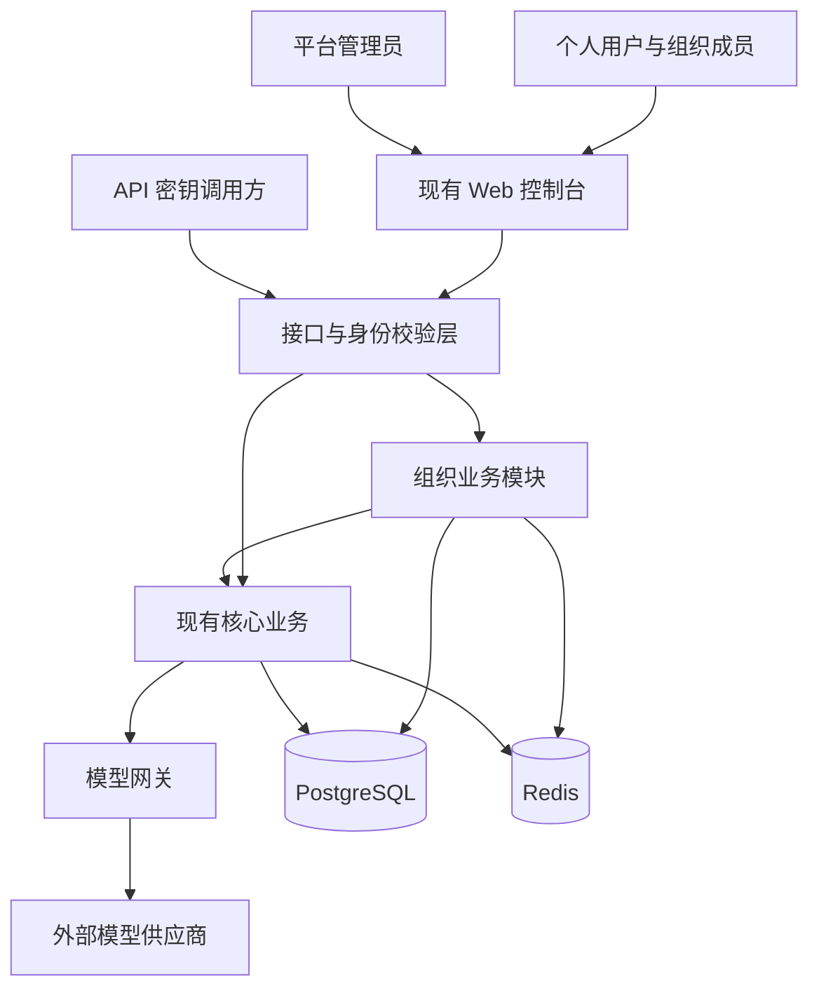
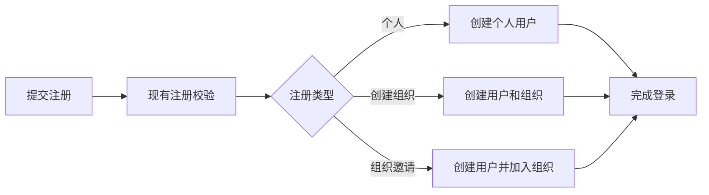
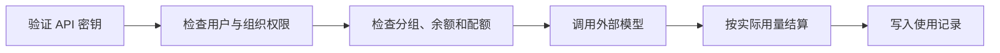

# Sub2API Enterprise 架构设计

版本：0.2.0

更新日期：2026-09-10

阶段：M1 架构设计确认稿，功能尚未实现

关联需求：[需求设计](./需求设计.md)

## 1. 架构目标

在现有 Sub2API 中增加组织能力，让个人用户和组织用户共用同一套注册、密钥、模型调用、计费和用量系统。

M1 保持现有单体部署，不增加独立服务。组织能力作为新的内部业务模块，与现有模块协作。

## 2. 系统边界

Sub2API 继续负责：

- 用户注册、登录和平台身份。
- 组织、成员、邀请码和成员配额。
- API 密钥及分组权限。
- 模型请求转发、计费和使用记录。
- 平台管理员与组织管理员的控制台能力。

模型供应商仍是系统外部依赖。M1 不接入 ACF 和 ManyRouter，也不改变现有模型转发职责。

## 3. 系统概览

组织业务模块只处理组织相关规则。模型转发、价格计算和供应商调度继续由现有核心业务负责。

## 4. 架构分层

| 分层 | 职责 |
|---|---|
| 前端展示层 | 注册、组织成员管理、组织用量和平台组织管理；复用现有页面框架和组件 |
| 接口与身份校验层 | 识别当前用户或 API 密钥，校验平台管理员、组织管理员和普通成员的访问范围 |
| 业务层 | 处理注册、组织、成员、分组、密钥、结算和用量规则 |
| 数据访问层 | 统一读写组织、用户、密钥、余额和使用记录，保证关键操作的一致性 |
| 基础设施层 | PostgreSQL 保存业务事实，Redis提供缓存和快速额度检查，现有网关连接外部模型 |

各层继续遵循仓库现有依赖方向：上层调用下层，业务规则不放进前端或数据库访问代码。

## 5. 业务模块关系

### 5.1 组织模块

组织模块负责组织、成员关系、组织邀请码、成员配额和组织分组范围。它向其他模块提供当前用户的组织身份、付款归属和可用分组。

### 5.2 注册模块

注册模块继续负责所有注册入口和现有校验。完成注册时调用组织模块，形成个人用户、组织创建者或组织普通成员。

用户、组织关系和邀请码状态需要一起成功或一起失败。

### 5.3 密钥与分组模块

密钥仍归创建密钥的用户。个人用户沿用现有分组规则；组织用户使用平台授予该组织的分组。

密钥创建和每次调用都检查组织分组，保证授权收回后已有密钥也无法继续使用该分组。

### 5.4 计费模块

计费模块继续使用现有价格和用量计算。个人调用由本人付款；组织普通成员调用由组织创建者付款，同时累计该成员的消费配额。

组织创建者自己的调用由本人付款，用量归本人。成员使用自己的密钥时，用量归成员。

### 5.5 使用记录模块

使用记录继续保存每次调用。组织管理员可以查看本组织范围，普通成员只能查看自己，平台管理员保持全平台权限。

组织统计在现有筛选和统计能力上增加组织范围与成员分布。

## 6. 主要业务流程

### 6.1 注册

开放注册和邀请码开关对所有注册入口保持一致。

### 6.2 API 调用与结算

成员、付款账号、密钥和组织归属在一次调用中保持明确。关键结算沿用现有幂等处理，避免请求重试导致重复扣费。

### 6.3 组织管理

平台管理员设置组织可用分组并查看全平台组织。组织管理员只管理自己的成员、邀请码和配额。所有组织范围都由服务端根据当前身份确定。

## 7. 数据与一致性原则

- PostgreSQL 是组织关系、权限、余额、配额和使用记录的业务依据。
- Redis只提升读取和额度检查速度，不能单独决定永久权限或余额。
- 注册和消费结算属于关键事务，相关数据需要一起提交。
- 权限或配额修改先写入数据库，再更新或清理缓存。
- 历史用量保存调用发生时的组织归属，成员停用不会改变历史记录。
- 现有个人用户没有组织关系，升级后继续执行原有业务。

## 8. 权限架构

平台权限与组织权限分开判断：

- 平台管理员可以管理全平台用户、组织和分组授权。
- 组织管理员只拥有本组织的成员、邀请码、配额和用量管理权限。
- 普通组织成员管理自己的密钥并查看自己的用量。
- 个人用户保持原有能力。

前端只负责展示可用入口。后端对每次读取和修改重新校验范围，防止通过修改请求访问其他组织。

## 9. 运行与故障边界

- 对外运营使用默认完整运行模式，组织注册、管理和计费都在该模式工作。
- 数据库不可用时，涉及组织权限或结算的请求停止处理，避免产生无法确认的归属和费用。
- 缓存异常沿用现有降级和告警能力，不能放宽组织权限。
- 外部模型调用继续使用现有超时、重试和错误处理规则。
- 组织功能发布不要求迁移现有个人用户，也不影响已有个人密钥。

## 10. 后续阶段衔接

- M2 只调整整体视觉和控制台体验，继续使用 M1 的组织业务边界。
- M3 将 ACF 接入接口与身份校验边界，不进入组织结算核心。
- M4 将 ManyRouter 接入模型供应和线路管理边界，不接管用户、组织、余额和使用记录。

各阶段开始前再讨论对应模块，并编写模块设计文档。

## 11. M1 架构边界

M1 保持单组织、单组织管理员和统一付款账号。暂不提供多组织身份、部门、项目层级、成员迁移、组织解散、管理员转让、ACF 接入和 ManyRouter 接入。

## 12. 确认记录

| 日期 | 版本 | 内容 |
|---|---|---|
| 2026-09-10 | 0.2.0 | 确认沿用现有单体架构，以组织业务模块接入注册、密钥、分组、计费和使用记录；后续按里程碑逐个设计模块 |

## 13. 变更记录

| 日期 | 版本 | 内容 |
|---|---|---|
| 2026-09-10 | 0.1.0 | 基于现有 Sub2API 单体结构形成 M1 架构设计草案 |
| 2026-09-10 | 0.2.0 | 根据后续模块设计指令将架构设计更新为确认稿 |
