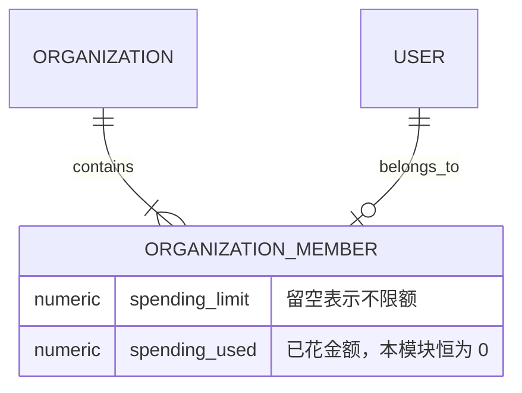

# 成员管理与消费配额模块设计

模块定位：让组织管理员看到并管理本组织成员，给成员设定可消费的金额上限。

对应代码：[成员配额服务](../../backend/internal/service/organization_member.go) · [成员数据访问](../../backend/internal/repository/organization_member_repo.go) · [成员接口](../../backend/internal/handler/organization_member_handler.go) · [组织路由](../../backend/internal/server/routes/organization.go) · [组织页](../../frontend/src/views/user/OrganizationView.vue)

所属里程碑：[M1 企业组织最小闭环](../roadmap.md#m1-企业组织最小闭环)

当前状态：进行中

设计状态：已确认

最近更新时间：2026-09-11

相关文档：[需求设计](../需求设计.md) · [架构设计](../架构设计.md) · [组织身份与注册](./组织身份与注册.md)

## 1. 职责与边界

本模块负责：

- 组织管理员分页查看、搜索本组织成员，列表包含管理员本人。
- 启用、停用本组织普通成员。
- 给单个成员设定消费上限。
- 选中多个普通成员，把一笔总额均分成各自的新上限。
- 把已有的组织邀请码入口合并进成员管理页面，形成一个完整的组织页。

本模块暂不负责：

- 成员花钱时扣谁的余额、已用金额怎么累计、调用前怎么拦截。这些由[组织结算](./组织结算.md)接入。
- 组织可用分组和密钥权限，由[组织分组与密钥权限](./组织分组与密钥权限.md)实现。
- 组织整体用量、成员分布统计，由「组织用量与平台管理」模块实现。
- 移出成员、退出组织、转让组织管理员、跨组织迁移，留到 M1 之后评估。

## 2. 现有实现基础

- 组织、成员关系和两类邀请码已经由[组织身份与注册](./组织身份与注册.md)建好，一个账号最多一条成员关系。
- 平台管理员的用户管理已经有成熟的分页、搜索、改状态能力，本模块沿用同样的行为，但接口另开一组、范围限定在本组织。
- 用户状态改完之后必须清理鉴权缓存，平台管理员那条路径已经这么做，本模块复用同一个清理动作。
- 计费金额在整个仓库统一按小数点后 8 位存储和取整，配额沿用同一精度。

## 3. 核心业务对象

### 3.1 组织成员

成员就是已有的成员关系记录，本模块在它上面补两个金额字段：消费上限、已用金额。组织管理员自己那条记录不使用这两个字段，他花的钱一直走自己的账号余额。

### 3.2 消费上限

上限表示这个成员累计最多可以花掉多少钱，取值含义如下：

| 取值 | 含义 |
|---|---|
| 留空 | 不限额，新成员默认就是这个状态，只受组织管理员账号余额约束 |
| 0 | 完全不能消费 |
| 大于 0 | 最多累计消费这么多 |

这里的 0 表示禁止，和仓库里密钥额度、每分钟请求数上限中「0 表示不限制」的约定相反，和按平台划分的那套额度约定一致。字段注释、接口文档和界面都要写明，避免被按「0 等于不限」误读。

### 3.3 已用金额

已用金额表示这个成员到目前为止一共花掉了多少。剩余额度等于上限减已用金额；上限留空时不计算剩余。

本模块只建立这个字段并把它展示出来，真正的写入发生在[组织结算](./组织结算.md)。

## 4. 数据关系

两个金额字段直接加在成员关系表上，不另开表。理由：一个账号最多一条成员关系，天然唯一；列成员列表时不用多做一次关联查询。

迁移保持幂等，老数据不回填，已有成员升级后都是不限额状态。

## 5. 成员列表

- 范围固定为当前登录账号所属组织，客户端传过来的组织标识一律忽略。
- 支持按邮箱、用户名模糊搜索，支持按启用/停用筛选，按加入时间倒序分页。
- 列表返回：邮箱、用户名、状态、是否为组织管理员、消费上限、已用金额、剩余额度、加入时间。
- 不返回余额、密码、备注等与本模块无关的账号资料。

## 6. 成员状态

- 只能操作本组织的普通成员。
- 组织管理员不能停用自己，也不能操作平台管理员账号。
- 停用只改账号状态，成员关系、消费上限、已用金额、密钥和历史记录全部保留。
- 恢复后继续按该成员当前的上限执行。
- 改完状态立即清理鉴权缓存，否则停用会在一个缓存周期内不生效。

## 7. 上限调整

### 7.1 单人调整

- 传一个金额表示设为该值，传空表示改为不限额。
- 金额不能为负，按 8 位小数取整后保存。
- 允许把上限调到比已用金额还低。已发生的消费一分不动，这个成员的剩余额度按 0 展示并在列表里标出来。
- 不能给组织管理员本人设上限。

### 7.2 批量均分

- 只接受本组织的普通成员，列表里出现管理员本人或其他组织的账号时整笔拒绝。
- 均分把管理员填的总额等额分成选中人数份，作为每个人的新上限，覆盖原有上限（原本不限额的也会被覆盖成数值）。
- 按 8 位小数分，除不尽的余数按最小单位依次补给排序靠前的成员，保证各人新上限之和精确等于填写的总额。
- 均分只改上限，不动已用金额，也不动任何真实余额。
- 一笔均分要么全部成员改完，要么一个都不改。

## 8. 对外能力

| 接口 | 作用 |
|---|---|
| 查询成员列表 | 分页、搜索、筛选本组织成员 |
| 修改成员状态 | 启用或停用一个普通成员 |
| 修改成员上限 | 给一个普通成员设定或取消消费上限 |
| 均分上限 | 把一笔总额均分给选中的普通成员 |

四个接口都挂在组织路由下，只有组织创建者可以调用。已有的组织信息查询和邀请码接口保持不变。

## 9. 前端交互

组织页从「只有邀请码」扩展成一个完整页面：

- 上半部分是成员列表，带搜索、状态筛选和分页，支持多选。
- 每行可以直接改这个人的上限，或启用、停用。
- 选中多人后出现均分入口，填一笔总额，提交前先显示每人将拿到多少。
- 下半部分保留邀请码列表和创建按钮。
- 普通成员进入这个页面只看到组织名称，看不到成员列表和任何管理操作。

界面沿用现有表格、分页、搜索、弹窗和主题组件，整体视觉统一留到 M2。按照前端守则，页面只放完成操作必需的信息，不加状态说明和后续规划文案。

## 10. 权限与安全

- 组织身份由服务端根据登录账号查出来，前端传入的组织标识和角色一律忽略。
- 每个写操作都要重新确认：调用者是组织创建者，目标成员属于同一组织。
- 跨组织操作、操作自己、操作平台管理员都返回稳定的业务错误，不暴露其他组织是否存在。
- 错误信息不输出其他成员的邮箱、余额等资料。

## 11. 当前实现

- 成员关系表增加“消费上限”和“已消费金额”两列，并提供幂等迁移。存量成员不回填，升级后都是不限额。
- 组织路由下新增四个接口：成员列表、改状态、改上限、均分上限。组织身份由服务端按登录账号查出，请求里不接受组织标识。
- 成员列表按加入时间倒序分页，支持邮箱和用户名模糊搜索、按启用停用筛选，已软删除的账号不出现在列表里。
- 停用、启用复用平台管理员改用户状态的同一条落库路径，并在改完后清理鉴权缓存。
- 上限支持设数值、设 0、改回不限额；均分在一个数据库事务里写入，目标里出现管理员本人、外组织成员或不存在的账号时整笔拒绝。
- 组织页扩展为“成员列表 + 邀请码”一个页面，成员可多选后均分，提交前显示每人将拿到多少。普通成员进入该页面只看到组织名称。

## 12. 验证方式

### 12.1 核心业务测试

- 成员列表只返回本组织成员，搜索和分页结果正确。
- 组织管理员之外的账号调用任何管理接口都被拒绝。
- 用别的组织的成员标识调用改状态、改上限、均分，全部被拒绝。
- 停用自己、停用平台管理员被拒绝。
- 上限支持设数值、设 0、改回不限额；负数被拒绝。
- 上限调到低于已用金额时保存成功，已用金额不变。
- 均分金额守恒：各人新上限之和精确等于填写的总额，包括除不尽的场景。
- 均分列表里混入管理员本人或外组织成员时整笔失败，没有任何成员被改动。
- 停用成员后鉴权缓存被清理。

### 12.2 前端验证

- 测试均分预览的金额计算，包括除不尽和金额为 0 的情况。
- 测试普通成员看不到管理入口。
- 人工检查列表、弹窗在桌面和移动端的显示。

按仓库规范，纯展示层（配色、布局、组件外观）不写单测。

### 12.3 当前验证结果

- 后端全量测试、静态检查（golangci-lint v2.13.1）和生产构建通过。
- 新增服务层单测覆盖越权拦截、成员保护、状态规则、上限取值和均分金额守恒。
- PostgreSQL 18 隔离环境跑通三个仓储集成用例：组织范围隔离、搜索与软删除过滤、上限批量写入的全成功或全不生效。
- 路由注册测试确认按成员标识的路径和固定的均分路径可以共存。
- 前端 269 个测试文件、1979 个用例，以及规范检查、类型检查通过；新增均分预览的纯函数单测。
- 按项目约束未启动开发服务器，三个接口的真实运行验收待人工完成。

### 12.4 模块完成依据

1. 四个接口都能通过真实请求完成对应操作。
2. 越权、均分守恒和状态规则的测试通过。
3. 后端、前端相关测试及项目门禁通过。
4. 形成可追溯的提交记录。

## 13. 决策记录

| 决策 | 结论 | 说明 |
|---|---|---|
| 上限取值语义 | 留空为不限额，0 为禁止消费 | 新成员默认不限额 |
| 已用金额累计 | 放到[组织结算](./组织结算.md)，已完成 | 累计已用和切换付款账号改的是同一条扣费语句，一起做只写一轮幂等和并发测试 |
| 上限低于已用金额 | 允许保存 | 需求要求配额调整保留已发生的消费记录，剩余按 0 展示 |
| 冻结金额 | 本模块不引入，已由[组织结算](./组织结算.md)补上 | 批量出图的预扣现在会占住成员额度，剩余额度改为「上限减已消费减已冻结」 |

需要留意：新成员默认不限额，意味着拿组织邀请码注册进来的人当场就能开始消耗组织管理员的余额，直到管理员手动设上限。如果后续要收紧，可以在邀请码上带一个默认上限，本模块的数据结构不需要改。

## 14. 待扩展项

- 成员花钱时扣组织管理员余额、累计已用金额、调用前拦截，已由[组织结算](./组织结算.md)完成。
- 邀请码携带默认消费上限，等上一条落地后再评估。
- 移出成员、组织解散、管理员转让，留到 M1 之后。

## 15. 改动历史

| 日期 | 内容 |
|---|---|
| 2026-09-11 | 建立模块设计，确定上限取值语义、均分规则和本模块与结算模块的分工 |
| 2026-09-11 | 完成后端、前端实现与自动化验证，等待三个接口的真实运行验收 |
