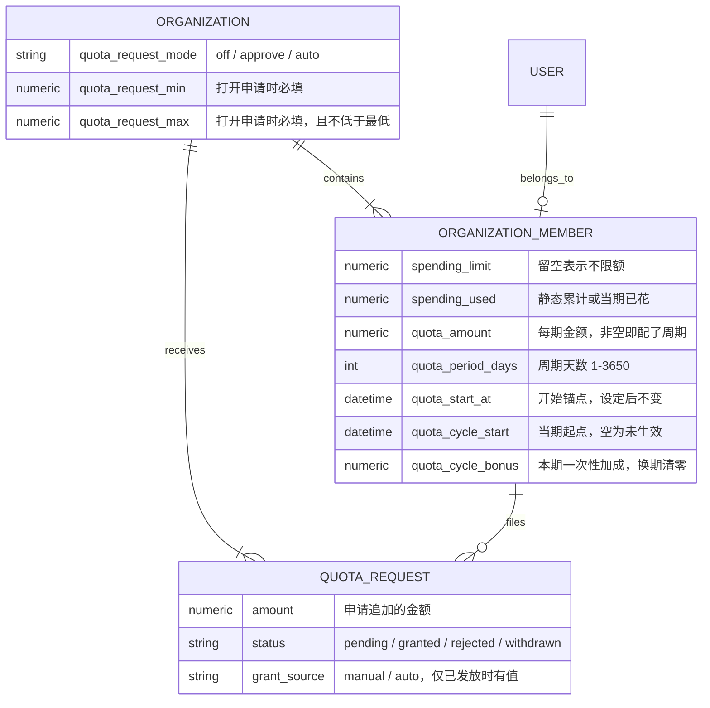

# 成员管理与消费配额模块设计

模块定位：让组织管理员看到并管理本组织成员，给成员设定可消费的金额上限；成员可按组织策略申请追加额度。

对应代码：[成员配额服务](../../backend/internal/service/organization_member.go) · [成员数据访问](../../backend/internal/repository/organization_member_repo.go) · [成员接口](../../backend/internal/handler/organization_member_handler.go) · [组织路由](../../backend/internal/server/routes/organization.go) · [组织页](../../frontend/src/views/user/OrganizationView.vue) · [用户仪表盘](../../frontend/src/views/user/DashboardView.vue)

所属里程碑：[M1 企业组织最小闭环](../roadmap.md#m1-企业组织最小闭环)

当前状态：进行中（周期配额与配额申请制已完成自动化验证，真实运行验收待做）

设计状态：已确认

最近更新时间：2026-09-15

相关文档：[需求设计](../需求设计.md) · [架构设计](../架构设计.md) · [组织身份与注册](./组织身份与注册.md) · [组织结算](./组织结算.md)

## 1. 职责与边界

本模块负责：

- 组织管理员分页查看、搜索本组织成员，列表包含管理员本人。
- 启用、停用本组织普通成员。
- 给单个成员设定消费上限。
- 给单个成员设定周期配额：每期金额 + 周期天数 + 开始时间，到期自动恢复额度。
- 选中多个普通成员，把一笔总额均分成各自的新上限。
- 选中多个普通成员，统一发放同一份周期配额。
- 把已有的组织邀请码入口合并进成员管理页面，形成一个完整的组织页。
- 组织管理员配置本组织的配额申请策略（关闭 / 先批后加 / 即申即加，以及单次最低、最高金额）。
- 普通成员按策略提交配额申请；先批后加由管理员通过或驳回，即申即加提交当下加额度并留档。
- 普通成员在自己的仪表盘看到「组织配额」卡：剩余额度、周期重置时间、符合条件时的申请按钮。

本模块暂不负责：

- 成员花钱时扣谁的余额、已用金额怎么累计、调用前怎么拦截。这些由[组织结算](./组织结算.md)接入。
- 组织可用分组和密钥权限，由[组织分组与密钥权限](./组织分组与密钥权限.md)实现。
- 组织整体用量、成员分布统计，由[组织用量与平台管理](./组织用量与平台管理.md)实现。
- 移出成员、退出组织、转让组织管理员、跨组织迁移，留到 M1 之后评估。
- 账号余额、充值、兑换、余额提醒。申请制不改这些数字，成员顶栏和余额卡继续显示自己账号里的钱。

## 2. 现有实现基础

- 组织、成员关系和两类邀请码已经由[组织身份与注册](./组织身份与注册.md)建好，一个账号最多一条成员关系。
- 平台管理员的用户管理已经有成熟的分页、搜索、改状态能力，本模块沿用同样的行为，但接口另开一组、范围限定在本组织。
- 用户状态改完之后必须清理鉴权缓存，平台管理员那条路径已经这么做，本模块复用同一个清理动作。
- 计费金额在整个仓库统一按小数点后 8 位存储和取整，配额沿用同一精度。

## 3. 核心业务对象

### 3.1 组织成员

成员就是已有的成员关系记录，本模块在它上面补两个金额字段：消费上限、已用金额。组织管理员自己那条记录不使用这两个字段，他花的钱一直走自己的账号余额。

### 3.2 消费上限

上限表示这个成员累计最多可以花掉多少钱，取值含义如下：

| 取值 | 含义 |
|---|---|
| 留空 | 不限额，新成员默认就是这个状态，只受组织管理员账号余额约束 |
| 0 | 完全不能消费 |
| 大于 0 | 最多累计消费这么多 |

这里的 0 表示禁止，和仓库里密钥额度、每分钟请求数上限中「0 表示不限制」的约定相反，和按平台划分的那套额度约定一致。字段注释、接口文档和界面都要写明，避免被按「0 等于不限」误读。

### 3.3 已用金额

已用金额表示这个成员到目前为止一共花掉了多少。剩余额度等于上限减已用金额；上限留空时不计算剩余。

本模块只建立这个字段并把它展示出来，真正的写入发生在[组织结算](./组织结算.md)。

### 3.4 周期配额

静态上限是一次性的总额：用完只能人工再调。周期配额把它变成按期发放：设定每期金额、周期天数和一个开始时间，每个周期到期后额度自动恢复。

成员关系表为此增加四列：

| 列 | 含义 |
|---|---|
| 每期金额 | 该周期内最多可消费的金额，0 表示每期都禁止消费；非空即代表配了周期配额 |
| 周期天数 | 每期长度，取值 1 到 3650 天 |
| 开始锚点 | 管理员选的开始时间，设定后不变，作为周期网格的原点 |
| 当期起点 | 当前周期从什么时候开始；为空表示锚点在未来、尚未生效 |

生效规则只有一条：配了周期配额且当期起点非空时，按周期模式执行，上限取每期金额，已用金额按当期累计；其余情况（没配、或锚点还在未来）都按静态上限执行。锚点在未来时，生效前沿用该成员原本的静态状态——原来不限额就还不限额，原来有静态上限就还按旧上限，到点后第一期自动开始。

三种子设置时机的行为：

| 开始时间选择 | 行为 |
|---|---|
| 现在（默认） | 第一期立刻开始，已用金额清零 |
| 过去 | 锚点对齐到所选时刻（例如设成每月 1 号），已过掉的周期一步折算掉，直接进入当前期，已用清零 |
| 未来 | 生效前维持静态状态，越过锚点后第一期自动开始 |

取消周期配额即回到静态模式：四个周期列清空，已用金额不清零，从取消那一刻起按静态上限继续比较。

周期模式的剩余额度等于「本期可花上限减当期已消费减已冻结」。本期可花上限默认等于每期金额；配额申请批准后的一次性加成只加在本期可花上限上，不改每期金额。上一期没用完的额度（含一次性加成）到期清零，不累积到下一期——要累积直接调高静态上限即可，没必要做周期。

## 4. 数据关系


```mermaid
erDiagram
    ORGANIZATION ||--|{ ORGANIZATION_MEMBER : contains
    USER ||--o| ORGANIZATION_MEMBER : belongs_to
    ORGANIZATION ||--|{ QUOTA_REQUEST : receives
    ORGANIZATION_MEMBER ||--o{ QUOTA_REQUEST : files
    ORGANIZATION {
        string quota_request_mode "off / approve / auto"
        numeric quota_request_min "打开申请时必填"
        numeric quota_request_max "打开申请时必填，且不低于最低"
    }
    ORGANIZATION_MEMBER {
        numeric spending_limit "留空表示不限额"
        numeric spending_used "静态累计或当期已花"
        numeric quota_amount "每期金额，非空即配了周期"
        int quota_period_days "周期天数 1-3650"
        datetime quota_start_at "开始锚点，设定后不变"
        datetime quota_cycle_start "当期起点，空为未生效"
        numeric quota_cycle_bonus "本期一次性加成，换期清零"
    }
    QUOTA_REQUEST {
        numeric amount "申请追加的金额"
        string status "pending / granted / rejected / withdrawn"
        string grant_source "manual / auto，仅已发放时有值"
    }
```

消费上限和已用金额直接加在成员关系表上，不另开表。理由：一个账号最多一条成员关系，天然唯一；列成员列表时不用多做一次关联查询。

申请流水另开一张表。成员行只表示「现在能花多少」；申请表表示要过、批过、自动发过的历史。即申即加也写这张表，归档才站得住。

组织表增加申请策略三列：模式、单次最低、单次最高。老组织升级后模式为关闭，行为与现在一致。

成员行增加「本期一次性加成」：只在周期生效中有意义，换期或取消周期时清零。静态上限没有这一列的用法，申请批准直接改消费上限。

迁移保持幂等，老数据不回填，已有成员升级后都是不限额状态。

## 5. 成员列表

- 范围固定为当前登录账号所属组织，客户端传过来的组织标识一律忽略。
- 支持按邮箱、用户名模糊搜索，支持按启用/停用筛选，按加入时间倒序分页。
- 列表返回：**组织内名称（最左一列）**、邮箱、用户名、状态、是否为组织管理员、消费上限、已用金额、剩余额度、加入时间。
- 组织内名称由注册时本人填写、管理员可改（见[组织身份与注册](./组织身份与注册.md)）；没填的老成员名称列显示「-」，邮箱照常可辨。
- 改名走成员行的「改名」入口（管理员本人也可改自己），名称必填 1 到 50 字，不限制重名。
- 组织相关的成员展示（成员分布卡片、使用记录成员列、成员筛选下拉、配额申请列表）一律优先组织内名称、回退邮箱。
- 不返回余额、密码、备注等与本模块无关的账号资料。

## 6. 成员状态

- 只能操作本组织的普通成员。
- 组织管理员不能停用自己，也不能操作平台管理员账号。
- 停用只改账号状态，成员关系、消费上限、已用金额、密钥和历史记录全部保留。
- 恢复后继续按该成员当前的上限执行。
- 改完状态立即清理鉴权缓存，否则停用会在一个缓存周期内不生效。

## 7. 上限调整

### 7.1 单人调整

- 传一个金额表示设为该值，传空表示改为不限额。
- 金额不能为负，按 8 位小数取整后保存。
- 允许把上限调到比已用金额还低。已发生的消费一分不动，这个成员的剩余额度按 0 展示并在列表里标出来。
- 不能给组织管理员本人设上限。

### 7.2 批量均分

- 只接受本组织的普通成员，列表里出现管理员本人或其他组织的账号时整笔拒绝。
- 均分把管理员填的总额等额分成选中人数份，作为每个人的新上限，覆盖原有上限（原本不限额的也会被覆盖成数值）。
- 按 8 位小数分，除不尽的余数按最小单位依次补给排序靠前的成员，保证各人新上限之和精确等于填写的总额。
- 均分只改上限，不动已用金额，也不动任何真实余额。
- 一笔均分要么全部成员改完，要么一个都不改。
- 上限的三种模式互斥：改静态上限（单人或均分）会同时清掉周期配额，明确表示这个成员退出周期模式。

### 7.3 周期配额设置

- 单人设置传一份完整周期配置：每期金额、周期天数、开始时间；传空表示取消周期、回到静态。
- 每期金额允许 0（每期都禁止消费），不允许负数，按 8 位小数取整。
- 周期天数必须 between 1 和 3650。
- 开始时间由前端的时间选择器给出，默认现在；可以选过去（对齐锚点）或未来（到点生效）。
- 设置周期不动静态上限两列：锚点在未来时生效前要用静态状态顶着，取消周期后也回到这个静态状态。
- 取消周期或改配一份新的周期时，本期一次性加成清零。加成只跟「当前这一期」绑定，换一套周期配置等于换一期。

### 7.4 批量周期发放

- 选中多个普通成员，统一套同一份周期配置（每期金额、周期天数、开始时间人人相同），适合「每人每 30 天 100」的月度发放。
- 校验与均分一致：只接受本组织的普通成员，混入管理员本人、外组织成员或不存在的账号时整笔拒绝。
- 一笔发放要么全部成员改完，要么一个都不改。

## 7A. 周期怎么自动恢复：惰性推进

周期到期不靠定时任务，靠「碰到额度时顺手推进」：

- 任何要读或写成员额度的时刻（成员调用前的判断、扣费事务、预扣冻结、管理页列表），先看现在有没有越过「当期起点 + 周期天数」。
- 越过了就把当期起点一次推进 k 个整周期（k 为已经过掉的期数），当期已消费清零，本期一次性加成清零，在一个数据库行锁事务里完成。停机、成员几期没登录都不怕，下一次碰到额度一步推到当前期。
- 锚点在未来时，越过锚点同样在这些时刻被发现：第一期从锚点起算，已用清零，加成清零，进入周期模式。
- 不引入后台定时器，就少一处会挂、会漂移的东西。

推进与消费的并发靠既有的行锁串行：边界瞬间一笔在途扣费可能计入新的一期，与既有「并发请求可能略微超出上限」的容差口径一致。推进时冻结金额不清——冻结是真实占着的钱，带进新期继续占新期的额度。一次性加成不带进新期。

## 7B. 配额申请制

管理员照旧能直接改上限、均分、设周期。申请制是成员自己开口要额度的那条路，不替代管理员发放。

申请不加余额、不预扣、不转账，只改这个人当前能花的上限。组织付款账号没钱，额度加了也调不成。

### 7B.1 组织策略

挂在组织上，只对本组织普通成员生效。组织管理员本人没有成员额度，不能申请。平台管理员不配这个。

| 模式 | 成员提交后 | 适合谁 |
|---|---|---|
| 关闭（默认） | 不能申请，入口不出现 | 继续只由管理员发额度 |
| 先批后加 | 先落一笔待处理，额度不动；管理员通过后才加 | 要控人、要过问理由 |
| 即申即加 | 提交当下就加，记录记成已发放 | 信任成员、只要留痕 |

老组织升级后是关闭，行为与现在一致。

打开「先批后加」或「即申即加」时，单次最低、单次最高都必填：都大于 0，最高不低于最低，精度与现有金额相同（小数点后 8 位）。关掉申请时这两项不用填。金额不能不限——即申即加尤其靠这道闸，否则成员填一个很大的数就等于自己给自己开额度。

每人同时只能有一笔待处理（只约束先批后加）。即申即加没有待处理，这条用不上。

第一期不做「低于某金额自动发、超过再审」。那是前两种的混合，真需要可以后加。

### 7B.2 成员申请什么

申请只表达一件事：再追加一笔金额。必须落在组织配的最低、最高闭区间里。

不申请「改成不限额」，不申请「改周期天数」，不申请「把上限改成某个绝对值」，不申请「提高每期固定发多少」。那些仍是管理员的事。

理由可选，有字数上限。

发到哪里，跟这个人**批准那一刻**（即申即加则是提交那一刻）怎么花额度对齐：

| 这个人现在 | 发放后 |
|---|---|
| 固定累计上限（含上限为 0） | 上限加上这笔，已用、冻结不动 |
| 周期配额已生效 | 只补给当期：本期一次性加成加上这笔，每期金额、周期天数、锚点不变。下期还按原来的每期金额走 |
| 周期已配、锚点还在未来 | 按现在顶着的静态上限加 |
| 不限额 | 没有「再要一点」的对象，入口隐藏，提交直接拒 |

周期走「当期补给、下期清掉」——成员开口通常是「这期不够了」，不是「以后每月都加」。要改每期固定发多少，管理员继续用现有的设周期入口。

申请提交时拍一张快照：当时哪种模式、当时上限或每期金额、当时已用。归档用。发放看批准（或自动发放）那一刻的生效模式，不拿快照当发放依据。

中间若被改成不限额、被停用、被移出可申请范围：待处理单在审批时作废（记拒绝或失效，额度不动）。

管理员直接改上限、均分、设周期与申请互不影响。申请只是成员发起的那条路。

加额度成功后，走现在改上限已经在做的事：清这个人的鉴权缓存，调用侧马上按新剩余判断。

### 7B.3 流程

```text
成员提交
  → 组织是「关闭」：拒
  → 不在最低最高区间 / 已有待处理 / 本人是管理员 / 不限额 / 已停用：拒
  → 「即申即加」：同一事务里加额度 + 记已发放（来源=自动）
  → 「先批后加」：只记待处理

管理员通过
  → 再校验一遍这个人现在还能不能加
  → 按 7B.2 加额度
  → 记已发放（来源=人工），可写审批备注

管理员驳回 / 成员撤待处理单
  → 额度不动，留下原因
```

### 7B.4 申请流水

每笔至少留下：谁、哪个组织、要多少、理由；状态（待处理 / 已发放 / 已驳回 / 已撤回）；发放来源（人工通过 / 提交即发，仅已发放时有值）；实际加上去的金额；提交时的模式快照；审批人、审批时间、审批备注。

列表：管理员按组织筛待处理；成员只看自己的。

调用热路径不读申请表，只认成员身上的生效上限（周期则是每期金额加本期一次性加成）。

### 7B.5 成员仪表盘上的组织配额卡

账号余额、顶栏余额、充值、兑换、余额提醒全部不动。组织普通成员的仪表盘第一行、紧挨现有余额卡右侧，多一张「组织配额」卡。组织管理员和个人用户没有这张卡。简易模式现在把余额卡藏了，配额卡照样出——成员真正受约束的是额度。

拉仪表盘概况时多带一块组织配额，不必另开页面请求。这块只在组织普通成员时出现，查的是成员身上现在的额度，和结算判断用的是同一套数。

| 情况 | 卡上数字 | 重置时间 | 申请按钮 |
|---|---|---|---|
| 有上限，还剩一笔 | 还能花的金额 | 周期生效中才显示本期截止 | 组织开了申请才出现 |
| 上限为 0，或已经花完 | `0` | 同上 | 同上 |
| 周期配额生效中 | 本期剩余 | 显示本期何时重置 | 同上 |
| 不限额 | 「不限额」，不写 `0` | 不显示 | 不出现 |
| 组织关了申请 | 仍显示剩余或不限额 | 周期生效中仍显示重置时间 | 不出现 |

不限额显示「不限额」三个字，避免写成 `0` 让人以为没额度。申请按钮还要这个人不是不限额。点开弹窗：金额、可选理由、提交。金额被组织配的最低、最高卡住。自己的申请记录放组织页，不塞进仪表盘。

有这张卡时，仪表盘第一行改成五列（大屏），余额和组织配额并排；没这张卡时保持现在的四列。手机两列：余额和组织配额同一行。

申请提交后把这一块再拉一次。即申即加数字立刻变大；先批后加数字先不变，组织页能看到待处理。

### 7B.6 组织页

不新开菜单、不新开审批页。管理员看记录、做审批，都在现有组织页。

组织管理员从上到下：

1. 标题行（现有：组织名、创建邀请码）。
2. **配额申请**整块：
   - 策略：关闭 / 先批后加 / 即申即加；打开后填单次最低、最高。
   - 下面一张表：谁、要多少、理由、状态、提交时间。默认只看待处理；可切到全部看历史（已发放、已驳回、已撤回）。
   - 待处理行上直接「通过」「驳回」。驳回可填一句原因。不另开审批页。
   - 先批后加且有待处理时，这一块排在成员表上面，避免漏批。没有待处理、或模式不是先批后加时，排在成员表和邀请码之间。
   - 即申即加没有待处理，表里就是已发放流水，没有通过/驳回按钮。
   - 关闭申请时只留策略，表不占地方。
3. 成员表、改额度、均分、周期发放（现有）。
4. 邀请码（现有）。

普通成员：组织页看到组织名称和自己的申请记录，看不到成员列表，也不能批别人的单。申请入口只在仪表盘的组织配额卡上，本页不再做一份表单。

组织管理员的仪表盘没有组织配额卡，也不在仪表盘批申请。

## 8. 对外能力

| 接口 | 作用 | 谁能调 |
|---|---|---|
| 查询成员列表 | 分页、搜索、筛选本组织成员，含各自的配额模式与本期窗口 | 组织创建者 |
| 修改成员状态 | 启用或停用一个普通成员 | 组织创建者 |
| 修改成员名称 | 改一个成员（含管理员本人）在组织中的名称，1 到 50 字必填 | 组织创建者 |
| 修改成员上限 | 给一个普通成员设定或取消消费上限（静态模式，同时清周期配置） | 组织创建者 |
| 设定周期配额 | 给一个普通成员设置或取消周期配额 | 组织创建者 |
| 均分上限 | 把一笔总额均分给选中的普通成员（静态模式） | 组织创建者 |
| 批量周期发放 | 给选中的普通成员统一套同一份周期配置 | 组织创建者 |
| 读取 / 修改申请策略 | 模式、单次最低、单次最高 | 组织创建者 |
| 提交配额申请 | 追加一笔金额，可选理由 | 本组织普通成员 |
| 撤回待处理申请 | 只撤自己的待处理单 | 申请人本人 |
| 列出申请 | 管理员看本组织；成员只看自己的 | 组织创建者或申请人 |
| 通过 / 驳回申请 | 先批后加的待处理单 | 组织创建者 |

前六个接口都挂在组织路由下，只有组织创建者可以调用。已有的组织信息查询和邀请码接口保持不变。

仪表盘概况接口在组织普通成员时多带一块组织配额（剩余或不限额、周期重置时间、能否申请、能申请时的最低最高）。个人用户和组织管理员不带这块。这块走现有仪表盘查询，不另开页面请求。

## 9. 前端交互

组织页从「只有邀请码」扩展成一个完整页面：

- 上半部分是成员列表，带搜索、状态筛选和分页，支持多选。
- 每行可以改这个人的配额或启用、停用。配额编辑是三选一：不限额、固定累计上限、周期配额；选周期时填每期金额、周期天数和开始时间（默认现在，可改）。
- 周期配额在列表里显示本期剩余和本期截止时间；尚未生效的显示生效日期和发放节奏。
- 选中多人后出现均分入口（静态）和周期发放入口（同一份配置发给所有人）。
- 下半部分保留邀请码列表和创建按钮。
- 组织管理员在本页「配额申请」整块配置策略，并在同一张表上查看记录、通过或驳回。有待处理时这一块排在成员表上面，否则排在成员表和邀请码之间。不新开审批页。
- 普通成员进入这个页面只看到组织名称和自己的申请记录，看不到成员列表和任何管理操作。申请入口在仪表盘的组织配额卡上，不在本页再做一份表单。

组织普通成员的仪表盘第一行、余额卡右侧多一张「组织配额」卡，规则见 7B.5。

界面沿用现有表格、分页、搜索、弹窗和主题组件，整体视觉统一留到 M2。按照前端守则，页面只放完成操作必需的信息，不加状态说明和后续规划文案。统计卡只放标签、数字、注解；周期重置时间作为注解，不另写说明文案。

## 10. 权限与安全

- 组织身份由服务端根据登录账号查出来，前端传入的组织标识和角色一律忽略。
- 每个写操作都要重新确认：调用者是组织创建者，目标成员属于同一组织。成员提交、撤回申请时，身份由服务端按登录账号确定，不能指定别人的成员标识。
- 跨组织操作、操作自己、操作平台管理员都返回稳定的业务错误，不暴露其他组织是否存在。
- 错误信息不输出其他成员的邮箱、余额等资料。
- 申请策略和申请记录不进入调用热路径。调用前两道闸仍只认成员身上的生效额度。

## 11. 当前实现

- 成员关系表增加“消费上限”和“已消费金额”两列，并提供幂等迁移。存量成员不回填，升级后都是不限额。
- 组织路由下新增四个接口：成员列表、改状态、改上限、均分上限。组织身份由服务端按登录账号查出，请求里不接受组织标识。
- 成员列表按加入时间倒序分页，支持邮箱和用户名模糊搜索、按启用停用筛选，已软删除的账号不出现在列表里。
- 停用、启用复用平台管理员改用户状态的同一条落库路径，并在改完后清理鉴权缓存。
- 上限支持设数值、设 0、改回不限额；均分在一个数据库事务里写入，目标里出现管理员本人、外组织成员或不存在的账号时整笔拒绝。
- 组织页扩展为“成员列表 + 邀请码”一个页面，成员可多选后均分，提交前显示每人将拿到多少。普通成员进入该页面只看到组织名称。
- 周期配额：成员表加每期金额、周期天数、开始锚点、当期起点四列（迁移 243，幂等不回填）；新增单人设定/取消与批量发放两个接口；模式解析集中在 `ResolveMemberQuotaState` 一个函数，设置接口、两道闸、扣费、预扣、鉴权快照、列表展示全部走它。
- 静态上限的单人修改和均分同时清掉周期配置，三种模式互斥；周期设置不动静态两列，锚点未来时生效前用静态顶着，取消即回到静态。
- 成员列表接口返回周期模式、每期金额、周期天数、本期起止；列表查询前把到期未推进的行先在行锁里推进，管理员看到的当期已用与剩余是真的。
- 组织页上限编辑改为三选一（不限额 / 固定累计 / 周期配额），周期含每期金额、天数与开始时间（留空从现在开始）；批量操作新增「周期发放」，均分保留；列表显示每期金额、周期与下期重置时间。
- 配额申请制（7B）已实现：组织表加申请策略三列（迁移 244），申请流水单独一张 `organization_quota_requests` 表（含提交时快照、审批人与备注，「每人一笔待处理」用部分唯一索引兜底），成员表加本期一次性加成列。
- 申请相关接口挂在组织路由下：读改策略、提交、撤回、列表（创建者看本组织、成员看自己）、通过、驳回；身份全部由服务端按登录账号确定。
- 即申即加与管理员通过在仓储的同一事务里完成：行锁内先做周期推进，再按此刻生效模式发放（周期生效进当期加成，其余进静态上限），成员已变不限额时申请自动作废为已驳回且额度不动；发放后清成员鉴权缓存。
- 生效上限统一改为「周期生效中取每期金额加本期一次性加成」：模式解析入口、鉴权快照、预扣的数据库判断、缓存回源推进、成员列表全部一致；换期、取消或改配周期、写静态上限与均分都清加成。
- 仪表盘概况接口在组织普通成员时附带组织配额块（剩余或不限额、本期截止、能否申请与最低最高）；前端第一行余额卡右侧多一张「组织配额」卡，可申请时带申请弹窗，不限额显示「不限额」且不出按钮。
- 组织页新增「配额申请」块：管理员配策略、看待处理 / 全部、通过 / 驳回（驳回可留备注），先批后加且有待处理时整块排在成员表上面；普通成员进入组织页看到自己的申请记录，可撤回待处理单。

## 12. 验证方式

### 12.1 核心业务测试

- 成员列表只返回本组织成员，搜索和分页结果正确。
- 组织管理员之外的账号调用任何管理接口都被拒绝。
- 用别的组织的成员标识调用改状态、改上限、均分，全部被拒绝。
- 停用自己、停用平台管理员被拒绝。
- 上限支持设数值、设 0、改回不限额；负数被拒绝。
- 上限调到低于已用金额时保存成功，已用金额不变。
- 均分金额守恒：各人新上限之和精确等于填写的总额，包括除不尽的场景。
- 均分列表里混入管理员本人或外组织成员时整笔失败，没有任何成员被改动。
- 停用成员后鉴权缓存被清理。

### 12.2 前端验证

- 测试均分预览的金额计算，包括除不尽和金额为 0 的情况。
- 测试普通成员看不到管理入口。
- 人工检查列表、弹窗在桌面和移动端的显示。

按仓库规范，纯展示层（配色、布局、组件外观）不写单测。

### 12.3 当前验证结果

- 后端全量测试、静态检查（golangci-lint v2.13.1）和生产构建通过。
- 新增服务层单测覆盖越权拦截、成员保护、状态规则、上限取值和均分金额守恒。
- PostgreSQL 18 隔离环境跑通三个仓储集成用例：组织范围隔离、搜索与软删除过滤、上限批量写入的全成功或全不生效。
- 路由注册测试确认按成员标识的路径和固定的均分路径可以共存。
- 前端 269 个测试文件、1979 个用例，以及规范检查、类型检查通过；新增均分预览的纯函数单测。
- 按项目约束未启动开发服务器，三个接口的真实运行验收待人工完成。
- 周期配额扩展（2026-09-15）：服务层单测覆盖锚点对齐（跨多期一步到位）、激活即推进（静态已用不带进第一期）、三种设置时机、取消保留已用、批量整笔拒绝、静态操作清周期、生效上限与剩余计算；PostgreSQL 18 隔离环境跑通周期写入三种模式、行锁推进、回源推进带本期截止、预扣按每期金额拦截、换期后恢复放行、未生效沿用静态；前端新增时间换算纯函数单测，vitest、类型检查、规范检查通过。全套集成测试在本机暴露三个用户相关套件互相污染的存量问题（干净主干同样失败，与本次无关），记录见 [review 剩余问题](../review/_剩余问题.md)。
- 配额申请制（2026-09-16）：后端全量测试、静态检查（golangci-lint）与生产构建通过，仓储包仅存的三个失败为 pg_dump 进程锁用例的 Windows 本机环境问题（与本次无关）；新增服务层单测覆盖策略校验（off 清空、必填区间、精度取整）、提交规则（关闭拒绝、区间校验、管理员 / 不限额 / 停用拒绝、待处理互斥、即申即加静态与周期两种发放、鉴权缓存清理）、审批（通过加额度、成员变不限额自动作废、非待处理拒绝、驳回留因、撤回权限）与仪表盘概况（管理员无卡、不限额无按钮、周期带截止、关闭只剩数字）；前端 270 个测试文件、1994 个用例及规范检查、类型检查、生产构建通过。真实运行验收待部署后人工进行。

### 12.4 模块完成依据

1. 四个接口都能通过真实请求完成对应操作。
2. 越权、均分守恒和状态规则的测试通过。
3. 后端、前端相关测试及项目门禁通过。
4. 形成可追溯的提交记录。

## 13. 决策记录

| 决策 | 结论 | 说明 |
|---|---|---|
| 上限取值语义 | 留空为不限额，0 为禁止消费 | 新成员默认不限额 |
| 已用金额累计 | 放到[组织结算](./组织结算.md)，已完成 | 累计已用和切换付款账号改的是同一条扣费语句，一起做只写一轮幂等和并发测试 |
| 上限低于已用金额 | 允许保存 | 需求要求配额调整保留已发生的消费记录，剩余按 0 展示 |
| 冻结金额 | 本模块不引入，已由[组织结算](./组织结算.md)补上 | 批量出图的预扣现在会占住成员额度，剩余额度改为「上限减已消费减已冻结」 |
| 周期到期恢复 | 惰性推进，不加定时任务 | 碰到额度时在行锁事务里顺手推进，停机不漏不重；后台定时器多一处会挂的东西 |
| 未来开始时间 | 生效前维持静态状态 | 管理员常要「下个月 1 号起每人每 30 天 100」；静态两列不清，取消周期即回到该状态 |
| 上期剩余额度 | 到期清零不累积 | 累积需求直接调高静态上限即可，周期制保持每期等额、可预期 |
| 均分入口 | 保留，静态语义 | 均分解决「一笔钱分给几个人」；周期发放解决「按期等额发放」，两个场景都真实存在 |
| 三种模式互斥 | 静态操作清周期配置 | 同时挂着两种模式没法回答「现在按哪个执行」，切换即退出另一种 |
| 申请制三种策略 | 关闭 / 先批后加 / 即申即加 | 默认关闭，老组织升级后行为不变；不做「阈值内自动、超过再审」 |
| 申请只追加金额 | 一次性临时加，不改周期节奏 | 周期成员只加本期可花上限，下期清掉；改每期金额仍走管理员设周期 |
| 单次金额范围 | 打开申请时最低、最高都必填 | 都大于 0，最高不低于最低；不能不限 |
| 成员看见额度的位置 | 仪表盘「组织配额」卡，不改余额 | 顶栏、余额卡、充值仍认账号里的真钱；不限额显示「不限额」而不是 0 |
| 申请入口 | 配额卡上的按钮，点开弹窗 | 不限额或组织关闭申请时不出现按钮；成员看自己的记录在组织页 |
| 管理员审批入口 | 组织页「配额申请」整块 | 待处理行上通过/驳回；有待处理时排在成员表上面；不新开页、不进仪表盘 |

需要留意：新成员默认不限额，意味着拿组织邀请码注册进来的人当场就能开始消耗组织管理员的余额，直到管理员手动设上限。如果后续要收紧，可以在邀请码上带一个默认上限，本模块的数据结构不需要改。不限额的成员也不能申请——申请是往现有额度上追加，没有可追加的对象。

## 14. 待扩展项

- 成员花钱时扣组织管理员余额、累计已用金额、调用前拦截，已由[组织结算](./组织结算.md)完成。
- 周期配额的设置、批量发放与本页展示，本次扩展实现；到期推进由[组织结算](./组织结算.md)在额度读写路径上接入。
- 配额申请制（7B）本次实现；结算热路径已认「每期金额 + 本期一次性加成」，换期清加成。
- 邀请码携带默认消费上限，等周期配额落地后再评估（可与周期默认配额合并考虑）。
- 移出成员、组织解散、管理员转让，留到 M1 之后。
- 申请制第一期不做：站内/邮件催办、按部门不同策略、申请提高每期金额、申请改成不限额、即申即加的按日累计上限。

## 真实运行验收

2026-09-11 在本地隔离环境（PostgreSQL 18 与 Redis 容器、真实上游模型账号）逐条走通，结论：成员列表含组织管理员本人；单人设上限、设 0、改回不限额与负数拒绝均符合预期；10 均分给 3 人时各份之和精确等于 10；停用成员后登录被拒、上限与历史保留，恢复后继续沿用原上限；管理员本人不可被操作；普通成员与其他组织的管理员访问全部被拒。

## 15. 改动历史

| 日期 | 内容 |
|---|---|
| 2026-09-11 | 建立模块设计，确定上限取值语义、均分规则和本模块与结算模块的分工 |
| 2026-09-11 | 完成后端、前端实现与自动化验证，等待三个接口的真实运行验收 |
| 2026-09-11 | 真实运行验收通过，模块标记为已完成 |
| 2026-09-15 | 确认周期配额扩展需求：每期金额 + 周期天数 + 开始时间；未来生效维持静态、期末清零、均分保留并新增批量周期发放；到期恢复采用惰性推进，进入实现阶段 |
| 2026-09-15 | 完成周期配额实现：迁移 243、两个新接口、模式解析统一入口、两道闸与预扣的推进接入、组织页三模式编辑与批量周期发放；后端单测/静态检查、仓储集成定向用例、前端测试与类型检查通过 |
| 2026-09-15 | 确认配额申请制：组织三种模式、一次性临时加、单次必填最低最高；成员入口在仪表盘组织配额卡，不改账号余额；设计已确认、未实现 |
| 2026-09-15 | 钉死管理员审批入口：组织页「配额申请」整块，待处理行上通过/驳回，有待处理时排在成员表上面 |
| 2026-09-16 | 完成配额申请制实现：迁移 244、申请流水表与策略三列、六个组织路由接口、同事务发放与自动作废、生效上限统一接入本期一次性加成、仪表盘组织配额卡与组织页审批块；后端 / 前端测试与门禁通过，真实运行验收待做 |
| 2026-09-16 | 修换期后上期加成仍进新期上限、仪表盘推进后仍用旧已用、不限额成员看不到自己申请流水 |
