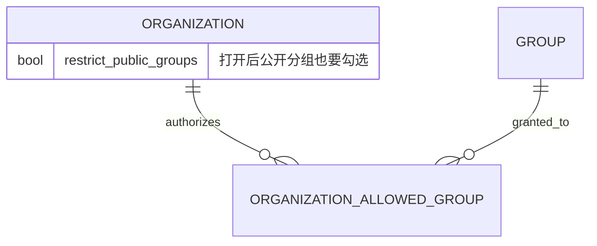

# 组织分组与密钥权限模块设计

模块定位：由平台统一决定每个组织能用哪些分组，并让组织成员的密钥创建和调用都落在这个范围内。

对应代码：[组织分组服务](../../backend/internal/service/organization_group.go) · [组织分组数据访问](../../backend/internal/repository/organization_group_repo.go) · [平台组织接口](../../backend/internal/handler/admin/organization_handler.go) · [平台组织页](../../frontend/src/views/admin/OrganizationsView.vue)

所属里程碑：[M1 企业组织最小闭环](../roadmap.md#m1-企业组织最小闭环)

当前状态：进行中

设计状态：已确认

最近更新时间：2026-09-11

相关文档：[需求设计](../需求设计.md) · [架构设计](../架构设计.md) · [组织身份与注册](./组织身份与注册.md) · [成员管理与消费配额](./成员管理与消费配额.md)

## 1. 职责与边界

本模块负责：

- 平台管理员新增「组织管理」页：查看全平台组织列表和详情，给每个组织配置可用分组范围。
- 组织成员创建、修改密钥时，只能从组织被授权的分组里选。
- 组织成员发起调用时再校验一次分组，平台收回授权后已有密钥立刻调不通。
- 授权变动后立即清理该组织全部成员的鉴权缓存。

本模块暂不负责：

- 组织管理员给成员逐人二次分配分组，M1 不提供。
- 组织维度的用量统计和平台侧组织用量看板，由[组织用量与平台管理](./组织用量与平台管理.md)实现。
- 成员花钱扣谁的余额，由[组织结算](./组织结算.md)实现。
- 线路、分组价格、分组本身的增删改，继续由现有分组管理负责。

## 2. 现有实现基础

平台现在判断「某个账号能不能用某个分组」的规则是两条：

- 公开分组：默认所有人都能用；只有给这个账号打开了「只能用指定分组」的开关，才要求该分组在他的授权清单里。
- 专属分组：必须在授权清单里才能用。
- 订阅类型的分组另算，要有有效订阅才能用。

这套判断只在**创建和修改密钥**时执行。密钥建好之后把授权收回，这把密钥照样能继续调用。需求验收第 6 条要求已有密钥也受最新授权约束，所以本模块要补一道调用前的检查。

鉴权缓存里已经带着账号的授权清单和开关，把组织的范围写进同一个快照，调用时的判断就在内存里完成，不额外查库。

## 3. 组织分组范围

组织沿用与账号完全相同的两条规则，只是清单和开关挂在组织上：

| 组织配置 | 公开分组 | 专属分组 |
|---|---|---|
| 新建组织（未配置） | 全部可用 | 都不可用 |
| 只勾了若干专属分组 | 全部可用 | 只有勾中的可用 |
| 打开「只能用指定分组」 | 只有勾中的可用 | 只有勾中的可用 |

组织管理员和普通成员用的是同一份范围，组织管理员不能给自己多加分组。

账号自己那份授权清单和开关，在他属于组织期间不再参与判断，由组织的范围整体接管；退出组织这件事 M1 不提供，所以不涉及切回。

订阅类型的分组仍然要有有效订阅才能用，组织授权只是多一道门。

## 4. 数据关系

新增一张组织授权分组表，结构和现有的账号授权分组表一致；组织表增加一个「只能用指定分组」开关，默认关闭。存量组织不回填，升级后都是「公开分组全放、专属分组全不给」。

分组被删除时不清理授权记录，与现有账号授权的处理保持一致：读取时只认活跃分组，已删除的分组自然匹配不上。

## 5. 平台组织管理

- 管理员菜单新增「组织管理」，只有平台管理员能进。
- 组织列表支持按组织名和组织管理员邮箱搜索、翻页，显示组织名、组织管理员、成员数、创建时间。
- 组织详情展示上述信息，并提供分组勾选和「只能用指定分组」开关。看成员明细跳转到现有用户管理页，不重复造一套表格。
- 保存授权时，服务端只接受存在的分组，并立即清理该组织全部成员的鉴权缓存。

## 6. 两处拦截

### 6.1 创建和修改密钥

成员可选的分组列表、密钥绑定分组的校验，统一改成先取组织范围再判断。个人用户走原来的账号规则，一行行为都不变。

### 6.2 调用前

调用前的资格检查里增加一条：这次调用的密钥属于组织成员时，用组织范围重新判断分组是否可用，不通过就直接拒绝，不发给上游。

判断所需的组织范围随鉴权快照一起缓存，不给每个请求增加数据库往返。个人用户不进入这条分支，调用链行为保持原样。

## 7. 缓存与一致性

- 组织授权一改，立刻清掉该组织全部成员的鉴权缓存，下一次调用重新构建快照。
- 快照构建时一次性把组织范围查出来，与现有的按分组限流覆盖值同一处理方式。
- 缓存异常时不放宽组织范围，遵循架构设计里「缓存不能单独决定权限」的原则。

## 8. 权限与安全

- 组织管理页只对平台管理员开放，组织管理员和普通成员访问一律拒绝。
- 组织范围由服务端按组织标识写入和读取，成员侧接口不接受任何分组授权参数。
- 组织管理员不能修改本组织的分组范围，也不能读取其他组织的配置。

## 9. 当前实现

- 组织表增加「只能用指定分组」开关，并新增组织授权分组表，提供幂等迁移。存量组织不回填，升级后都是「公开分组全放、专属分组全不给」。
- 平台新增三个接口：组织列表（可按组织名和组织管理员邮箱、用户名搜索）、组织详情、覆盖写入分组范围。保存时拒绝不存在的分组，并在同一个事务里写开关和清单。
- 账号数据上增加一个「分组范围来自组织」的标记。组织成员的可选分组、密钥绑定校验和鉴权快照都改用组织范围，账号自己的授权清单和公开分组开关在他属于组织期间不参与判断。
- 调用前的资格检查里增加组织分组校验，判断数据取自鉴权快照，不增加数据库往返；这条校验放在简易模式跳过之前，因为分组授权是权限而不是计费规则。
- 组织范围读取失败时直接让这次请求失败，不回退到账号自己的规则。
- 鉴权快照版本号上调，升级后旧快照作废重建，避免升级前缓存的快照绕过组织校验。
- 保存分组范围后立即清理该组织全部成员的鉴权缓存。
- 平台控制台新增「组织管理」菜单页：组织列表带搜索和翻页，弹窗里勾选分组并切换限制开关。

## 10. 验证方式

### 10.1 核心业务测试

- 新建组织默认能用全部公开分组，专属分组不可用。
- 勾了专属分组后成员可以绑定该分组；打开「只能用指定分组」后，没勾的公开分组也不可用。
- 组织管理员本人与普通成员适用同一份范围。
- 成员可选分组列表与密钥绑定校验结果一致。
- 平台收回授权后，成员已有密钥的下一次调用被拒绝。
- 个人用户的分组规则、可选列表和调用行为保持不变。
- 组织管理员和普通成员访问平台组织管理接口被拒绝。
- 授权变更后该组织全部成员的鉴权缓存被清理。

### 10.2 前端验证

- 平台组织列表的搜索、翻页和分组勾选保存。
- 人工检查组织详情在桌面和移动端的显示。

按仓库规范，纯展示层不写单测。

### 10.3 当前验证结果

- 后端全量测试、静态检查（golangci-lint v2.13.1）和生产构建通过。
- 新增服务层单测覆盖：个人用户不受影响、组织范围整体接管账号规则、读取失败不降级、默认范围下公开分组可用而专属分组不可用、打开限制后未勾选的公开分组被拒、简易运行模式下仍然执行组织分组校验、保存无效分组整笔失败、保存成功后全部成员缓存被清理。
- PostgreSQL 18 隔离环境跑通三个仓储集成用例：新建组织的默认范围、覆盖写入不留残留、平台列表按组织管理员邮箱搜索且成员数正确。
- 路由注册测试覆盖平台侧三条组织管理路由。
- 前端 269 个测试文件、1979 个用例，以及规范检查、类型检查和生产构建通过。
- 按项目约束未启动开发服务器，真实运行验收与其他模块一起统一进行。

### 10.4 模块完成依据

1. 平台能配置组织分组范围，成员的密钥创建和调用都按该范围执行。
2. 越权、默认范围和调用拦截的测试通过。
3. 后端、前端相关测试及项目门禁通过。
4. 形成可追溯的提交记录。

## 11. 决策记录

| 决策 | 结论 | 说明 |
|---|---|---|
| 组织未配置分组时的默认范围 | 公开分组全放，专属分组全不给 | 与现有账号默认规则一致，新建组织落地即可用 |
| 组织与账号两份授权的关系 | 属于组织期间由组织范围整体接管 | 避免两份清单相互叠加后说不清谁生效 |
| 订阅类型分组 | 组织授权之外仍需有效订阅 | 不改订阅的计费和额度口径 |
| 已有密钥 | 调用时拒绝，不动密钥数据 | 密钥的额度、有效期和历史记录全部保留 |
| 平台组织管理页范围 | 列表、详情、分组授权 | 成员明细跳现有用户管理页，组织用量留给后续模块 |

## 12. 待扩展项

- 组织维度用量与平台侧组织看板，由[组织用量与平台管理](./组织用量与平台管理.md)实现。
- 组织管理员逐人分配分组、成员退出组织后的范围切回，留到 M1 之后评估。

## 13. 改动历史

| 日期 | 内容 |
|---|---|
| 2026-09-11 | 建立模块设计，确定组织分组范围规则、两处拦截点和平台组织管理页范围 |
| 2026-09-11 | 完成后端、前端实现与自动化验证，真实运行验收与其他模块统一进行 |
