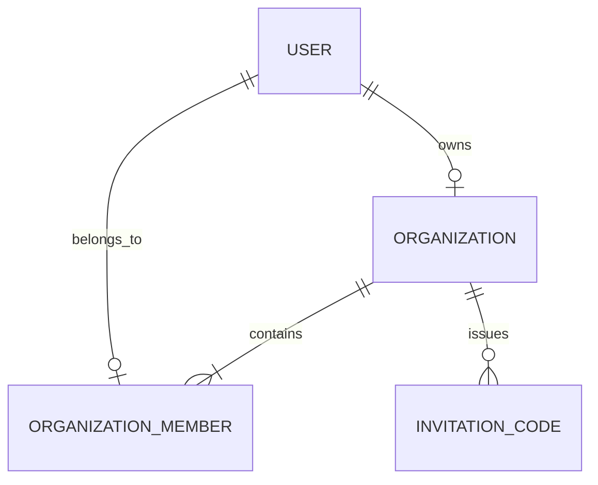
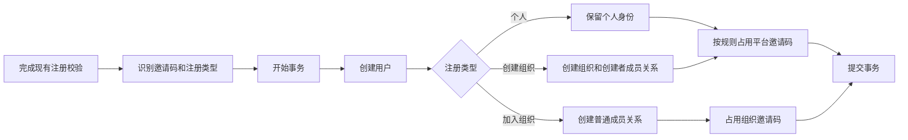

# 组织身份与注册模块设计

模块定位：建立组织、组织成员身份和两类邀请码，跑通个人注册、创建组织和通过组织邀请加入组织。

对应代码：尚未实现；预计涉及后端组织领域、现有注册服务与接口，以及前端注册页和组织邀请码入口。

所属里程碑：[M1 企业组织最小闭环](../roadmap.md#m1-企业组织最小闭环)

当前状态：未开始

设计状态：草案，待确认

最近更新时间：2026-09-10

相关文档：[需求设计](../需求设计.md) · [架构设计](../架构设计.md)

## 1. 职责与边界

本模块负责：

- 创建组织，并把创建者设为唯一组织管理员。
- 保存账号与组织的成员关系。
- 区分平台邀请码和组织邀请码。
- 通过统一注册流程创建个人用户、组织管理员或组织普通成员。
- 向登录后的页面提供当前用户的组织身份摘要。
- 允许组织管理员创建本组织的一次性邀请码。

本模块暂不负责：

- 成员列表、启用、停用和消费配额。
- 组织可用分组和密钥权限。
- 组织统一扣费和组织用量统计。
- 组织改名、解散、管理员转让和成员迁移。
- 已有个人账号加入组织。

这些能力由 M1 后续模块承接。

## 2. 现有实现基础

- 现有注册服务已经处理开放注册、邮箱验证、验证码、平台邀请码和第三方登录。
- 用户创建与一次性邀请码占用已经放在同一数据库事务中。
- 平台邀请码保存在现有兑换码数据中，并具有未使用、已使用和过期状态。
- 登录用户接口和前端身份状态已经能够返回用户资料与平台管理员身份。
- 注册页已经有邀请码输入、预校验和错误提示。

本模块沿用这些能力，只增加组织身份和注册结果。

## 3. 核心业务对象

### 3.1 组织

组织保存名称、创建者和创建时间。创建者同时是唯一组织管理员和后续组织付款账号。

M1 允许组织重名，业务上依靠组织标识区分。一个账号最多创建一个组织。

### 3.2 组织成员关系

每个组织用户都保存一条成员关系，组织创建者也包含在内。一个账号最多存在一条成员关系，从数据约束上保证单组织身份。

平台管理员身份继续使用现有平台角色。组织管理员身份通过“当前账号是组织创建者”得出，不能获得全平台管理权限。

### 3.3 邀请码

现有邀请码增加组织归属：

- 没有组织归属的是平台邀请码。
- 绑定组织的是组织邀请码。
- 两类邀请码共用现有唯一编码、状态、过期和一次性占用能力。

组织管理员创建邀请码时，组织归属由服务端根据登录身份写入，客户端不能指定其他组织。

## 4. 数据关系

需要新增组织和组织成员两类持久化数据，并给现有邀请码增加可选组织归属。

关键约束：

- 组织创建者账号唯一。
- 成员账号在全部组织中唯一。
- 同一账号不能同时成为个人组织成员和另一个组织的创建者。
- 组织邀请码只能加入其绑定的组织。
- 组织创建者必须同时具有该组织的成员关系。

最后一条由注册事务保证，其他唯一性同时由数据库约束和业务校验保证。

## 5. 注册判定

### 5.1 请求信息

在现有注册信息上增加可选组织名称。邀请码继续使用当前单个输入框，由服务端识别类型。

### 5.2 判定规则

| 开放注册 | 邀请码注册 | 组织名称 | 邀请码 | 结果 |
|---|---|---|---|---|
| 关闭 | 任意 | 任意 | 任意 | 拒绝新账号注册 |
| 开启 | 关闭 | 空 | 空 | 创建个人用户 |
| 开启 | 关闭 | 有值 | 空 | 创建组织和组织管理员 |
| 开启 | 关闭 | 空 | 组织邀请码 | 创建普通成员并加入对应组织 |
| 开启 | 开启 | 空 | 平台邀请码 | 创建个人用户 |
| 开启 | 开启 | 有值 | 平台邀请码 | 创建组织和组织管理员 |
| 开启 | 开启 | 空 | 组织邀请码 | 创建普通成员并加入对应组织 |

组织名称与组织邀请码同时出现时拒绝注册，避免客户端同时表达创建和加入。邀请码注册关闭后，平台邀请码不参与注册资格判断；组织邀请码仍用于确定加入哪个组织。

邮箱验证、密码规则、验证码和现有第三方登录限制继续生效。

## 6. 注册流程

### 6.1 统一入口

邮箱注册和各第三方登录完成注册时，都先经过同一个注册判定过程。判定结果只包含个人、创建组织、加入组织三种类型。

各第三方登录继续负责验证外部身份。组织模块只接收已经验证的用户注册信息和组织注册意图。

### 6.2 数据事务

用户、组织、成员关系和邀请码状态必须一起提交。任何一步失败都回滚，不能留下无创建者组织、无组织成员或已占用但注册失败的邀请码。

并发使用同一个组织邀请码时，只允许一个事务成功。

## 7. 对外能力

### 7.1 现有注册接口调整

- 注册请求可以携带组织名称。
- 邀请码预校验返回平台邀请码或组织邀请码类型。
- 第三方登录的待完成注册信息能够保存组织名称或组织邀请码。
- 当前用户信息返回组织标识、组织名称以及是否为组织管理员。

邀请码预校验只返回注册页面需要的信息，不返回组织成员、付款账号或其他内部资料。

### 7.2 组织邀请码入口

组织管理员可以查看和创建本组织邀请码。M1 延续现有一次性使用方式，不增加批量码、多次使用次数或复杂邀请策略。

该入口只完成后续注册所需的最小闭环。成员管理模块开始后，再将它合并进完整成员管理页面。

## 8. 前端交互

- 注册页始终保留一个平台或组织邀请码输入框。
- 邀请码注册开启时，个人注册和创建组织必须填写平台邀请码。
- 邀请码注册关闭时，输入框可选，填写组织邀请码即可加入对应组织。
- “创建组织”入口展开组织名称输入；识别出组织邀请码后关闭创建组织状态。
- 注册成功后，前端身份状态保存组织摘要，用于后续显示成员管理等入口。
- 组织管理员提供一个最小组织入口，用于查看组织名称和创建邀请码。

界面继续使用现有注册页、表单、提示和主题组件。本模块只增加完成注册所需的信息。

## 9. 权限与安全

- 组织管理员身份完全由服务端查询，前端传入的角色信息一律忽略。
- 创建组织邀请码时只使用当前登录用户拥有的组织。
- 邀请码预校验继续使用现有公开接口限流。
- 邀请码日志和错误响应不输出完整邀请码或组织内部信息。
- 注册成功前不签发可用登录身份。
- 唯一性冲突和邀请码并发占用返回稳定业务错误，不暴露数据库信息。

## 10. 当前实现

当前仓库只有个人用户和平台管理员身份。已有注册和平台邀请码可以复用，组织、成员关系、组织邀请码及组织身份响应均尚未实现。

## 11. 验证方式

### 11.1 核心业务测试

- 覆盖两个注册开关与三种注册结果的组合。
- 验证创建组织后只有一位组织管理员，并保存创建者成员关系。
- 验证组织邀请码只能创建普通成员并加入绑定组织。
- 验证一个账号最多属于一个组织。
- 验证同一邀请码并发注册只成功一次，失败事务不留下账号或成员关系。
- 验证个人注册和现有平台邀请码行为保持可用。
- 验证邮箱注册与各第三方登录使用相同组织规则。
- 验证普通成员无法创建组织邀请码或读取其他组织信息。

### 11.2 前端验证

- 测试邀请码类型与创建组织状态之间的切换逻辑。
- 测试注册开关对应的必填规则。
- 人工检查注册表单在桌面、移动端、加载和错误状态下的显示。

### 11.3 模块完成依据

模块只有在以下条件全部满足后才能改为“已完成”：

1. 三种注册结果均可通过真实接口完成。
2. 数据约束和事务测试通过。
3. 后端、前端相关测试及项目门禁通过。
4. 形成可追溯的提交记录。

## 12. 待扩展项

- 成员启用、停用和配额由下一个模块实现。
- 组织分组和密钥限制由后续模块实现。
- 组织付款与用量统计由后续模块实现。
- 现有个人账号加入组织、成员迁移和管理员转让留到 M1 之后评估。

## 13. 改动历史

| 日期 | 内容 |
|---|---|
| 2026-09-10 | 建立首个模块设计，明确组织身份、两类邀请码和统一注册流程 |
