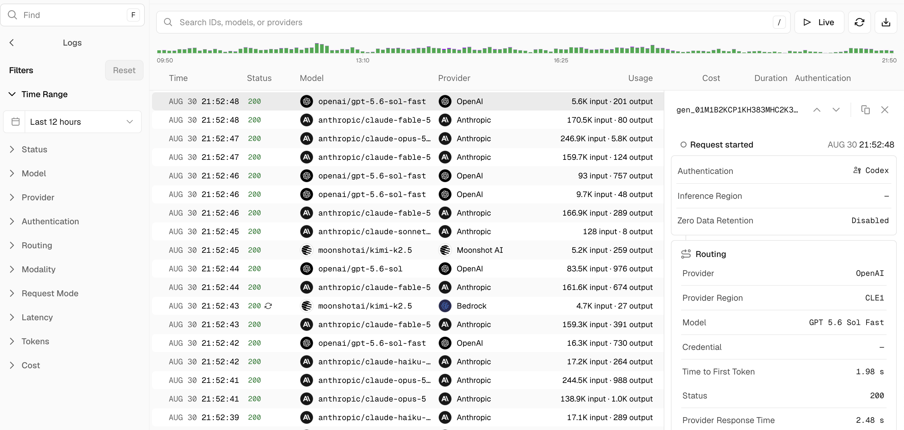
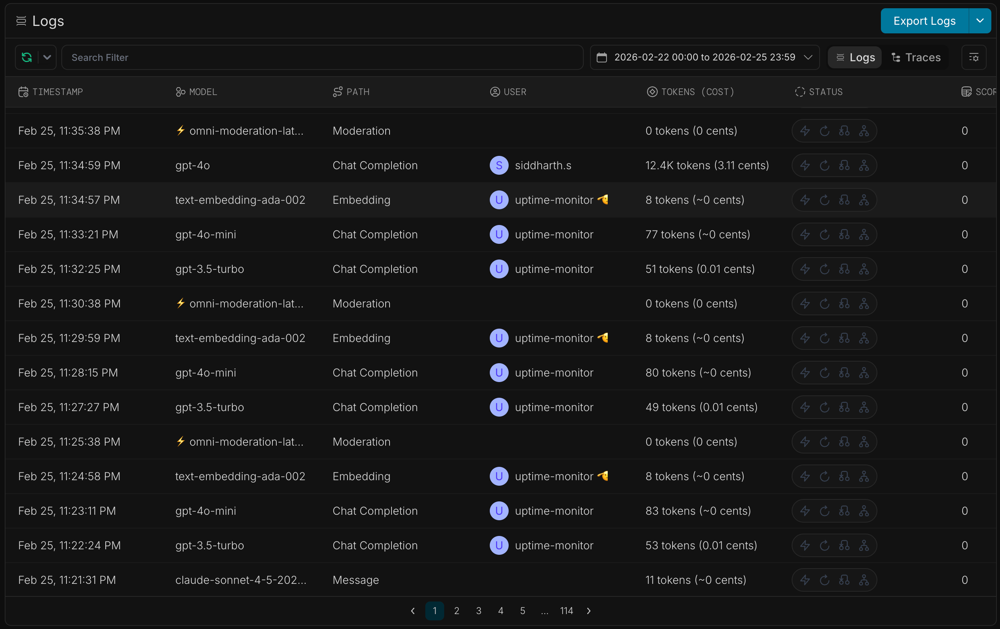
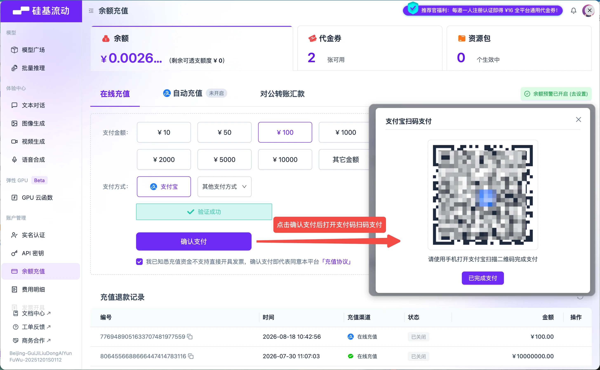
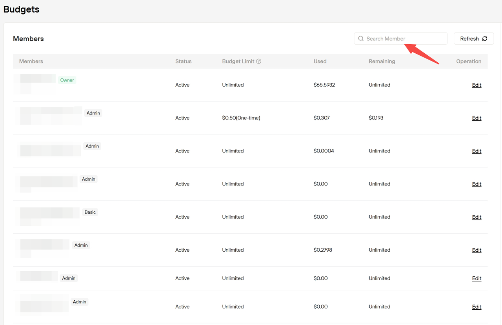
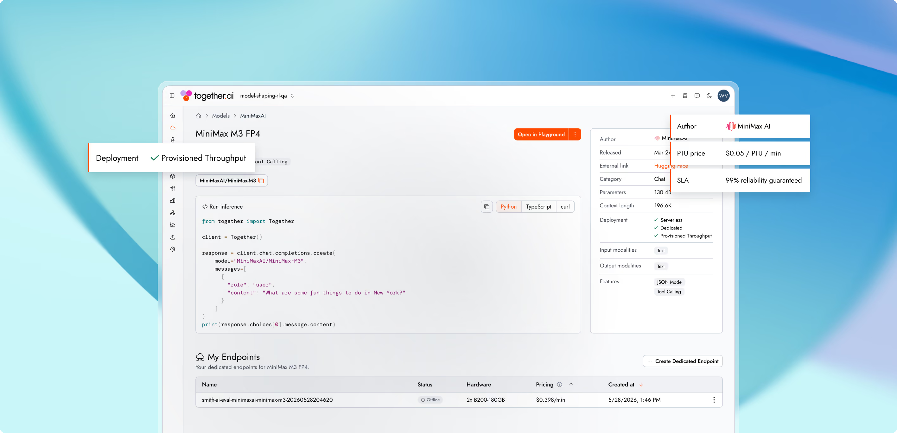
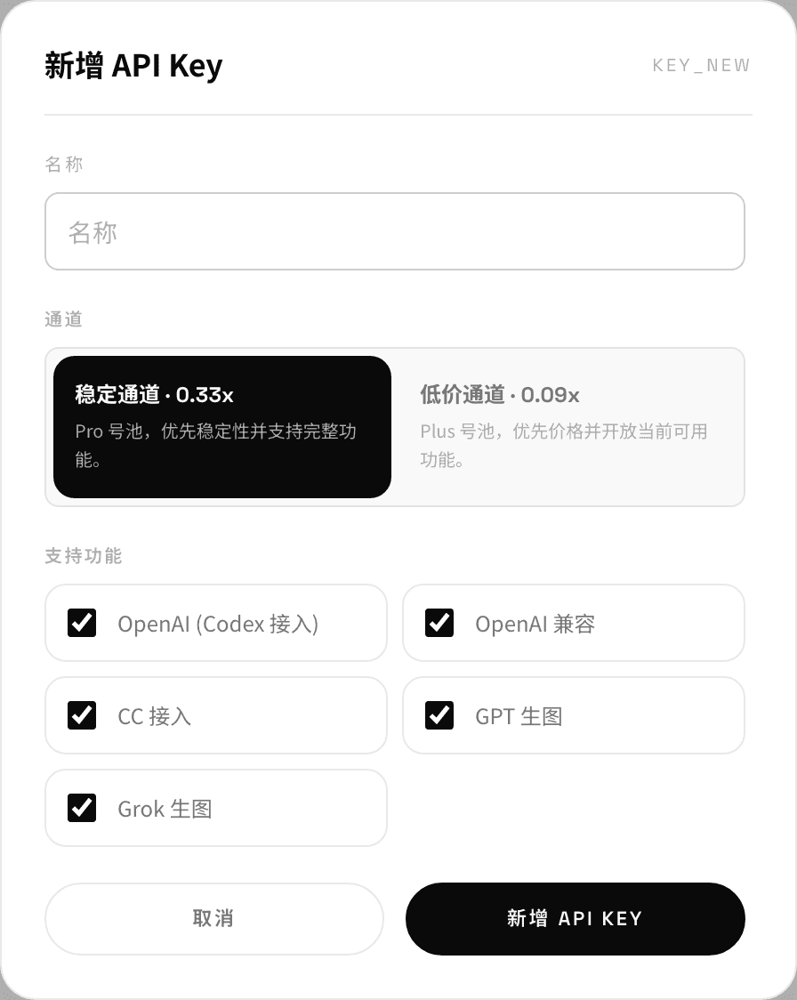

# 官方截图与界面观察

状态：调研记录，视觉方向未定稿。观察日期：2026-09-26。

本轮没有可用的浏览器连接。下文依据从官方文档下载并实际查看的产品截图，不能替代登录后的操作、手机端或当前线上页面验收。下载来源、日期和原图校验值见 [图片来源](./官方截图/sources.json)。

## Vercel AI Gateway：浅色请求列表与详情侧栏

- 来源：[官方请求日志文档](https://vercel.com/docs/ai-gateway/observability-and-spend/logs)。截图为官网提供的说明素材。
- 实际观察：左侧固定筛选区，中部是请求表格，上方是搜索、实时查看和导出入口，右侧展开当前请求详情。
- 实际观察：大部分面积使用白色和浅灰，选中行靠底色区分，绿色用于成功状态；模型图标和名称帮助扫描，时间与用量排列紧凑。
- 实际观察：详情按身份、路由等内容分组，整页同时保留列表上下文；用户查看一条记录时仍能对照其他请求。
- 文档描述：用量列按文本、图片、视频等类型切换单位；更细的费用和用量分解放进详情；无权限时显示权限提示，和无记录区分。
- 可借鉴：先显示对判断有用的少量列，把解释放入侧栏；筛选、图表、列表和详情围绕同一项任务组织。
- 适用限制：截图横向信息很密，新产品是否保留供应商、路由过程等列，要看用户需求和本项目的数据边界。图片不证明手机端体验。

## Portkey：深色日志工作台

- 来源：[官方日志文档](https://portkey.ai/docs/product/observability/logs)。截图为官网提供的说明素材。
- 实际观察：顶部将导出作为明确操作；搜索、时间范围和日志类型切换在表格上方同一条工具区域。
- 实际观察：背景与行使用接近的深色，细边框分区；青色突出主要操作，紫色头像帮助识别调用者。内容以行列组织，装饰占比低。
- 实际观察：用量与费用放在同一格；相同请求按时间顺序排列，可同时扫描模型、调用类型、用户和结果状态。
- 文档描述：点击行打开详情侧栏，可查看调用数据；平台另有不记录请求与响应正文的选项，只保留用量、费用和耗时。
- 可借鉴：把费用和用量放在同一处解释；对高频操作保持稳定位置；明确区分调用统计与请求正文保存。
- 适用限制：密集图标的含义需要说明；本项目不能因为参考该截图就默认开始保存用户请求正文。

## 硅基流动：充值与资金状态

- 来源：[财务说明](https://docs.siliconflow.cn/cn/userguide/faqs/misc_finance)。截图包含官方添加的操作箭头，属于教程素材。
- 实际观察：顶部区分余额、代金券和资源包；充值区域按在线充值、自动充值、对公转账组织，下方放充值退款记录。
- 实际观察：紫色同时用于品牌、当前入口、金额选择和主要操作，左侧还包含模型体验、账户管理和支持入口。
- 可借鉴：把资金状态、支付动作、交易记录放在同一任务中，减少充值后找不到订单或到账信息的情况。
- 适用限制：截图的金额、代金券、推广政策和充值档位只属于素材时点，不能作为当前报价或本项目规则；新界面可以减少促销横幅对财务操作的干扰。

## Novita：成员预算表

- 来源：[预算说明](https://docs.novita.ai/guides/budgets.md)。箭头和模糊处理来自官方素材。
- 实际观察：成员、状态、预算上限、已用、剩余和编辑入口并排；右上角提供成员搜索与刷新。
- 可借鉴：管理员在一行内理解成员的额度和消费，不必分别打开多张信息卡。
- 适用限制：角色名称与预算规则属于 Novita；本项目必须沿用实际存在的组织角色和扣费归属，不能只照着表格增加新权限。

## Together AI：模型详情的官网宣传配图

- 来源：[预留吞吐产品页](https://www.together.ai/provisioned-throughput)。这是一张带装饰背景与悬浮说明的官方宣传图，未确认与当前控制台逐项一致。
- 实际观察：模型名称和能力标签在上，接入代码占中间主要区域，右侧放模型参数，下方列交付实例；橙色突出试用入口和少量链接。
- 可借鉴：模型详情同时支持理解能力和立即接入；官网可以展示带真实任务内容的产品画面，具体参数继续来自当前服务数据。
- 适用限制：预留算力、部署实例和服务保证属于该产品的交付能力。图片中的价格与可靠性数字不作为本项目候选承诺。

## 神稳 AI：密钥创建窗口

- 来源：[Codex 接入文档](https://shenwenai.com/docs/codex)，2026-09-26 证书修复后下载并查看。
- 实际观察：白底黑字，大圆角窗口；名称、通道、支持功能依次排列，选中通道与主要操作使用黑色填充。
- 可借鉴：把创建密钥需要的选择集中展示，每个通道同时解释用途；新产品也可以先让客户选择使用工具，再呈现匹配的方案。
- 时效边界：图中“稳定通道 0.33x”与当前文字中的 GPT Pro 0.22x、通道清单和用途规则存在差异。图片能支持局部视觉观察，不能证明当前业务支持范围。

## 对本项目的候选原则

以下均为建议，尚未成为需求或设计规范。

1. 官网帮助客户判断服务是否适合自己；控制台帮助客户完成接入、查费和排错。两部分可以共享品牌，同时使用适合各自任务的信息密度。
2. 控制台可从浅色中性背景、细边框、一个主要强调色开始讨论；深色作为配套主题候选。具体颜色、字体、间距需在视觉方向阶段确认。
3. 概览页优先回答余额或配额是否够用、本期花费如何、接入是否正常，以及下一步该做什么。
4. 模型页必须解释价格单位、适用条件和接入方式；没有来源的数据不能变成宣传数字。
5. 调用详情优先解释这次消费的构成；底座不提供的供应商对比、路由过程、性能承诺和正文审计不能直接照搬。
6. 当前素材来自六家平台，包含五家文档界面截图和一家宣传配图，只支持这些局部观察；首页构图、响应式、登录及首次接入仍需后续浏览器观察与设计验证。
