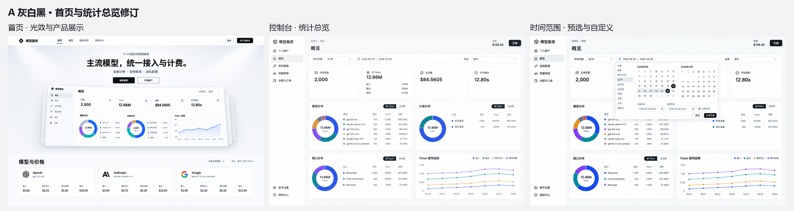
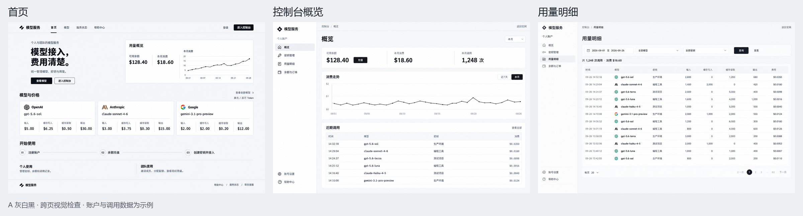

# 独立客户前端视觉设计

状态：已定稿（当前视觉与内容基线） · 最近更新：2026-09-28

一句话方向：参考 Aceternity Proactiv，以近黑底色、青蓝主操作、悬浮导航和丰富产品画面，统一官网及客户控制台。

当前支持浅色、深色和跟随系统，首次默认深色，选择在浏览器中保存。入口位于官网与账号页顶部、控制台侧栏底部及手机顶栏，规格见 [主题切换](../design/theme-switching.md)。浅色保持青蓝品牌：背景 `#F7F9FC`、表面 `#FFFFFF`、文字 `#172330`、辅助文字 `#596B7D`、主操作 `#00779E` 配白字、边框 `#D8E1EB`。两套外观共用尺寸、布局与控件，图表、阴影、反馈色与厂家标志同时适配。

## 当前实施基线：Proactiv 整站改版

2026-09-28 用户要求首页、顶部菜单及全部页面按 [Proactiv Marketing](https://ui.aceternity.com/template-preview/proactiv-marketing-template) 重做，明确授权虚构文案和营销内容并补足信息量。完整页面、区块、控件、数据边界和验收要求以 [Proactiv 实施规格](../design/proactiv-redesign.md) 为准，优先于本文下方的早期浅色图样。

默认主题：背景 `#090B0D`、卡片 `#111518`、次级表面 `#191E23`、文字 `#F4F7FA`、次级文字 `#9CA7B3`、边框 `#262E35`、主操作 `#39C8F4`、主操作文字 `#061116`。首页大标题 80/60/40px，区块标题 42/32/28px，官网内容宽 1200px，业务宽度保留 1408px；圆角统一 8/16/20px。实际值集中在主题文件，页面复用共享基础组件。

首页至少十二个区块：首屏、控制台产品展示、厂家带、五格平台能力、工作空间、使用场景、模型价格、余额计费、客户故事、工具生态、FAQ 和结尾操作区。官网内页、账号页及控制台同时使用统一主题。Aceternity 效果采用官方公开组件并适配项目，来源见素材归档。

临时品牌 Nexus API、营销用统计面板、团队示意和六个客户故事为构造内容，集中在 `src/content/marketing.ts`，后续可整体替换。真实账户余额、账单、用量、模型定价和公开状态继续由现有接口提供；模型卡仍是紧凑四价，不增加详情页或套餐。

以下第 1–12 节保留此前设计过程和图样，其中浅色样式、精简首页和旧品牌已由本次基线取代。

适用：`frontend-portal/` 的官网和客户控制台。依据：[需求设计](./需求设计.md) · [页面清单](./页面清单.md) · [方向选择记录](./前端设计/方向对比.md) · [官方界面参考](../../docs/调研/2026-09-26-AI-API服务站/12-官方截图与界面观察.md)。

## 1. 已确认的视觉与内容边界

- 采用 A 灰白黑方向，紧凑模型卡片稿已获用户基本认可。
- 模型卡片只保留厂家标志与名称、模型代号，以及输入、缓存写入、缓存读取、输出四项美元价格。
- 官网侧重服务理解与模型选择，控制台侧重余额、用量、密钥和团队操作，二者使用同一套基础样式。
- 临时名称为“模型服务”，示意标志不视为正式品牌标志。
- 当前图样用于选择和检查视觉，价格与业务数据的正式展示以实际接口和配置为准。
- 首页采用 Aceternity 的光效与滚动产品展示；概览改用丰富统计，移除最近调用，时间范围统一联动。
- 用户已认可本轮首页效果、统计总览和时间选择方向；当前信息量先保留，后续按实际需要补充内容。本次确认的是设计基线，实际页面仍需浏览器验收。
- 2026-09-27 收敛：用量仅按日期选择范围，删除近 24 小时与时分输入；监控历史只展示可用性记录，速度只显示最近一次探测值。

## 2. 参考来源

| 参考 | 采用的具体特点 |
|---|---|
| Vercel AI Gateway 官方界面 | 中性色表面、细分隔线、对齐的数据列、紧贴任务的操作 |
| Novita 官方预算界面 | 简洁表格、直接的数值表达、少量强调 |
| Together 官方模型界面素材 | 模型信息和实际使用内容相邻组织 |
| 用户选定的 A 紧凑图 | 三列小卡片、统一四价顺序、黑色主操作 |

## 3. 颜色

首版页面按 A 浅色稿设计。深色列仅为基础颜色的对应关系，尚未成为单独的主题切换功能。

| 用途 | A 浅色 | 深色对应 |
|---|---|---|
| 页面底色 | `#F7F8FA` | `#111418` |
| 内容表面 | `#FFFFFF` | `#1A1F26` |
| 次级表面、选中行 | `#F1F3F5` | `#262D36` |
| 主要文字 | `#17191D` | `#EDF1F5` |
| 次级文字 | `#68717D` | `#ABB4C0` |
| 边框与分隔 | `#E2E5E9` | `#343E4B` |
| 主要操作背景 | `#17191D` | `#EDF1F5` |
| 主要操作文字 | `#FFFFFF` | `#17191D` |
| 成功 | `#18794E` | `#79D6A2` |
| 警告 | `#8A6100` | `#E7BD62` |
| 错误 | `#B42318` | `#FF9A93` |

厂家标志使用适当的原始品牌色；主操作保持黑色。多分类图表使用固定的数据配色，避免各分片难以区分。

数据配色：蓝 `#4263EB`、青 `#0F8B8D`、紫 `#8B5CF6`、琥珀 `#E49B3B`、灰蓝 `#64748B`、浅玫红 `#C76A77`。同一数据分类在图表和相邻数值表中保持一致。

## 4. 字体、字号与数字

- 正文采用清晰的无衬线字族；拉丁文字优先 Inter，中文优先 Noto Sans SC，回退到微软雅黑和系统无衬线字体。
- 字重使用 400、500、600、700；普通数据不使用过粗字重。
- 字号阶梯：辅助信息 12px、表格 13px、正文和控件 14px、重要正文 16px、模型代号 18–20px、区块标题 20px、页面标题 28px、官网主标题 40–48px。
- 正文行高 1.5，标题行高 1.2；型号和数值需要完整可读。
- 金额、时间和用量使用等宽数字特性，金额列右对齐。价格显示精度沿用已有业务格式，不把小额价格截断为零。

## 5. 尺寸与布局

| 项目 | 规格 |
|---|---|
| 间距阶梯 | 4、8、12、16、20、24、32、48、64px |
| 官网内容宽度 | 最大 1408px，居中；大屏侧留白 64px，中屏 32px，手机 16px |
| 官网导航 | 高 64px |
| 控制台侧栏 | 桌面宽 216px，保持视口高度；主内容水平留白 24px，手机 16px；设置与帮助固定在底部区域 |
| 内容圆角 | 卡片 8px，控件 6px，弹窗 10px |
| 边框 | 1px，使用统一边框色 |
| 阴影 | 控制台普通内容区保持克制；浮层和首页滚动产品展示使用适当层次 |
| 常规控件 | 高 36px；触屏操作区域至少 44px |
| 常规表格行 | 44px 起，随多行文字自然增高 |
| 基础对话框 | 最大 480px，窄屏两侧各留 16px，内容随视口滚动 |
| 宽表格基准 | 最小 680px，由表格容器内部横向滚动，不撑宽整页 |

模型卡片宽度随容器变化，桌面内部留白约 20px，目标高度约 180–200px，长型号允许自然换行。标题与价格之外不填补说明或装饰。

## 6. 不同尺寸下的排版

- 1280px 及以上：模型卡片三列，控制台保留侧栏。
- 768–1279px：模型卡片两列，缩小外围留白；控制台按可用宽度调整导航。
- 小于 768px：模型卡片一列；四项价格空间不足时按原顺序排为两行两列；导航通过紧凑入口访问。
- 表格保留关键身份和金额信息，可用横向滚动容器承载其余列，避免整页被撑宽。
- 页面的长文本、加载、空数据和错误状态在真实页面实现后检查。

## 7. 基础组件与交互状态

共用按钮、输入框、选择器、搜索、标签、卡片、表格、弹窗、分页与图表样式，统一组件库和实现目录。

M0 已将按钮、输入、标签、卡片、表格、骨架、空/错反馈、选择器、弹窗、气泡层和日期日历落入共享控件目录；官网/控制台外壳复用这些规则。小按钮桌面高 32px，常规桌面高 36px，手机触控均至少 44px。分页、图表与业务查询在对应里程碑接入。

| 状态 | 统一处理 |
|---|---|
| 默认 | 使用中性边框和文字，主要操作使用黑底白字 |
| 悬停 | 轻微加深背景或边框，位置和尺寸保持稳定 |
| 按下 | 进一步加深背景，无夸张缩放 |
| 禁用 | 降低强调，保持文字可辨识，不接受重复操作 |
| 加载 | 控件尺寸保持稳定，反馈当前操作正在进行 |
| 错误 | 用错误色标明相关字段，并给出可执行的错误说明 |

键盘焦点另用清晰的 2px 外轮廓表达，不依赖颜色变化猜测位置。

## 8. 图表、空状态与可访问性

- 图表给出清楚的时间和金额单位；多系列使用固定分类色，环形图配相邻的请求、Token 和实际消费表格；不用无来源的同比、增长率或业绩数字。
- 无记录时说明当前没有记录，并在确有必要时提供下一步操作；无权限、请求失败和空数据分别处理。
- 正文对比度目标至少 4.5:1；关键控件可通过键盘操作，表单具有关联标签。
- 控制台状态反馈保持 120–180ms；首页可采用 Aceternity 的轻光效与滚动透视，内容先可读，再由动效强化层次。尊重减少动态效果的系统偏好。

## 9. 页面应用

- 官网首页：服务与入口、Aceternity 产品展示效果、模型价格概览、简要使用路径和个人/团队能力。
- 模型列表：紧凑四价卡片，单位统一展示。
- 控制台概览：当前余额或配额、区间请求/Token/实际消费/平均耗时、模型/分组/接口环形分布与数值表、Token 趋势、统一时间范围。概览不展示最近调用列表。
- 用量明细：查询工具与明细表，数值按列对齐。
- 服务状态展示近 7 天可用率、当前响应速度和近期可用性状态条，记录范围以接口实际返回为准。

M1 首页的专属动效和布局样式集中在 `src/styles/marketing.css`，复用基础字体、颜色和圆角；正文容器最大 1408px、产品预览最大 1120px，区块留白桌面 64px/手机 48px，首屏至产品预览缩短为 32px/24px。厂家标志与控制台图采用本地素材，来源见 [官网素材与动效来源](./前端设计/官网素材与动效来源.md)。

## 10. 验证与实施边界

图样需逐张目视检查信息完整性、文字可辨认性、视觉一致性和已确认功能范围。生成图中的图标、具体字形与间距可能存在差异，正式实现通过同一套主题和组件统一。

目前独立工程、共享控件和首版业务页面均已接入，前端技术栈见 [技术设计](./技术设计.md)。本机开发入口由用户明确授权运行。早期 Aceternity 动效样稿继续作为首页设计参考，本规范的实施入口为 [M0 工程基础](./roadmap.md#m0) 和 [工程与共享界面](./模块设计/工程与共享界面.md)。

2026-09-27 用户指出实现与示意图不一致后，补齐[控制台对齐规格](../design/console-alignment.md)：统计卡标题必须有图标，底部账号设置与主业务菜单分开，环图中心显示合计；删除重复描述及测试内容。正式数据仍来自业务接口，示意图的数值不进入运行页面。

## 11. 本轮首页与统计总览修订

- [首页效果稿](./前端设计/示意图/08-A首页效果修订.png)：浅色光效、产品展示层次和紧凑模型价格卡片。
- [统计总览稿](./前端设计/示意图/09-A统计总览修订.png)：区间汇总、模型/分组/接口分布、相邻数值表和 Token 趋势；删除最近调用。
- [时间范围布局参考](./前端设计/示意图/11-A时间范围展开校正.png)：保留预选、双月日历、起止日期与统一应用；图中的近 24 小时和时分输入已于 2026-09-27 取消。
- [可直接打开的首页动效样稿](./前端设计/原型/首页动效.html) · [原型说明](./前端设计/原型/原型说明.md)：使用 Aceternity 官方光效和滚动透视组件，适配 A 风格。

前三张为设计示意图，已逐张目视检查；图中账户与统计数字均为构造样例。时间浮层旧稿出现多个选择端点，已由第 11 张校正图取代。生成与校验记录见 [本轮记录](./前端设计/示意图/A首页与统计修订生成记录.json)。

动效样稿通过格式检查、严格类型检查与静态构建；脚本、样式和图片均已内嵌。统计总览与日期控件已接入业务数据；按天查询直接复用现有接口，精确到时分的扩展已取消。实际滚动、不同屏宽与键盘验收以当前浏览器记录为准，工程检查不能代替这些结果。

本轮信息结构、组件来源与后端复用依据见 [首页效果与统计总览修订](./前端设计/首页效果与统计总览修订.md)。

## 12. 初轮跨页图样记录

- [首页原图](./前端设计/示意图/05-A首页.png)：服务定位、产品概览示意、三张紧凑价格卡片、使用流程及个人/团队能力。
- [控制台概览原图](./前端设计/示意图/06-A控制台概览.png)：余额与消费汇总、消费走势和近期调用摘要。
- [用量明细原图](./前端设计/示意图/07-A用量明细.png)：日期、模型、密钥查询，调用明细与费用表格。

本批三张生成成功，使用 19.2 积分，主控已逐张查看。三张保持 A 的中性色表面、黑色主操作和细边框；卡片内四价顺序与美元单位正确，未加入套餐、在线试用、通知中心或企业采购入口。

首页的模型价格取自已核对的仓库基础价格快照；账户余额、消费、调用记录和图表为示例数据，不代表生产账户或真实业务指标。图样中的临时标志、局部字形、侧栏尺寸和图表刻度仍须在实际页面中统一验证。

本批用于一起检查视觉应用，尚未作为真实页面运行验收。生成尺寸、校验值及费用见 [生成记录](./前端设计/示意图/A跨页生成记录.json)。

首页和概览的上述初轮图样已被本次新要求取代，具体规则见 [首页效果与统计总览修订](./前端设计/首页效果与统计总览修订.md)。用量明细仍承担逐条记录查询。
