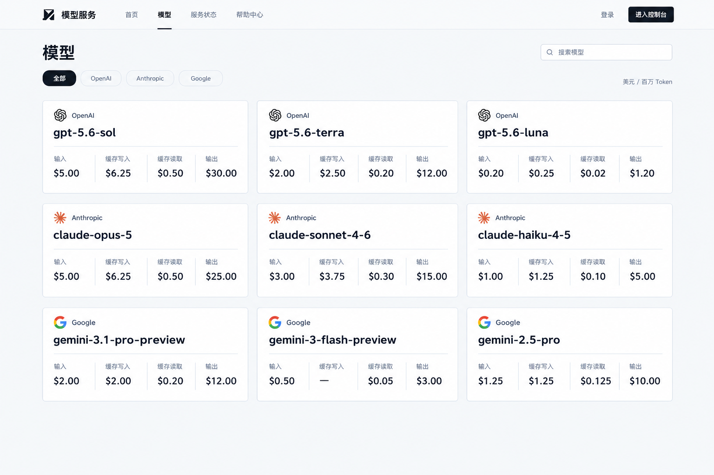
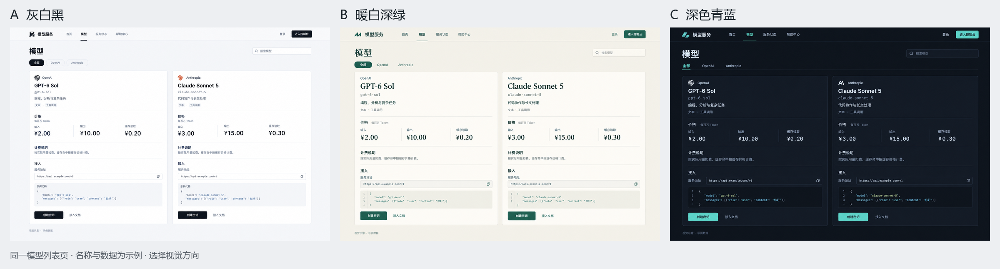

# 模型列表页视觉方向对比

状态：用户已选择 A 灰白黑并基本认可紧凑版，首页效果与统计总览已按新要求修订 · 日期：2026-09-26

依据：[已确认页面与内容](../页面清单.md) · [官方界面参考](../../../docs/调研/2026-09-26-AI-API服务站/12-官方截图与界面观察.md)

## 当前已选方案

用户已选择 A 灰白黑，并明确收紧模型卡片：每张卡片仅包含厂家标志与名称、模型代号，以及输入、缓存写入、缓存读取、输出四项美元价格。

卡片删除能力介绍、计费说明、服务地址、调用示例和操作按钮。桌面按三列紧凑排列，在一屏展示多款模型。

当前卡片约定取代下方初轮大卡片的内容规格；旧图仅保留为选型记录。

## 当前紧凑版

- 三列、三行，同屏展示九张小卡片。
- 每张卡片只含厂家标志与名称、模型代号、输入/缓存写入/缓存读取/输出四项美元价格。
- 价格单位在页面统一显示，卡片中不再放说明、示例或操作按钮。
- 图中数字来自仓库基础价格表，正式页面需要读取当前后台计费配置；证据与数据见 [模型价格来源核对](./模型价格来源核对.md)。
- 使用 A 原图编辑生成，消耗 6.4 积分；主控已逐张卡片核对字段顺序与数值，缺失缓存写入价格正确显示为横线。

## 初轮比较记录

用同一个模型列表页比较三种视觉方向，页面布局、模型数量、卡片内容和操作保持一致。模型详情直接放在卡片中，包含基本信息、价格、计费条件、服务地址与调用示例。

名称暂用“模型服务”。图中的模型、价格、描述和服务地址都是视觉比较用的示例，不能作为实际上架与收费规格。正式页面的数据以当前业务为准。

## 三个候选

| 方案 | 视觉特点 | 参考依据 | 希望呈现的感觉 |
|---|---|---|---|
| A 灰白黑 | 浅灰白底、黑色主操作、细灰分隔线、清晰的无衬线文字 | Vercel 的中性表面与对齐方式，Novita 的简洁数据表达 | 清楚、直接、适合专业用户日常使用 |
| B 暖白深绿 | 暖白底、深绿主操作、稳重标题字形、柔和分隔 | 沿用 Vercel 与 Together 的信息组织，暖白深绿是本轮自选的视觉变化 | 沉稳、有品牌辨识度、较温和 |
| C 深色青蓝 | 炭灰背景、分层深色卡片、青蓝主操作、高对比文字 | Portkey 官方界面的深色层次与节制强调色 | 集中、清晰、偏开发工具气质 |

本轮只选择视觉方向，尚未确认主题色值、字体、组件尺寸或前端技术。

## 图片

- [A 灰白黑原图](./示意图/01-灰白黑.png)
- [B 暖白深绿原图](./示意图/02-暖白深绿.png)
- [C 深色青蓝原图](./示意图/03-深色青蓝.png)

初轮主控曾推荐 B；用户最终选择 A 灰白黑，以用户选择为准。

## 生成与检查

- 使用 g2i 的 gpt-image-2.5，三张 1536×1024 图片并发生成成功，实际合计 19.2 积分。
- 提示词已固定相同布局和内容，重点比较底色、强调色、分隔方式与字体感觉。
- 主控已逐张查看：两张模型卡片均保留信息、价格、计费说明和接入内容；没有新增独立详情、在线试用、套餐或消息功能。图片中文字可辨认，版本间有生成模型造成的局部间距与字形差异，后续实现仍须统一设计规范。
- 已生成并检查并排对比图；生成信息、尺寸和文件校验值见 [生成记录](./示意图/生成记录.json)。
- 官方参考包括公开文档界面与宣传素材；本轮概念图属于新生成的设计示意，不能替代实际浏览器验收。

## 下一步

模型卡片已按用户要求修订并获基本认可；以同一套视觉检查首页、控制台概览和用量明细，规范见 [前端设计](../前端设计.md)。

首页与概览已按用户新要求更新，当前稿见 [首页效果与统计总览修订](./首页效果与统计总览修订.md)，其中包含新版总览、时间浮层和可直接打开的首页动效样稿。早期跨页图只保留为历史记录。
