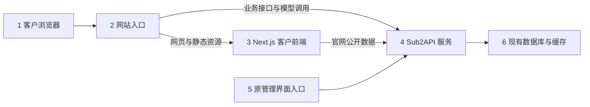
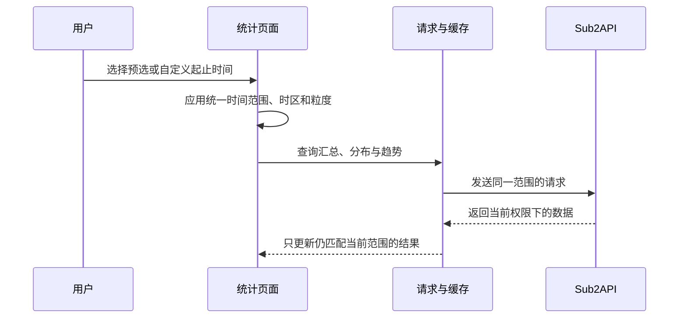

# 独立客户前端架构设计

状态：本轮推荐方案，供整体核对；业务尚未实施 · 最近更新：2026-09-27

依据：[需求设计](./需求设计.md) · [技术设计](./技术设计.md) · [视觉基线](./前端设计.md) · [开发路线图](./roadmap.md)

## 1. 总体结构

1. 客户浏览器访问官网、账号入口和客户控制台。
2. 网站入口按路径分流网页和接口。实际域名、端口在部署阶段填写。
3. 新前端独立运行。公开页面由服务端输出可阅读内容；客户控制台在确认登录身份后查询个人数据。
4. 现有 Sub2API 继续负责登录、权限、计费、充值、密钥、组织、用量和模型调用。
5. 原管理界面建议使用单独的管理域名，由 Go 服务继续提供，避开新旧页面路径冲突。
6. 使用现有数据库与缓存。新前端不另设业务数据库，探测采集也继续由后端负责。

## 2. 分层与依赖

### 2.1 页面与共享界面

规划目录：`src/app/`、`src/components/`、`src/styles/`。页面只拼装业务区块，统一使用主题、基础控件和页面外壳。图表与首页动效各自封装。

对应模块：[工程与共享界面](./模块设计/工程与共享界面.md)。

### 2.2 客户业务模块

规划目录：`src/features/`。按官网目录、服务状态、账号、密钥、用量、余额和组织划分；模块负责展示数据、表单和交互状态。实际权限和资金计算继续交给后端。

对应模块：[官网与模型](./模块设计/官网与模型.md)、[公开状态](./模块设计/公开状态.md)、[账号与密钥](./模块设计/账号与密钥.md)、[用量统计](./模块设计/用量统计.md)、[余额与订单](./模块设计/余额与订单.md)、[组织与成员](./模块设计/组织与成员.md)、[组织用量](./模块设计/组织用量.md)。

### 2.3 请求与数据转换

规划目录：`src/lib/api/`、`src/lib/time/`、`src/lib/format/`。统一处理接口地址、身份凭证、响应检查、错误、日期范围、金额和 Token 格式。查询缓存按账号、组织、筛选和时间范围隔离。

公开页面的服务端请求只能使用公开接口和固定后端地址；个人及组织查询由已登录的客户端发起，不进入公开页面缓存。

### 2.4 现有后端与必要扩展

代码位于既有 `backend/`。复用现有接口、服务和数据存储；首版已经识别的扩展是统计精确起止时间，以及公开状态的速度历史数据和完整时间窗口。

扩展保持旧参数与响应兼容，修改时同步维护原后端对应模块文档，并在新前端模块中记录接入契约。

### 2.5 部署与交付

新前端独立依赖、构建和发布；入口代理负责网站与业务接口分流。模型调用继续直达 Go 服务，避免让网页服务承接长时间模型响应。

对应模块：[部署与验收](./模块设计/部署与验收.md)。

| 层 | 可以依赖谁 | 边界 |
|---|---|---|
| 页面与共享界面 | 业务模块、主题、基础控件 | 不在页面文件里复制请求和费用规则 |
| 业务模块 | 请求层、公共规则、共享控件 | 模块间通过明确的数据与操作衔接 |
| 请求与数据转换 | 固定后端接口、基础工具 | 不直接访问数据库或供应商账号 |
| 现有后端 | 现有服务、数据库和缓存 | 是权限、费用与订单状态的最终来源 |
| 部署与交付 | 新前端产物与现有后端产物 | 两套产物可以分别发布和回退 |

## 3. 官网模型与价格

匿名访客读取现有公开模型广场；平台开关、要求登录和后台模式等限制继续生效。服务端生成的公开页面只缓存匿名可见结果。登录后按用户可见分组与个人倍率查询，结果独立缓存。

卡片固定为厂家标志与名称、模型代号、输入/缓存写入/缓存读取/输出四项美元价格。采用底座已有有效价格和倍率口径；官方参考价不能充当用户实付价，缺失价格与零价格分别处理。不同条件无法合并为单价时，在同一价格位置显示真实区间，不增加详情页或说明区块。

接口失败或关闭时显示对应状态，不用仓库样例价格冒充实时售价。价格适配规则和后台计费结果的一致性在实现中验证。

## 4. 登录与身份

登录、注册、找回密码和双重验证沿用现有后端协议。浏览器保存访问与续期凭证，通过请求头发送身份；私有页面在浏览器恢复身份后加载，首版不新增 Cookie 会话中转服务。新前端统一管理会话恢复、续期、退出与身份切换；同页与跨标签协调续期，处理一次性凭证竞争。新旧界面使用独立的浏览器存储命名，防止互相覆盖。

客户数据查询等待身份确定后启动。退出或切换账号时，取消旧请求并清理对应缓存。界面按后端返回的个人、组织管理员和普通成员身份呈现；后端对每次请求继续校验权限。

普通成员展示自己的配额与用量，组织支出由组织管理员余额结算。组织管理员按已有权限查看组织用量和管理成员。平台管理操作仍在原后台完成。

会话失效回到登录；权限不足保留明确的无权访问结果；网络短暂失败提供重试，不将其当成正常空数据。具体登录、刷新和退出契约见 [接入核对](./调研/2026-09-26-接入契约核对.md)。

## 5. 统计查询流程

- 请求边界采用包含开始、不包含结束的时间区间；今天等日历范围按用户时区换算，近 24 小时按真实经过时长计算。
- 汇总、模型/分组/接口分布、相邻表格和趋势共享同一组范围；小时或天只改变聚合粒度。
- 切换范围后旧响应不能覆盖新范围，图表与汇总不混用累计、今日和选定区间数据。
- 总览显示实际消费；四类 Token 分开统计。余额或配额单独读取当前值，不随历史时间回退。
- 页面可分区加载，但每个结果必须属于当前范围；失败区块显示失败，无记录区块显示空数据。

## 6. 状态监控

继续使用现有后台配置的主动探测。公开页面只保留可用性、响应速度和历史趋势；既有公开开关和脱敏规则继续生效。

当前公开接口已有近 7 天可用率、最近一次响应耗时，以及最多 60 个状态点；历史点未包含延迟。首版在现有后端补齐按时间汇总的可用性和响应耗时，使近 7 天趋势覆盖完整窗口。不会用最后 60 次探测冒充完整 7 天。

可用性按既有探测口径解释；速度采用模型探测的响应耗时。没有探测样本或没有延迟值时保留缺失状态，不填零或生成正常曲线。公开响应只给展示所需数据，沿用现有供应商账号、内部标识和错误信息的隔离边界。

## 7. 充值、组织与恢复

充值流程由后端创建订单并确认到账，浏览器支付返回仅触发订单查询；账户余额变化以服务端结果为准。充值、密钥创建和成员变更等写操作在网络失败时不做盲目自动重试。

组织身份、配额与余额分别处理，不把“分配额度”展示成资金转账。服务重启后持久业务事实仍由现有数据库恢复；前端重新确认身份并拉取数据，不依赖页面内存保存订单或组织状态。

## 8. 路由与发布边界

官网页面、客户控制台和网页资源走新前端；现有业务 API、支付通知、模型推理与兼容调用入口走 Go 服务。模型目录采用 `/catalog`，已有 `/models` 模型接口仍交给 Go。路径清单见 [接入核对](./调研/2026-09-26-接入契约核对.md)，实施与验证记录由 [部署与验收](./模块设计/部署与验收.md) 维护。

推荐客户网站和旧管理后台分别使用网站域名与管理域名；可以部署在现有服务器上。具体域名、端口、实际支付回跳地址和服务容量在部署阶段填写。本轮没有启动服务或改动线上配置。

## 9. 扩展位置与本轮边界

| 后续变化 | 改动位置 |
|---|---|
| 丰富首页内容 | 官网模块和内容素材，沿用当前视觉规范 |
| 新增公开模型 | 现有后台模型配置与目录适配 |
| 增加统计维度 | 用量模块与对应后端查询 |
| 增加站点主题或品牌资料 | 主题和共享外壳 |

套餐、主动提醒、在线试用、企业采购等仍按需求文档后置。上述目录和流程是待实现设计；本轮仅新增设计与源码核对记录。
